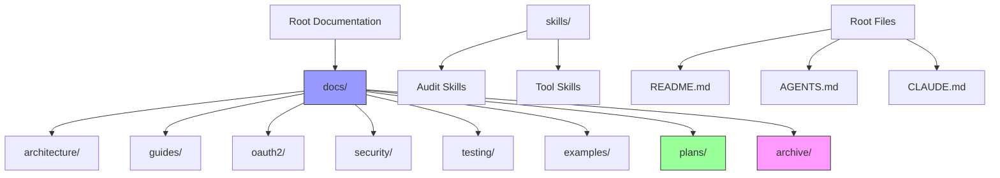

# Design Document: Documentation Consolidation and Enhancement

## Overview

This design addresses the comprehensive reorganization, enhancement, and maintenance of the ATProtoPDS documentation ecosystem. The project consolidates fragmented documentation across multiple directories, fills critical gaps in deployment and troubleshooting guides, establishes quality standards, and implements an archive management strategy to maintain documentation currency.

## Architecture

## Correctness Properties

*A property is a characteristic or behavior that should hold true across all valid executions of a system—essentially, a formal statement about what the system should do. Properties serve as the bridge between human-readable specifications and machine-verifiable correctness guarantees.*

### Property 1: File Consolidation Completeness

*For any* file in source directories (`plan/` or `plans/`), after consolidation that file should exist in the destination `docs/` directory with equivalent content.

**Validates: Requirements 1.1**

### Property 2: Git History Preservation

*For any* file moved during consolidation, the git history for that file should be accessible at the new location using `git log`.

**Validates: Requirements 1.4, 14.3**

### Property 3: Link Resolution After Migration

*For any* internal link in any migrated documentation file, that link should resolve to an existing file or anchor after migration completes.

**Validates: Requirements 2.1, 2.2, 2.5**

### Property 4: Empty Directory Cleanup

*For any* source directory that becomes empty after consolidation, that directory should be removed from the filesystem.

**Validates: Requirements 1.3**

### Property 5: Migration Mapping Completeness

*For any* file moved during consolidation, the migration mapping file should contain an entry mapping the old path to the new path.

**Validates: Requirements 1.5**

### Property 6: Cross-Reference Update Correctness

*For any* cross-reference in a moved file, the reference should be updated to reflect the new relative path from the moved file's new location.

**Validates: Requirements 2.1, 14.4**

### Property 7: Documentation Completeness

*For any* public API, build target, configuration option, or XRPC endpoint in the system, documentation should exist covering that element.

**Validates: Requirements 3.2, 4.2, 8.1, 9.1**

### Property 8: Code Example Compilation

*For any* code example in documentation, that code should compile without errors when extracted and built with the project's build system.

**Validates: Requirements 8.2, 8.5**

### Property 9: Code Example Style Consistency

*For any* code example in documentation, that code should pass the project's linter and style checker.

**Validates: Requirements 8.4, 8.6**

### Property 10: Code Example Completeness

*For any* code example in documentation, that example should include expected output or behavior description.

**Validates: Requirements 8.3**

### Property 11: Endpoint Documentation Structure

*For any* documented XRPC endpoint, the documentation should include sections for: request schema, response schema, authentication requirements, error codes, and examples.

**Validates: Requirements 9.2, 9.3, 9.4, 9.5, 9.6**

### Property 12: Skill Documentation Structure

*For any* skill in the `skills/` directory, the documentation should include sections for: purpose, usage, and examples.

**Validates: Requirements 12.4**

### Property 13: Diagram Syntax Validity

*For any* Mermaid diagram in documentation, the diagram syntax should be valid and render without errors when processed by a Mermaid validator.

**Validates: Requirements 7.5, 7.6**

### Property 14: Archive Metadata Completeness

*For any* file moved to the archive directory, that file should have associated metadata including timestamp and archival reason.

**Validates: Requirements 10.1, 10.3**

### Property 15: Archive Index Completeness

*For any* file in the `docs/archive/` directory, that file should be listed in the archive index file.

**Validates: Requirements 10.2**

### Property 16: Archive File Preservation

*For any* file archived, the archived version should be byte-for-byte identical to the original file at the time of archival.

**Validates: Requirements 10.4**

### Property 17: Markdown Formatting Consistency

*For any* Markdown file in the documentation system, that file should pass the project's Markdown linter with zero warnings.

**Validates: Requirements 11.1**

### Property 18: Internal Link Validity

*For any* internal link in any documentation file, that link should resolve to an existing file or valid anchor.

**Validates: Requirements 11.2**

### Property 19: Code Block Language Tags

*For any* code block in any Markdown file, that code block should specify a language identifier.

**Validates: Requirements 11.3**

### Property 20: Mermaid Diagram Rendering

*For any* Mermaid diagram in documentation, that diagram should render successfully without errors.

**Validates: Requirements 11.4**

### Property 21: API Documentation Completeness

*For any* API documentation file, that file should include all required sections as defined by the documentation standards.

**Validates: Requirements 11.5**

### Property 22: Validation Error Reporting

*For any* validation error detected by the Quality_Validator, the error report should include the file path and specific location of the error.

**Validates: Requirements 11.6**

### Property 23: Skills Index Completeness

*For any* skill directory in `skills/`, that skill should be listed in the `skills/README.md` index file.

**Validates: Requirements 12.3**

### Property 24: Skill Cross-Reference Presence

*For any* skill that is relevant to a documentation section, that documentation section should contain a link to the skill.

**Validates: Requirements 12.5**

### Property 25: Critical Information Preservation

*For any* critical information section in root documentation files before updates, that section should exist with equivalent content after updates.

**Validates: Requirements 13.4**

### Property 26: Migration Directory Creation

*For any* destination directory path specified in migration configuration, if that directory does not exist, the Consolidation_Tool should create it before moving files.

**Validates: Requirements 14.2**

### Property 27: Migration Report Generation

*For any* completed migration execution, a migration report file should be generated containing statistics and status of all moved files.

**Validates: Requirements 14.5**

### Property 28: Migration Rollback Capability

*For any* failed migration execution, the Consolidation_Tool should be able to restore all files to their pre-migration state.

**Validates: Requirements 14.6**

### Property 29: Documentation Index Completeness

*For any* major documentation topic in the system, that topic should be listed in the documentation index.

**Validates: Requirements 15.1**

### Property 30: File Naming Consistency

*For any* documentation file in the system, the filename should follow the project's naming convention pattern.

**Validates: Requirements 15.3**

### Property 31: Related Documentation Cross-References

*For any* pair of related documentation files, each file should contain a cross-reference link to the other.

**Validates: Requirements 15.4**

## Implementation Plan

### Phase 1: Consolidation Script Development

1. Create migration script accepting source/destination parameters
2. Implement git mv operations for history preservation
3. Implement cross-reference and link updating logic
4. Implement migration mapping file generation
5. Implement rollback capability
6. Add validation for link resolution after migration

### Phase 2: Directory Structure Migration

1. Execute consolidation from `plan/` to `docs/plans/`
2. Execute consolidation from `plans/` to `docs/plans/`
3. Verify all files migrated successfully
4. Verify all links resolve correctly
5. Remove empty source directories
6. Update root documentation files (README.md, AGENTS.md)

### Phase 3: Content Creation

1. Create comprehensive developer guide
2. Create deployment guides (Docker, VM, development)
3. Create performance tuning guide
4. Create troubleshooting guides
5. Create enhanced diagrams (OAuth2, Repository, WebSocket, PLC)
6. Create code examples for all public APIs
7. Create API documentation for all XRPC endpoints

### Phase 4: Quality Assurance Implementation

1. Implement documentation validation script
2. Add Markdown linting
3. Add link validation
4. Add code example compilation testing
5. Add Mermaid diagram validation
6. Add API documentation structure validation
7. Integrate validation into CI/CD pipeline

### Phase 5: Archive Management Setup

1. Create archive directory structure
2. Implement archive script with metadata capture
3. Create archive index file
4. Document archive management process
5. Establish quarterly review schedule

### Phase 6: Skills Organization

1. Verify skills remain in `skills/` directory
2. Create skills index in `skills/README.md`
3. Add cross-references from documentation to relevant skills
4. Verify all skill documentation includes required sections

## Testing Strategy

### Unit Tests

Unit tests will focus on specific examples and edge cases:

- Migration script handles files with special characters in names
- Migration script handles symbolic links correctly
- Link updater handles relative paths at different directory depths
- Archive manager handles files with identical names
- Validation script detects specific error conditions

### Property-Based Tests

Property-based tests will verify universal properties across all inputs (minimum 100 iterations per test):

- **Property 1 Test**: Generate random file sets, verify all files present after consolidation
  - **Feature: documentation-consolidation-and-enhancement, Property 1**: File Consolidation Completeness
  
- **Property 3 Test**: Generate random documentation with links, verify all links resolve after migration
  - **Feature: documentation-consolidation-and-enhancement, Property 3**: Link Resolution After Migration
  
- **Property 7 Test**: Extract all public APIs from codebase, verify documentation exists for each
  - **Feature: documentation-consolidation-and-enhancement, Property 7**: Documentation Completeness
  
- **Property 8 Test**: Extract all code examples, attempt compilation, verify zero errors
  - **Feature: documentation-consolidation-and-enhancement, Property 8**: Code Example Compilation
  
- **Property 13 Test**: Extract all Mermaid diagrams, run validator, verify all pass
  - **Feature: documentation-consolidation-and-enhancement, Property 13**: Diagram Syntax Validity
  
- **Property 18 Test**: Extract all internal links, verify each resolves to existing target
  - **Feature: documentation-consolidation-and-enhancement, Property 18**: Internal Link Validity

### Integration Tests

- End-to-end migration test with sample documentation set
- Full validation suite run on actual documentation
- Archive workflow test from identification through archival
- Skills cross-reference verification across full documentation set

## Security Considerations

### Information Disclosure

- Archive management must not expose sensitive information in archived files
- Migration reports should not include file contents, only paths and status
- Validation error messages should not leak sensitive data from documentation

### Access Control

- Archive directory should have appropriate filesystem permissions
- Migration script should verify write permissions before execution
- Validation script should run with read-only access to documentation

### Supply Chain

- Documentation validation tools should be from trusted sources
- Mermaid diagram renderer should be sandboxed to prevent code execution
- Code example compilation should occur in isolated environment

## Performance Considerations

### Migration Performance

- Migration script should process files in parallel where possible
- Link updating should use efficient regex patterns
- Git operations should be batched to reduce overhead

### Validation Performance

- Validation should cache results for unchanged files
- Link validation should build file index once, reuse for all checks
- Code example compilation should reuse build artifacts

### Documentation Build Performance

- Diagram rendering should be cached
- Documentation generation should be incremental
- Search index should be updated incrementally

## Deployment Strategy

### Migration Execution

1. Create backup of current documentation state
2. Run migration script in dry-run mode
3. Review migration report for issues
4. Execute actual migration
5. Verify all links and references
6. Update CI/CD to use new paths
7. Communicate changes to team

### Validation Integration

1. Add validation script to pre-commit hooks
2. Add validation to CI/CD pipeline
3. Configure validation to fail builds on errors
4. Set up periodic full validation runs

### Rollout Communication

1. Announce migration timeline to team
2. Provide migration mapping file for reference
3. Update development documentation with new paths
4. Monitor for issues post-migration
5. Address feedback and issues promptly

## Maintenance Plan

### Ongoing Responsibilities

- Quarterly documentation currency review
- Monthly validation of all links and code examples
- Continuous integration of new documentation
- Regular archive management reviews

### Documentation Standards Enforcement

- All new documentation must pass validation before merge
- Code examples must compile and follow style guidelines
- API documentation must include all required sections
- Diagrams must use Mermaid syntax and validate successfully

### Archive Management

- Quarterly review of documentation for currency
- Archive outdated documentation with proper metadata
- Maintain archive index with clear organization
- Periodic cleanup of very old archived content
