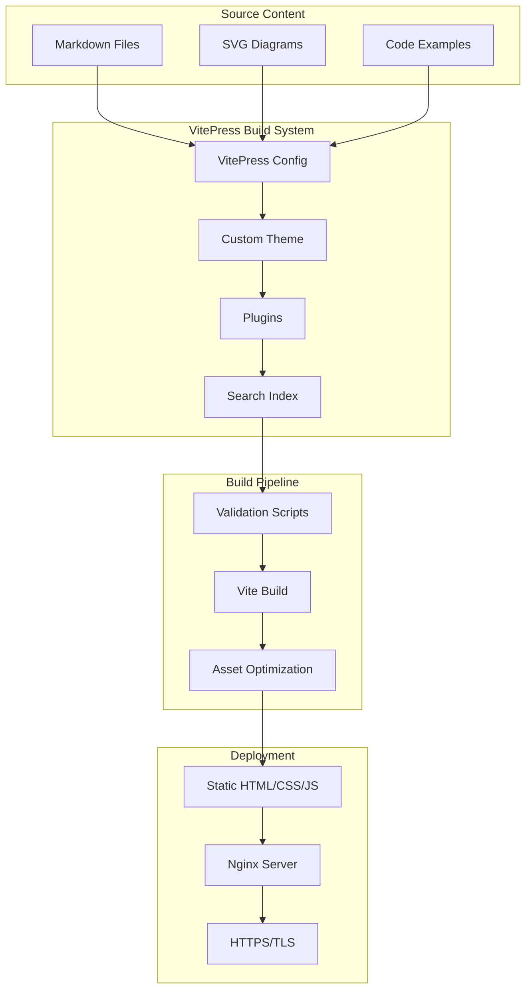

# Design Document: VitePress Documentation Migration

## Overview

This design document specifies the architecture and implementation approach for migrating the September PDS documentation from Jekyll to VitePress with comprehensive content expansion. The migration transforms ~100+ Markdown files organized in 12 sections from a basic reference into a book-quality technical resource with interactive features, enhanced code examples, and thorough explanations.

### Goals

1. **Modern Documentation Framework**: Replace Jekyll with VitePress for better performance, developer experience, and built-in features
2. **Content Preservation**: Maintain all existing documentation content, code examples, and SVG diagrams without loss
3. **Content Enhancement**: Transform brief documentation into comprehensive guides with explanations, context, and real-world examples
4. **Interactive Features**: Add enhanced code blocks, search, navigation, and accessibility features
5. **Production Deployment**: Deploy to pds.garazyk.xyz/docs with proper CI/CD integration

### Non-Goals

- Rewriting the entire documentation from scratch (we expand existing content)
- Changing the fundamental 12-section structure
- Migrating to a different framework than VitePress
- Creating new tutorials beyond the existing 6

### Success Criteria

- All Jekyll content successfully migrated to VitePress
- All internal links and diagrams working correctly
- Enhanced code blocks with syntax highlighting and annotations
- Search functionality covering all content
- Performance score of 90+ on Lighthouse
- WCAG 2.1 AA accessibility compliance
- Successful deployment to pds.garazyk.xyz/docs

## Architecture

### System Components

The VitePress documentation system consists of several key components:



### Directory Structure

The VitePress documentation will follow this structure:

```
docs/
├── .vitepress/
│   ├── config.ts              # Main VitePress configuration
│   ├── theme/
│   │   ├── index.ts           # Theme entry point
│   │   ├── style.css          # Custom styles
│   │   └── components/        # Custom Vue components
│   ├── plugins/
│   │   ├── code-enhancer.ts   # Code block enhancements
│   │   └── diagram-loader.ts  # SVG diagram integration
│   └── sidebar.ts             # Sidebar navigation config
├── public/
│   └── diagrams/              # SVG diagrams (copied from 12-diagrams)
├── 01-getting-started/
├── 02-core-concepts/
├── 03-application-layer/
├── 04-network-layer/
├── 05-database-layer/
├── 06-authentication/
├── 07-repository-protocol/
├── 08-sync-firehose/
├── 09-platform-compatibility/
├── 10-tutorials/
├── 11-reference/
├── 12-diagrams/               # Diagram reference pages
├── index.md                   # Home page
├── glossary.md                # Terminology
└── package.json               # Node.js dependencies
```

### Technology Stack

- **VitePress**: 1.0+ (static site generator)
- **Vue 3**: Component framework (used by VitePress)
- **Vite**: Build tool and dev server
- **TypeScript**: Configuration and plugin development
- **Shiki**: Syntax highlighting (built into VitePress)
- **MiniSearch**: Full-text search (built into VitePress)
- **Node.js**: 18+ (build environment)

## Components and Interfaces

### 1. VitePress Configuration Module

**File**: `.vitepress/config.ts`

**Responsibilities**:
- Define site metadata (title, description, base URL)
- Configure theme settings (colors, fonts, dark mode)
- Set up navigation and sidebar structure
- Enable and configure plugins
- Configure build options and optimization

**Interface**:

```typescript
interface VitePressConfig {
  // Site metadata
  title: string;
  description: string;
  base: string;  // '/docs' for pds.garazyk.xyz/docs
  
  // Theme configuration
  themeConfig: {
    logo: string;
    nav: NavItem[];
    sidebar: SidebarConfig;
    socialLinks: SocialLink[];
    search: SearchConfig;
    footer: FooterConfig;
  };
  
  // Build configuration
  srcDir: string;
  outDir: string;
  cacheDir: string;
  
  // Markdown configuration
  markdown: {
    lineNumbers: boolean;
    theme: string | { light: string; dark: string };
    config: (md: MarkdownIt) => void;
  };
  
  // Head tags (meta, links, scripts)
  head: HeadConfig[];
  
  // Build hooks
  buildEnd: (siteConfig: SiteConfig) => Promise<void>;
}
```

**Key Configuration Values**:

```typescript
export default defineConfig({
  title: 'September PDS Documentation',
  description: 'Comprehensive guide for implementing an ATProto Personal Data Server in Objective-C',
  base: '/docs/',
  
  themeConfig: {
    logo: '/logo.svg',
    siteTitle: 'September PDS',
    
    nav: [
      { text: 'Guide', link: '/01-getting-started/overview' },
      { text: 'Tutorials', link: '/10-tutorials/tutorial-1-hello-pds' },
      { text: 'Reference', link: '/11-reference/api-reference' },
      { text: 'GitHub', link: 'https://github.com/user/september-pds' }
    ],
    
    sidebar: {
      '/': sidebarConfig  // Defined in sidebar.ts
    },
    
    search: {
      provider: 'local',
      options: {
        miniSearch: {
          searchOptions: {
            fuzzy: 0.2,
            prefix: true,
            boost: { title: 4, text: 2, titles: 1 }
          }
        }
      }
    },
    
    editLink: {
      pattern: 'https://github.com/user/september-pds/edit/main/docs/:path',
      text: 'Edit this page on GitHub'
    }
  },
  
  markdown: {
    lineNumbers: true,
    theme: {
      light: 'github-light',
      dark: 'github-dark'
    }
  }
});
```

### 2. Sidebar Configuration Module

**File**: `.vitepress/sidebar.ts`

**Responsibilities**:
- Define hierarchical navigation structure
- Map to existing 12-section organization
- Support collapsible sections
- Maintain current page highlighting

**Interface**:

```typescript
interface SidebarItem {
  text: string;
  link?: string;
  items?: SidebarItem[];
  collapsed?: boolean;
}

type SidebarConfig = SidebarItem[];
```

**Implementation**:

```typescript
export const sidebarConfig: SidebarConfig = [
  {
    text: '01 Getting Started',
    collapsed: false,
    items: [
      { text: 'Overview', link: '/01-getting-started/overview' },
      { text: 'Architecture Overview', link: '/01-getting-started/architecture-overview' },
      { text: 'Setup', link: '/01-getting-started/setup' }
    ]
  },
  {
    text: '02 Core Concepts',
    collapsed: false,
    items: [
      { text: 'AT Protocol Basics', link: '/02-core-concepts/atproto-basics' },
      { text: 'CBOR and CAR', link: '/02-core-concepts/cbor-and-car' },
      { text: 'Merkle Search Trees', link: '/02-core-concepts/mst-trees' },
      { text: 'Cryptography', link: '/02-core-concepts/cryptography' },
      { text: 'PLC Directory', link: '/02-core-concepts/plc-directory' },
      { text: 'DID Document Updates', link: '/02-core-concepts/did-document-updates' }
    ]
  },
  // ... continues for all 12 sections
];
```

### 3. Migration Tool Module

**File**: `scripts/migrate-to-vitepress.ts`

**Responsibilities**:
- Convert Jekyll front matter to VitePress format
- Preserve all Markdown content and code blocks
- Update internal links to VitePress format
- Copy SVG diagrams to public directory
- Generate migration report

**Interface**:

```typescript
interface MigrationOptions {
  sourceDir: string;      // 'docs/'
  targetDir: string;      // 'docs/' (in-place migration)
  backupDir: string;      // 'docs-jekyll-backup/'
  dryRun: boolean;
}

interface MigrationResult {
  filesProcessed: number;
  filesConverted: number;
  linkUpdates: number;
  errors: MigrationError[];
  warnings: string[];
}

class MigrationTool {
  migrate(options: MigrationOptions): Promise<MigrationResult>;
  convertFrontMatter(content: string): string;
  updateLinks(content: string): string;
  copyDiagrams(): Promise<void>;
  generateReport(result: MigrationResult): void;
}
```

**Front Matter Conversion**:

Jekyll format:
```yaml
---
layout: default
title: Page Title
---
```

VitePress format:
```yaml
---
title: Page Title
description: Optional description
outline: deep
---
```

### 4. Content Expansion Module

**File**: `scripts/expand-content.ts`

**Responsibilities**:
- Identify code snippets needing expansion
- Add comprehensive explanations around code
- Insert "Why this matters" sections
- Add troubleshooting guidance
- Maintain consistent voice and style

**Interface**:

```typescript
interface ContentExpansionRule {
  pattern: RegExp;
  expansion: (match: string, context: FileContext) => string;
}

interface FileContext {
  filePath: string;
  section: string;
  existingContent: string;
  codeBlocks: CodeBlock[];
}

interface CodeBlock {
  language: string;
  code: string;
  lineNumber: number;
}

class ContentExpander {
  expandFile(filePath: string): Promise<string>;
  addExplanation(codeBlock: CodeBlock, context: FileContext): string;
  addWhySection(topic: string): string;
  addTroubleshooting(topic: string): string;
  addRealWorldExample(codeBlock: CodeBlock): string;
}
```

**Expansion Templates**:

```typescript
const expansionTemplates = {
  codeExplanation: (code: CodeBlock) => `
### Understanding the Code

${analyzeCode(code)}

**Key Points:**
- ${extractKeyPoint1(code)}
- ${extractKeyPoint2(code)}
- ${extractKeyPoint3(code)}

**Why This Approach:**
${explainDesignDecision(code)}
`,

  whyItMatters: (topic: string) => `
### Why This Matters

${explainImportance(topic)}

In production systems, ${explainProductionRelevance(topic)}.
`,

  troubleshooting: (topic: string) => `
### Common Issues and Solutions

**Problem:** ${commonProblem1(topic)}
**Solution:** ${solution1(topic)}

**Problem:** ${commonProblem2(topic)}
**Solution:** ${solution2(topic)}
`
};
```

### 5. Code Enhancement Plugin

**File**: `.vitepress/plugins/code-enhancer.ts`

**Responsibilities**:
- Apply syntax highlighting (via Shiki)
- Add line highlighting
- Support code group tabs
- Add copy-to-clipboard buttons
- Support code annotations

**Interface**:

```typescript
interface CodeEnhancementOptions {
  lineNumbers: boolean;
  highlightLines: boolean;
  copyButton: boolean;
  annotations: boolean;
  tabs: boolean;
}

interface CodeGroupConfig {
  title: string;
  tabs: Array<{
    label: string;
    code: string;
    language: string;
  }>;
}

function enhanceCodeBlocks(md: MarkdownIt, options: CodeEnhancementOptions): void;
```

**Markdown Extensions**:

Line highlighting:
```markdown
```objc{2,4-6}
// Line 1
// Line 2 - highlighted
// Line 3
// Lines 4-6 highlighted
// Line 5
// Line 6
\```
```

Code groups (platform-specific):
```markdown
::: code-group
```objc [macOS]
#import <Security/Security.h>
// macOS-specific code
\```

```objc [Linux]
#import <openssl/evp.h>
// Linux-specific code
\```
:::
```

Code with title:
```markdown
```objc [PDSApplication.m]
@implementation PDSApplication
// ...
@end
\```
```

### 6. Diagram Integration Module

**File**: `.vitepress/plugins/diagram-loader.ts`

**Responsibilities**:
- Load SVG diagrams from public directory
- Support inline embedding
- Add captions and descriptions
- Support dark mode variants
- Enable zoom/fullscreen

**Interface**:

```typescript
interface DiagramConfig {
  src: string;
  alt: string;
  caption?: string;
  darkSrc?: string;  // Optional dark mode variant
  zoomable?: boolean;
}

function embedDiagram(config: DiagramConfig): string;
```

**Markdown Syntax**:

```markdown


::: diagram
src: /diagrams/oauth2-dpop-flow.svg
alt: OAuth 2.0 with DPoP Flow
caption: Complete OAuth 2.0 authorization flow with DPoP token binding
zoomable: true
:::
```

### 7. Search Configuration Module

**File**: `.vitepress/config.ts` (search section)

**Responsibilities**:
- Configure MiniSearch indexing
- Define search ranking
- Support keyboard navigation
- Index code block content

**Configuration**:

```typescript
search: {
  provider: 'local',
  options: {
    locales: {
      root: {
        translations: {
          button: {
            buttonText: 'Search',
            buttonAriaLabel: 'Search documentation'
          },
          modal: {
            noResultsText: 'No results for',
            resetButtonTitle: 'Clear search',
            footer: {
              selectText: 'to select',
              navigateText: 'to navigate',
              closeText: 'to close'
            }
          }
        }
      }
    },
    miniSearch: {
      searchOptions: {
        fuzzy: 0.2,
        prefix: true,
        boost: {
          title: 4,
          heading: 3,
          text: 2,
          code: 1
        }
      },
      options: {
        fields: ['title', 'text', 'headings', 'code'],
        storeFields: ['title', 'text'],
        searchOptions: {
          boost: { title: 4, text: 2, headings: 3, code: 1 },
          fuzzy: 0.2,
          prefix: true
        }
      }
    }
  }
}
```

### 8. Build Pipeline Module

**File**: `scripts/build-docs.sh`

**Responsibilities**:
- Run validation checks
- Build VitePress site
- Optimize assets
- Generate sitemap
- Run post-build verification

**Interface**:

```bash
#!/bin/bash
# Build pipeline for VitePress documentation

set -e

echo "==> Running validation checks..."
npm run validate:links
npm run validate:diagrams
npm run validate:code-blocks

echo "==> Building VitePress site..."
npm run docs:build

echo "==> Optimizing assets..."
npm run optimize:images
npm run optimize:svg

echo "==> Generating sitemap..."
npm run generate:sitemap

echo "==> Running post-build verification..."
npm run verify:build

echo "==> Build complete!"
```

### 9. Validation Module

**File**: `scripts/validate-docs.ts`

**Responsibilities**:
- Check internal links
- Check external links
- Verify code block syntax
- Verify diagram references
- Check accessibility

**Interface**:

```typescript
interface ValidationResult {
  passed: boolean;
  errors: ValidationError[];
  warnings: ValidationWarning[];
}

interface ValidationError {
  type: 'broken-link' | 'missing-diagram' | 'invalid-code' | 'accessibility';
  file: string;
  line: number;
  message: string;
}

class DocumentationValidator {
  validateLinks(): Promise<ValidationResult>;
  validateDiagrams(): Promise<ValidationResult>;
  validateCodeBlocks(): Promise<ValidationResult>;
  validateAccessibility(): Promise<ValidationResult>;
  generateReport(results: ValidationResult[]): void;
}
```

### 10. Deployment Configuration

**File**: `docker/docs/nginx.conf`

**Responsibilities**:
- Serve static files
- Configure caching headers
- Handle 404 errors
- Support HTTPS

**Configuration**:

```nginx
server {
    listen 80;
    server_name pds.garazyk.xyz;
    
    location /docs {
        alias /var/www/docs;
        index index.html;
        
        # Try files, fallback to index.html for SPA routing
        try_files $uri $uri/ /docs/index.html;
        
        # Cache static assets
        location ~* \.(js|css|png|jpg|jpeg|gif|svg|ico|woff|woff2|ttf|eot)$ {
            expires 1y;
            add_header Cache-Control "public, immutable";
        }
        
        # No cache for HTML
        location ~* \.html$ {
            expires -1;
            add_header Cache-Control "no-store, no-cache, must-revalidate";
        }
    }
    
    # Custom 404 page
    error_page 404 /docs/404.html;
}
```

## Data Models

### Configuration Data Model

```typescript
interface SiteConfig {
  title: string;
  description: string;
  base: string;
  lang: string;
  head: HeadConfig[];
  themeConfig: ThemeConfig;
  markdown: MarkdownConfig;
  vite: ViteConfig;
}

interface ThemeConfig {
  logo: string;
  siteTitle: string;
  nav: NavItem[];
  sidebar: SidebarConfig;
  socialLinks: SocialLink[];
  footer: FooterConfig;
  search: SearchConfig;
  editLink: EditLinkConfig;
  lastUpdated: boolean;
  outline: OutlineConfig;
}

interface NavItem {
  text: string;
  link?: string;
  items?: NavItem[];
  activeMatch?: string;
}

interface SidebarItem {
  text: string;
  link?: string;
  items?: SidebarItem[];
  collapsed?: boolean;
}

interface SearchConfig {
  provider: 'local' | 'algolia';
  options: LocalSearchOptions | AlgoliaSearchOptions;
}

interface LocalSearchOptions {
  locales?: Record<string, LocaleConfig>;
  miniSearch?: MiniSearchOptions;
}
```

### Migration Data Model

```typescript
interface MigrationState {
  sourceFiles: FileInfo[];
  targetFiles: FileInfo[];
  linkMappings: Map<string, string>;
  diagramMappings: Map<string, string>;
  errors: MigrationError[];
  warnings: string[];
}

interface FileInfo {
  path: string;
  relativePath: string;
  content: string;
  frontMatter: FrontMatter;
  codeBlocks: CodeBlock[];
  links: Link[];
  diagrams: DiagramReference[];
}

interface FrontMatter {
  title?: string;
  description?: string;
  layout?: string;
  outline?: 'deep' | number | false;
  lastUpdated?: boolean;
}

interface Link {
  text: string;
  href: string;
  lineNumber: number;
  isInternal: boolean;
  isValid?: boolean;
}

interface DiagramReference {
  src: string;
  alt: string;
  lineNumber: number;
  exists?: boolean;
}
```

### Content Expansion Data Model

```typescript
interface ExpansionContext {
  file: FileInfo;
  section: DocumentationSection;
  codeBlocks: CodeBlock[];
  existingHeadings: string[];
  relatedFiles: FileInfo[];
}

interface DocumentationSection {
  name: string;
  number: number;
  topics: string[];
  style: 'tutorial' | 'guide' | 'reference';
}

interface CodeBlock {
  language: string;
  code: string;
  lineNumber: number;
  title?: string;
  highlightLines?: number[];
  annotations?: Annotation[];
}

interface Annotation {
  line: number;
  text: string;
  type: 'info' | 'warning' | 'error';
}
```


## Correctness Properties

*A property is a characteristic or behavior that should hold true across all valid executions of a system—essentially, a formal statement about what the system should do. Properties serve as the bridge between human-readable specifications and machine-verifiable correctness guarantees.*

### Property Reflection

After analyzing all acceptance criteria, I identified the following testable properties. During reflection, I eliminated redundancy by combining related properties:

**Redundancy Analysis:**
- Properties about "all files migrated" and "all pages have corresponding pages" are the same concept → combined into Property 1
- Properties about "preserve code snippets" and "code examples preserved" are redundant → combined into Property 2
- Properties about "internal links preserved" and "internal links work" are the same → combined into Property 3
- Properties about "diagrams preserved" and "diagrams referenced" overlap → combined into Property 4
- Multiple properties about "all tutorials have X section" can be combined → combined into Property 5
- Properties about "search indexes content" and "content is searchable" are the same → combined into Property 6
- Properties about "validation checks links" and "links are valid" are the same → combined into Property 7

### Property 1: Complete File Migration

*For any* Markdown file in the Jekyll source directory, there SHALL exist a corresponding file in the VitePress target directory with the same relative path and filename.

**Validates: Requirements 2.1, 20.1**

### Property 2: Code Block Preservation

*For any* code block in a source documentation file, the migrated file SHALL contain the identical code block with the same content, preserving all code examples without modification.

**Validates: Requirements 2.2, 3.10**

### Property 3: Internal Link Validity

*For any* internal link in the documentation, the link SHALL resolve to an existing page in the documentation system, ensuring all cross-references remain functional.

**Validates: Requirements 2.5, 11.1, 20.2**

### Property 4: Diagram Integration

*For any* SVG diagram file in the docs/12-diagrams/ directory, the diagram SHALL be referenced in at least one documentation page and SHALL have associated alt text or caption for accessibility.

**Validates: Requirements 2.9, 6.1, 6.4, 6.7, 11.4**

### Property 5: Tutorial Structure Completeness

*For any* tutorial in the 10-tutorials section, the tutorial SHALL contain all required sections: prerequisites, learning objectives, overview, troubleshooting, next steps, estimated time, and summary.

**Validates: Requirements 5.2, 5.3, 5.4, 5.5, 5.6, 5.7, 5.10**

### Property 6: Search Index Coverage

*For any* text content (headings, body text, code comments) in the documentation, searching for that content SHALL return the page containing it in the search results.

**Validates: Requirements 7.1, 7.8, 20.6**

### Property 7: Front Matter Conversion

*For any* documentation file with Jekyll front matter, the migrated file SHALL have valid VitePress front matter with required fields (title at minimum).

**Validates: Requirements 2.3, 11.6**

### Property 8: Heading Anchor Links

*For any* heading in a documentation page, there SHALL exist an anchor link that enables deep linking to that specific section.

**Validates: Requirements 8.7, 13.3**

### Property 9: Syntax Highlighting Application

*For any* code block in the documentation, the code block SHALL have a language identifier specified, enabling proper syntax highlighting in the rendered output.

**Validates: Requirements 4.1, 11.3**

### Property 10: Navigation Completeness

*For any* documentation page, the page SHALL be referenced in the sidebar navigation configuration, ensuring no orphaned pages exist.

**Validates: Requirements 11.7**

### Property 11: Image Reference Validity

*For any* image or diagram reference in the documentation, the referenced file SHALL exist in the public directory or diagrams directory.

**Validates: Requirements 11.5**

### Property 12: Heading Hierarchy Consistency

*For any* documentation page, the heading levels SHALL follow proper hierarchy (h1 → h2 → h3, etc.) without skipping levels.

**Validates: Requirements 11.9**

### Property 13: URL Redirect Mapping

*For any* Jekyll URL that differs from the corresponding VitePress URL, there SHALL exist a redirect configuration mapping the old URL to the new URL.

**Validates: Requirements 13.1, 10.8**

### Property 14: File Naming Consistency

*For any* source documentation file, the target file SHALL maintain the same filename unless a documented exception exists in the migration mapping.

**Validates: Requirements 13.2**

### Property 15: Code Example Compilation

*For any* code example in the tutorials section, the code SHALL compile without errors when tested with the appropriate compiler.

**Validates: Requirements 19.1**

### Property 16: Code Style Compliance

*For any* code example in the documentation, the code SHALL pass project linting rules and coding standards checks.

**Validates: Requirements 19.2**

### Property 17: External Link Availability

*For any* external link in the documentation, the link SHALL return a successful HTTP response (2xx or 3xx status code) when checked.

**Validates: Requirements 11.2**

### Property 18: Migration Verification Completeness

*For any* Jekyll page, code block, diagram, and internal link, the migration verification SHALL confirm successful migration and correct rendering in VitePress.

**Validates: Requirements 20.1, 20.2, 20.3, 20.4**

## Error Handling

### Migration Errors

The migration tool must handle various error conditions gracefully:

**File System Errors:**
- Missing source files: Log warning and continue with other files
- Permission errors: Fail with clear error message indicating which file
- Disk space errors: Fail early before partial migration

**Content Errors:**
- Invalid front matter: Attempt to fix common issues, log warning if unfixable
- Broken internal links: Log all broken links in migration report
- Missing diagrams: Log warning but continue migration
- Invalid Markdown syntax: Log warning with line number

**Error Recovery Strategy:**
```typescript
class MigrationErrorHandler {
  handleFileError(error: FileError): void {
    if (error.type === 'missing') {
      this.logger.warn(`Source file not found: ${error.path}`);
      this.report.warnings.push(error);
    } else if (error.type === 'permission') {
      throw new FatalError(`Permission denied: ${error.path}`);
    }
  }
  
  handleContentError(error: ContentError): void {
    this.logger.warn(`Content issue in ${error.file}:${error.line}: ${error.message}`);
    this.report.warnings.push(error);
    // Continue processing
  }
  
  handleLinkError(error: LinkError): void {
    this.brokenLinks.push(error);
    // Don't fail migration, but report all broken links
  }
}
```

### Build Errors

The build pipeline must handle errors appropriately:

**Validation Failures:**
- Broken links: Fail build with list of broken links
- Missing diagrams: Fail build with list of missing files
- Invalid code blocks: Fail build with file and line numbers
- Accessibility violations: Fail build with WCAG violation details

**Build Failures:**
- VitePress build errors: Display full error message and stack trace
- Asset optimization errors: Log warning but continue (use unoptimized assets)
- Sitemap generation errors: Log warning but continue (sitemap optional)

**Error Reporting:**
```typescript
interface BuildError {
  type: 'validation' | 'build' | 'optimization';
  severity: 'error' | 'warning';
  file?: string;
  line?: number;
  message: string;
  suggestion?: string;
}

class BuildErrorHandler {
  handleValidationError(error: ValidationError): void {
    console.error(`❌ Validation failed: ${error.message}`);
    if (error.file) {
      console.error(`   File: ${error.file}:${error.line || 0}`);
    }
    if (error.suggestion) {
      console.error(`   Suggestion: ${error.suggestion}`);
    }
    process.exit(1);
  }
  
  handleBuildError(error: BuildError): void {
    if (error.severity === 'error') {
      console.error(`❌ Build failed: ${error.message}`);
      process.exit(1);
    } else {
      console.warn(`⚠️  Warning: ${error.message}`);
    }
  }
}
```

### Runtime Errors

The deployed documentation site must handle runtime errors:

**404 Errors:**
- Display custom 404 page with search and navigation
- Log 404s for monitoring (if analytics enabled)
- Suggest similar pages based on URL

**Search Errors:**
- Gracefully degrade if search index fails to load
- Display error message with fallback to navigation
- Log error for debugging

**Asset Loading Errors:**
- Display placeholder for failed images/diagrams
- Continue rendering rest of page
- Log error for monitoring

## Testing Strategy

### Dual Testing Approach

The VitePress documentation migration requires both unit tests and property-based tests for comprehensive coverage:

**Unit Tests** focus on:
- Specific migration scenarios (Jekyll front matter → VitePress front matter)
- Edge cases (empty files, special characters in filenames)
- Error conditions (missing files, invalid syntax)
- Integration points (VitePress config generation, sidebar generation)

**Property-Based Tests** focus on:
- Universal properties across all files (all files migrated, all links valid)
- Comprehensive input coverage through randomization
- Invariants that must hold (file count preserved, content preserved)

### Unit Testing

**Migration Tool Tests:**
```typescript
describe('MigrationTool', () => {
  describe('convertFrontMatter', () => {
    it('converts Jekyll layout to VitePress format', () => {
      const input = '---\nlayout: default\ntitle: Test\n---\n';
      const output = migrationTool.convertFrontMatter(input);
      expect(output).toContain('title: Test');
      expect(output).not.toContain('layout: default');
    });
    
    it('preserves title and description', () => {
      const input = '---\ntitle: Test\ndescription: Desc\n---\n';
      const output = migrationTool.convertFrontMatter(input);
      expect(output).toContain('title: Test');
      expect(output).toContain('description: Desc');
    });
    
    it('handles missing front matter', () => {
      const input = '# Heading\n\nContent';
      const output = migrationTool.convertFrontMatter(input);
      expect(output).toContain('---\ntitle:');
    });
  });
  
  describe('updateLinks', () => {
    it('converts relative links to VitePress format', () => {
      const input = '[Link](./page.md)';
      const output = migrationTool.updateLinks(input);
      expect(output).toBe('[Link](./page)');
    });
    
    it('preserves anchor links', () => {
      const input = '[Link](./page.md#section)';
      const output = migrationTool.updateLinks(input);
      expect(output).toBe('[Link](./page#section)');
    });
  });
});
```

**Validation Tests:**
```typescript
describe('DocumentationValidator', () => {
  describe('validateLinks', () => {
    it('detects broken internal links', async () => {
      const result = await validator.validateLinks();
      expect(result.errors).toHaveLength(0);
    });
    
    it('reports missing link targets', async () => {
      // Create test file with broken link
      const result = await validator.validateLinks();
      expect(result.errors[0].type).toBe('broken-link');
    });
  });
  
  describe('validateCodeBlocks', () => {
    it('detects code blocks without language', async () => {
      const result = await validator.validateCodeBlocks();
      const noLangErrors = result.errors.filter(e => 
        e.message.includes('no language specified')
      );
      expect(noLangErrors).toHaveLength(0);
    });
  });
});
```

**Build Pipeline Tests:**
```typescript
describe('BuildPipeline', () => {
  it('runs validation before build', async () => {
    const spy = jest.spyOn(validator, 'validateAll');
    await buildPipeline.build();
    expect(spy).toHaveBeenCalled();
  });
  
  it('fails build on validation errors', async () => {
    jest.spyOn(validator, 'validateAll').mockResolvedValue({
      passed: false,
      errors: [{ type: 'broken-link', file: 'test.md', line: 1, message: 'Broken' }]
    });
    
    await expect(buildPipeline.build()).rejects.toThrow();
  });
  
  it('generates sitemap after successful build', async () => {
    await buildPipeline.build();
    expect(fs.existsSync('.vitepress/dist/sitemap.xml')).toBe(true);
  });
});
```

### Property-Based Testing

**Property Test Configuration:**
- Use fast-check library for TypeScript property-based testing
- Minimum 100 iterations per property test
- Each test references its design document property
- Tag format: `Feature: vitepress-docs-migration, Property {number}: {property_text}`

**Property Test Examples:**

```typescript
import fc from 'fast-check';

describe('Property Tests: VitePress Migration', () => {
  // Property 1: Complete File Migration
  it('Feature: vitepress-docs-migration, Property 1: For any Markdown file in Jekyll source, there exists a corresponding VitePress file', () => {
    fc.assert(
      fc.property(
        fc.array(fc.record({
          path: fc.string(),
          content: fc.string()
        })),
        (sourceFiles) => {
          // Setup: Create source files
          sourceFiles.forEach(file => createSourceFile(file));
          
          // Execute: Run migration
          const result = migrationTool.migrate({ sourceDir: 'test-source', targetDir: 'test-target' });
          
          // Verify: All source files have corresponding target files
          sourceFiles.forEach(file => {
            const targetPath = path.join('test-target', file.path);
            expect(fs.existsSync(targetPath)).toBe(true);
          });
        }
      ),
      { numRuns: 100 }
    );
  });
  
  // Property 2: Code Block Preservation
  it('Feature: vitepress-docs-migration, Property 2: For any code block in source, the same code exists in target', () => {
    fc.assert(
      fc.property(
        fc.array(fc.record({
          file: fc.string(),
          codeBlocks: fc.array(fc.record({
            language: fc.constantFrom('objc', 'typescript', 'bash'),
            code: fc.string()
          }))
        })),
        (testData) => {
          // Setup: Create files with code blocks
          testData.forEach(data => {
            const content = data.codeBlocks.map(block => 
              `\`\`\`${block.language}\n${block.code}\n\`\`\``
            ).join('\n\n');
            createSourceFile({ path: data.file, content });
          });
          
          // Execute: Run migration
          migrationTool.migrate({ sourceDir: 'test-source', targetDir: 'test-target' });
          
          // Verify: All code blocks preserved
          testData.forEach(data => {
            const targetContent = fs.readFileSync(path.join('test-target', data.file), 'utf8');
            data.codeBlocks.forEach(block => {
              expect(targetContent).toContain(block.code);
            });
          });
        }
      ),
      { numRuns: 100 }
    );
  });
  
  // Property 3: Internal Link Validity
  it('Feature: vitepress-docs-migration, Property 3: For any internal link, the link resolves to an existing page', () => {
    fc.assert(
      fc.property(
        fc.array(fc.record({
          file: fc.string(),
          links: fc.array(fc.record({
            text: fc.string(),
            target: fc.string()
          }))
        })),
        (testData) => {
          // Setup: Create files and link targets
          testData.forEach(data => {
            const content = data.links.map(link => 
              `[${link.text}](${link.target})`
            ).join('\n');
            createSourceFile({ path: data.file, content });
            
            // Create link targets
            data.links.forEach(link => {
              createSourceFile({ path: link.target, content: '# Target' });
            });
          });
          
          // Execute: Run migration and validation
          migrationTool.migrate({ sourceDir: 'test-source', targetDir: 'test-target' });
          const result = validator.validateLinks();
          
          // Verify: No broken links
          expect(result.errors.filter(e => e.type === 'broken-link')).toHaveLength(0);
        }
      ),
      { numRuns: 100 }
    );
  });
  
  // Property 6: Search Index Coverage
  it('Feature: vitepress-docs-migration, Property 6: For any text content, searching returns the containing page', () => {
    fc.assert(
      fc.property(
        fc.array(fc.record({
          file: fc.string(),
          content: fc.array(fc.string())
        })),
        async (testData) => {
          // Setup: Create files with content
          testData.forEach(data => {
            const content = data.content.join('\n\n');
            createSourceFile({ path: data.file, content });
          });
          
          // Execute: Build site and index
          await buildPipeline.build();
          const searchIndex = loadSearchIndex();
          
          // Verify: All content is searchable
          testData.forEach(data => {
            data.content.forEach(text => {
              if (text.length > 3) {  // Skip very short strings
                const results = searchIndex.search(text);
                const fileResults = results.filter(r => r.file === data.file);
                expect(fileResults.length).toBeGreaterThan(0);
              }
            });
          });
        }
      ),
      { numRuns: 100 }
    );
  });
  
  // Property 9: Syntax Highlighting Application
  it('Feature: vitepress-docs-migration, Property 9: For any code block, a language identifier is specified', () => {
    fc.assert(
      fc.property(
        fc.array(fc.record({
          file: fc.string(),
          codeBlocks: fc.array(fc.record({
            language: fc.constantFrom('objc', 'typescript', 'bash', 'json'),
            code: fc.string()
          }))
        })),
        (testData) => {
          // Setup: Create files with code blocks
          testData.forEach(data => {
            const content = data.codeBlocks.map(block => 
              `\`\`\`${block.language}\n${block.code}\n\`\`\``
            ).join('\n\n');
            createSourceFile({ path: data.file, content });
          });
          
          // Execute: Run validation
          const result = validator.validateCodeBlocks();
          
          // Verify: All code blocks have language
          const noLangErrors = result.errors.filter(e => 
            e.message.includes('no language specified')
          );
          expect(noLangErrors).toHaveLength(0);
        }
      ),
      { numRuns: 100 }
    );
  });
  
  // Property 12: Heading Hierarchy Consistency
  it('Feature: vitepress-docs-migration, Property 12: For any page, headings follow proper hierarchy', () => {
    fc.assert(
      fc.property(
        fc.array(fc.record({
          file: fc.string(),
          headings: fc.array(fc.record({
            level: fc.integer({ min: 1, max: 6 }),
            text: fc.string()
          }))
        })),
        (testData) => {
          // Setup: Create files with headings
          testData.forEach(data => {
            const content = data.headings.map(h => 
              `${'#'.repeat(h.level)} ${h.text}`
            ).join('\n\n');
            createSourceFile({ path: data.file, content });
          });
          
          // Execute: Run validation
          const result = validator.validateHeadingHierarchy();
          
          // Verify: No hierarchy violations
          const hierarchyErrors = result.errors.filter(e => 
            e.message.includes('heading hierarchy')
          );
          expect(hierarchyErrors).toHaveLength(0);
        }
      ),
      { numRuns: 100 }
    );
  });
});
```

### Integration Testing

**End-to-End Migration Test:**
```bash
#!/bin/bash
# Test complete migration workflow

set -e

echo "==> Setting up test environment..."
cp -r docs docs-backup
mkdir -p test-output

echo "==> Running migration..."
npm run migrate -- --source docs-backup --target test-output

echo "==> Validating migration..."
npm run validate -- --dir test-output

echo "==> Building site..."
cd test-output
npm run docs:build

echo "==> Verifying build output..."
test -f .vitepress/dist/index.html
test -f .vitepress/dist/sitemap.xml

echo "==> Testing search functionality..."
node scripts/test-search.js

echo "==> Testing accessibility..."
npm run test:a11y

echo "==> Migration test complete!"
```

### Validation Testing

**Link Validation:**
```typescript
describe('Link Validation', () => {
  it('validates all internal links', async () => {
    const result = await validator.validateLinks();
    expect(result.errors).toHaveLength(0);
  });
  
  it('validates all external links', async () => {
    const result = await validator.validateExternalLinks();
    const brokenLinks = result.errors.filter(e => e.type === 'broken-external-link');
    expect(brokenLinks).toHaveLength(0);
  });
});
```

**Diagram Validation:**
```typescript
describe('Diagram Validation', () => {
  it('validates all diagrams are referenced', async () => {
    const result = await validator.validateDiagrams();
    const unreferenced = result.warnings.filter(w => 
      w.includes('unreferenced diagram')
    );
    expect(unreferenced).toHaveLength(0);
  });
  
  it('validates all diagram references exist', async () => {
    const result = await validator.validateDiagrams();
    const missing = result.errors.filter(e => 
      e.message.includes('diagram not found')
    );
    expect(missing).toHaveLength(0);
  });
});
```

### Performance Testing

**Build Performance:**
```typescript
describe('Build Performance', () => {
  it('builds site in under 60 seconds', async () => {
    const start = Date.now();
    await buildPipeline.build();
    const duration = Date.now() - start;
    expect(duration).toBeLessThan(60000);
  });
  
  it('achieves Lighthouse score of 90+', async () => {
    await buildPipeline.build();
    const score = await runLighthouse('.vitepress/dist');
    expect(score.performance).toBeGreaterThanOrEqual(90);
  });
});
```

### Accessibility Testing

**WCAG Compliance:**
```typescript
describe('Accessibility Testing', () => {
  it('meets WCAG 2.1 AA standards', async () => {
    await buildPipeline.build();
    const results = await runAxe('.vitepress/dist');
    expect(results.violations).toHaveLength(0);
  });
  
  it('provides alt text for all images', async () => {
    const result = await validator.validateAccessibility();
    const missingAlt = result.errors.filter(e => 
      e.message.includes('missing alt text')
    );
    expect(missingAlt).toHaveLength(0);
  });
});
```

### Test Coverage Goals

- Unit test coverage: 80%+ for migration and validation code
- Property test coverage: All 18 correctness properties implemented
- Integration test coverage: Complete migration workflow
- Accessibility test coverage: All pages tested with axe-core
- Performance test coverage: Lighthouse tests for key pages

### Continuous Integration

The test suite integrates with GitHub Actions:

```yaml
name: Documentation Tests

on: [push, pull_request]

jobs:
  test:
    runs-on: ubuntu-latest
    steps:
      - uses: actions/checkout@v3
      - uses: actions/setup-node@v3
        with:
          node-version: '18'
      
      - name: Install dependencies
        run: npm ci
      
      - name: Run unit tests
        run: npm test
      
      - name: Run property tests
        run: npm run test:properties
      
      - name: Run migration test
        run: npm run test:migration
      
      - name: Build documentation
        run: npm run docs:build
      
      - name: Run accessibility tests
        run: npm run test:a11y
      
      - name: Run performance tests
        run: npm run test:performance
```


## Implementation Phases

### Phase 1: Setup and Configuration (Week 1)

**Objectives:**
- Install VitePress and dependencies
- Create basic configuration
- Set up development environment

**Tasks:**
1. Initialize Node.js project in docs directory
2. Install VitePress 1.0+ and dependencies
3. Create `.vitepress/config.ts` with basic configuration
4. Create `.vitepress/theme/` directory structure
5. Set up sidebar configuration from SUMMARY.md
6. Configure base URL to `/docs`
7. Test local development server

**Deliverables:**
- `package.json` with VitePress dependencies
- `.vitepress/config.ts` with site configuration
- `.vitepress/sidebar.ts` with navigation structure
- Working local dev server

### Phase 2: Migration Tool Development (Week 1-2)

**Objectives:**
- Build migration tool to convert Jekyll to VitePress
- Preserve all content and structure

**Tasks:**
1. Create `scripts/migrate-to-vitepress.ts`
2. Implement front matter conversion
3. Implement link format updates
4. Implement diagram copying
5. Create migration report generator
6. Test migration on sample files
7. Run full migration

**Deliverables:**
- Migration tool script
- Migration report
- All files migrated to VitePress format

### Phase 3: Content Enhancement (Week 2-4)

**Objectives:**
- Expand existing documentation with comprehensive explanations
- Add context and real-world examples

**Tasks:**
1. Create content expansion templates
2. Expand tutorial content (6 tutorials)
3. Add "Why this matters" sections
4. Add troubleshooting sections
5. Add prerequisite and learning objective sections
6. Verify code examples compile
7. Review and refine expanded content

**Deliverables:**
- Expanded tutorial content
- Enhanced guide sections
- Comprehensive explanations for all code examples

### Phase 4: Code Block Enhancement (Week 3)

**Objectives:**
- Implement enhanced code block features
- Add syntax highlighting and annotations

**Tasks:**
1. Configure Shiki syntax highlighting
2. Add line highlighting support
3. Implement code group tabs for platform-specific code
4. Add code block titles
5. Configure copy-to-clipboard buttons
6. Test code blocks in light and dark themes

**Deliverables:**
- Enhanced code block rendering
- Platform-specific code tabs
- Copy buttons on all code blocks

### Phase 5: Diagram Integration (Week 3)

**Objectives:**
- Integrate all SVG diagrams
- Add captions and accessibility features

**Tasks:**
1. Copy all SVG diagrams to `public/diagrams/`
2. Create diagram embedding component
3. Add captions and alt text to all diagrams
4. Create diagrams reference page
5. Test diagram rendering
6. Verify diagram validation script compatibility

**Deliverables:**
- All diagrams integrated
- Diagram reference page
- Accessible diagram descriptions

### Phase 6: Search and Navigation (Week 4)

**Objectives:**
- Configure search functionality
- Optimize navigation structure

**Tasks:**
1. Configure MiniSearch with optimal settings
2. Test search coverage
3. Verify keyboard navigation
4. Configure breadcrumbs
5. Add prev/next navigation
6. Test mobile navigation

**Deliverables:**
- Working search functionality
- Complete navigation system
- Mobile-responsive navigation

### Phase 7: Build Pipeline Integration (Week 4)

**Objectives:**
- Integrate VitePress into CI/CD
- Add validation checks

**Tasks:**
1. Create `scripts/build-docs.sh`
2. Update GitHub Actions workflow
3. Add validation scripts to pipeline
4. Configure asset optimization
5. Add sitemap generation
6. Test full build pipeline

**Deliverables:**
- Build script
- Updated CI/CD workflow
- Automated validation

### Phase 8: Deployment Configuration (Week 5)

**Objectives:**
- Configure deployment to pds.garazyk.xyz/docs
- Set up nginx configuration

**Tasks:**
1. Create nginx configuration for `/docs` path
2. Configure caching headers
3. Set up 404 page
4. Configure redirects if needed
5. Test deployment locally
6. Deploy to staging
7. Deploy to production

**Deliverables:**
- Nginx configuration
- Deployed documentation site
- Verified deployment

### Phase 9: Validation and Testing (Week 5)

**Objectives:**
- Comprehensive validation of migration
- Verify all requirements met

**Tasks:**
1. Run link validation
2. Run diagram validation
3. Run accessibility tests
4. Run performance tests
5. Verify all properties
6. Generate validation report

**Deliverables:**
- Validation report
- Accessibility compliance verification
- Performance metrics

### Phase 10: Documentation and Handoff (Week 6)

**Objectives:**
- Document maintenance procedures
- Create migration guide

**Tasks:**
1. Create maintenance documentation
2. Document content update workflow
3. Create migration guide for users
4. Document URL changes
5. Create troubleshooting guide
6. Final review and sign-off

**Deliverables:**
- Maintenance documentation
- Migration guide
- URL mapping file
- Troubleshooting guide

## Migration Checklist

### Pre-Migration

- [ ] Backup existing Jekyll documentation
- [ ] Install Node.js 18+ and npm
- [ ] Install VitePress dependencies
- [ ] Create VitePress configuration
- [ ] Test local development server

### Migration Execution

- [ ] Run migration tool on all files
- [ ] Verify file count matches (source vs target)
- [ ] Verify all code blocks preserved
- [ ] Verify all internal links updated
- [ ] Verify all diagrams copied
- [ ] Review migration report

### Content Enhancement

- [ ] Expand all 6 tutorials with required sections
- [ ] Add "Why this matters" sections
- [ ] Add troubleshooting sections
- [ ] Verify all code examples compile
- [ ] Add explanatory text around code blocks
- [ ] Review content quality

### Feature Implementation

- [ ] Configure syntax highlighting
- [ ] Add code group tabs
- [ ] Add copy buttons
- [ ] Integrate all diagrams
- [ ] Add diagram captions
- [ ] Configure search
- [ ] Set up navigation

### Validation

- [ ] Run link validation (0 broken links)
- [ ] Run diagram validation (all referenced)
- [ ] Run code block validation (all have language)
- [ ] Run accessibility tests (WCAG 2.1 AA)
- [ ] Run performance tests (Lighthouse 90+)
- [ ] Verify all 18 properties

### Deployment

- [ ] Configure nginx for /docs path
- [ ] Set up caching headers
- [ ] Create 404 page
- [ ] Configure redirects
- [ ] Deploy to staging
- [ ] Test staging deployment
- [ ] Deploy to production
- [ ] Verify production deployment

### Post-Migration

- [ ] Update external links to documentation
- [ ] Notify users of URL changes
- [ ] Archive Jekyll documentation
- [ ] Update README with new docs URL
- [ ] Create maintenance documentation

## Risk Mitigation

### Risk: Content Loss During Migration

**Mitigation:**
- Create full backup before migration
- Use version control for all changes
- Implement comprehensive validation
- Manual review of critical pages

### Risk: Broken Links After Migration

**Mitigation:**
- Automated link validation in CI/CD
- Redirect configuration for changed URLs
- URL mapping file for reference
- Pre-deployment link testing

### Risk: Performance Degradation

**Mitigation:**
- Lighthouse testing in CI/CD
- Asset optimization in build pipeline
- CDN for static assets (if needed)
- Performance budgets

### Risk: Accessibility Regression

**Mitigation:**
- Automated accessibility testing
- Manual testing with screen readers
- WCAG 2.1 AA compliance checks
- Accessibility review before deployment

### Risk: Search Not Working

**Mitigation:**
- Test search during development
- Verify search index generation
- Test search coverage
- Fallback to navigation if search fails

### Risk: Mobile Responsiveness Issues

**Mitigation:**
- Test on multiple devices
- Use responsive design testing tools
- Mobile-first development approach
- Browser testing in CI/CD

## Success Metrics

### Migration Success

- 100% of Jekyll files migrated to VitePress
- 0 broken internal links
- 0 missing diagrams
- All code blocks preserved

### Content Quality

- All 6 tutorials have required sections
- All code examples compile successfully
- Comprehensive explanations for all code snippets
- Consistent voice and style

### Performance

- Lighthouse performance score ≥ 90
- First Contentful Paint < 1.5s
- Time to Interactive < 3s
- Total page size < 500KB

### Accessibility

- WCAG 2.1 AA compliance
- 0 critical accessibility violations
- All images have alt text
- Keyboard navigation works

### Search

- All content indexed
- Search results < 100ms
- Relevant results ranked first
- Code content searchable

### User Experience

- Mobile-responsive on all devices
- Dark/light theme working
- Navigation intuitive
- Documentation easy to find

## Maintenance Plan

### Regular Updates

**Weekly:**
- Review and merge documentation PRs
- Update content for code changes
- Fix reported issues

**Monthly:**
- Review external link validity
- Update dependencies
- Review analytics (if enabled)
- Update diagrams if needed

**Quarterly:**
- Comprehensive content review
- Accessibility audit
- Performance audit
- User feedback review

### Content Update Workflow

1. Create branch for documentation changes
2. Make changes to Markdown files
3. Run validation locally: `npm run validate`
4. Test locally: `npm run docs:dev`
5. Create pull request
6. Automated checks run in CI
7. Review and merge
8. Automatic deployment to production

### Monitoring

**Metrics to Track:**
- Page views (if analytics enabled)
- Search queries
- 404 errors
- Build failures
- Validation failures

**Alerts:**
- Build failures
- Broken links detected
- Accessibility violations
- Performance degradation

## Conclusion

This design provides a comprehensive architecture for migrating the September PDS documentation from Jekyll to VitePress with significant content enhancement. The migration preserves all existing content while transforming it into a book-quality technical resource with interactive features, enhanced code examples, and thorough explanations.

The design includes:
- Complete system architecture with all components
- Detailed interfaces for all modules
- 18 correctness properties for validation
- Comprehensive testing strategy (unit + property-based)
- Phased implementation plan
- Risk mitigation strategies
- Success metrics and maintenance plan

The migration will result in a modern, performant, accessible documentation site that serves as both a learning resource and a comprehensive reference for the September PDS implementation.
