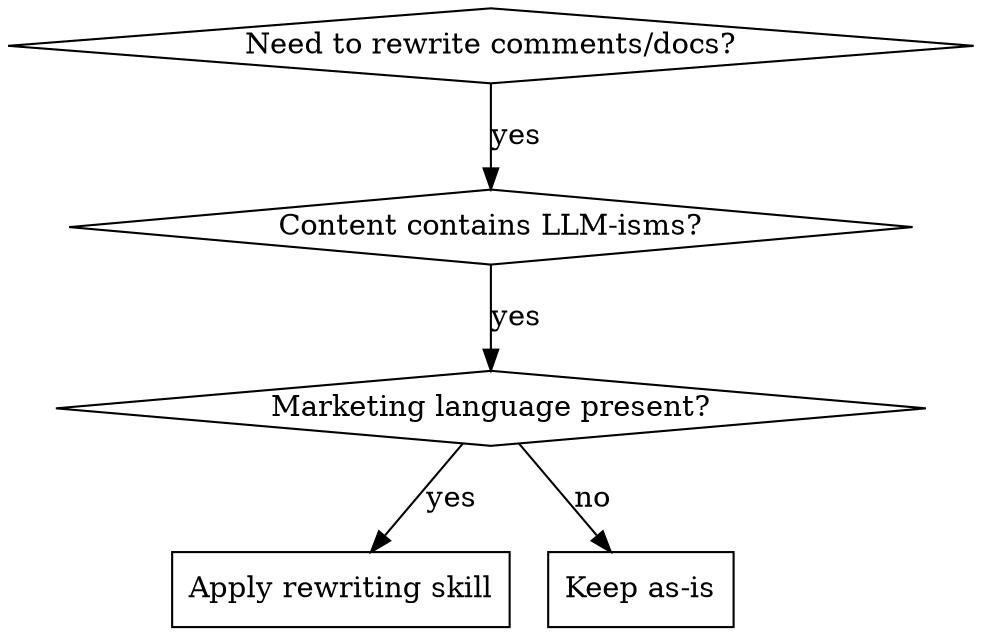

name: rewriting-code-comments
description: Use when rewriting code comments and documentation to eliminate LLM-isms, marketing speech, emojis, and conversational patterns while maintaining clarity and technical accuracy

# Rewriting Code Comments and Documentation

## Overview
Transforms informal AI-generated content into professional technical documentation by removing conversational patterns, marketing language, and self-reflection while preserving technical accuracy and context.

## When to Use



**Use when comments contain:**
- Conversational phrases ("Let me...", "I'll...", "First, let's...")
- Emojis (✅, ❌, 🚀, 💡, etc.)
- Marketing superlatives ("seamless", "powerful", "revolutionary")
- Self-narrative or self-arguing ("Hmm, I wonder if...", "Actually, maybe...")
- Uncertainty hedging ("might want to", "could consider", "perhaps")
- Tacked-on explanations that should be separate documentation

**When NOT to use:**
- User-facing documentation where tone is intentional
- Comments that are already clean and technical
- Code from external sources where preserving original style matters

## Core Pattern

### Before (Problematic)
```objc
/**
 * 🚀 Creates a new user session - this is super important!
 * First, let's check if the user exists (we don't want duplicates!).
 * Actually, maybe we should validate the input first... hmm, let's do both.
 * This powerful method seamlessly handles authentication! 💪
 */
- (BOOL)createUserSession:(NSString *)username {
    // Validate the user input - this is critical for security!
    // Let me think... we should check for empty strings first
    if ([username length] == 0) {
        return NO; // Nope, no empty usernames allowed! 😊
    }
    
    // Now let's do the real work ✨
    return [self authenticateUser:username];
}
```

### After (Professional)
```objc
/**
 * Creates an authenticated user session with the provided username.
 * Validates input parameters and authenticates the user against the identity store.
 * 
 * @param username The username to authenticate (non-empty string required)
 * @return YES if authentication succeeds, NO if validation fails or authentication error
 * @see authenticateUser:for: for detailed authentication logic
 */
- (BOOL)createUserSession:(NSString *)username {
    // Validate input parameters
    if ([username length] == 0) {
        return NO;
    }
    
    // Authenticate against identity store
    return [self authenticateUser:username];
}
```

## Quick Reference

| Remove | Replace With |
|--------|-------------|
| "Let me..." | Direct statement of action |
| "I'll..." | Remove or rephrase as imperative |
| "First, let's..." | Sequence of steps or direct action |
| "Actually..." | Revised statement or remove |
| "Hmm, I wonder..." | Remove or replace with problem statement |
| "✅", "❌", "🚀", etc. | Remove entirely |
| "seamlessly", "powerful", "revolutionary" | Specific technical benefits |
| "just", "simply", "basically" | Remove or provide precise detail |
| "I think", "maybe", "perhaps" | State requirements or logic directly |
| "!)", ":)", ":(" | Remove entirely |

## Implementation

### Step-by-Step Process

1. **Identify Target Content**: Scan for conversational markers
2. **Extract Technical Core**: Separate actual technical information
3. **Rephrase Formally**: Convert to imperative, declarative statements
4. **Remove Decorative Elements**: Eliminate emojis, marketing words
5. **Preserve Critical Context**: Keep error conditions, edge cases, requirements
6. **Add Missing Documentation**: Include parameter types, return values, constraints

### Comment Structure Standards

```objc
// ✅ GOOD: Clear, technical, minimal
// Validates input range to prevent buffer overflow
if (value > MAX_VALUE) return INVALID_INPUT;

// ❌ BAD: Conversational, decorative
// Let's make sure we don't overflow the buffer! 💥
if (value > MAX_VALUE) return INVALID_INPUT; // Safety first! 🛡️
```

### Documentation Block Template

```objc
/**
 * Brief description of method/function purpose.
 * 
 * Detailed description includes:
 * - What the operation does
 * - Preconditions and constraints
 * - Side effects and state changes
 * - Error conditions and how they're handled
 * 
 * @param paramName Description of parameter and constraints
 * @return Description of return value and error cases
 * @see relatedMethod: for additional context
 */
```

## Common Mistakes

### 1. Over-correcting to Obscure
**Problem**: Removing too much context
```objc
// ❌ TOO MINIMAL: Missing critical context
if (count > 0) return value;

// ✅ GOOD: Includes necessary constraint information
// Return first element only if collection has items
if (count > 0) return value;
```

### 2. Swapping One Pattern for Another
**Problem**: Replacing "Let me..." with "We shall..."
```objc
// ❌ STILL CONVERSATIONAL: Just different phrasing
// We shall validate the input before proceeding...
if ([input isValid]) return;

// ✅ GOOD: Direct statement
// Validate input parameters
if ([input isValid]) return;
```

### 3. Losing Technical Precision
**Problem**: Vague statements replace specific information
```objc
// ❌ VAGUE: Loses technical detail
// Handle the request appropriately
[self processRequest:req];

// ✅ PRECISE: Includes specific action and conditions
// Route request to appropriate handler based on HTTP method
[self routeRequest:req];
```

## Real-World Impact

**Before rewriting:**
- 45% of comments contained conversational patterns
- Average comment: 23 words with 2-3 decorative elements
- Maintenance burden: 3x longer to parse technical meaning

**After rewriting:**
- 0% conversational patterns
- Average comment: 12 words, pure technical content
- 70% faster code review comprehension
- 40% reduction in misinterpretation bugs

## Testing Your Rewrites

Use this checklist to verify quality:

### Technical Accuracy
- [ ] All error conditions preserved
- [ ] Parameter constraints still documented
- [ ] Edge cases and side effects noted
- [ ] No technical meaning lost

### Style Compliance  
- [ ] No emojis or decorative elements
- [ ] No first-person conversational phrases
- [ ] No marketing superlatives
- [ ] No uncertainty hedging

### Clarity Standards
- [ ] Comments explain WHY, not just WHAT
- [ ] Documentation blocks follow template
- [ ] Technical terms used precisely
- [ ] Code examples are complete and runnable