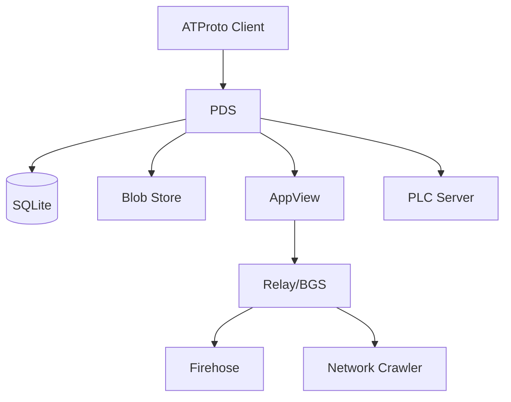

# ATProto PDS Architecture

Garazyk implements the AT Protocol Personal Data Server (PDS) specification in Objective-C,
with a sans-I/O networking layer that decouples protocol logic from transport.

## Service Boundaries

## Key Architectural Decisions

### Sans-I/O Networking

The HTTP stack separates protocol state (`HttpProtocolDriver`) from connection management
(`HttpConnectionIOCoordinator`). This enables the code to run across bare-metal sockets,
WebSocket proxies, or test harnesses without modification.

### SQLite with WAL Mode

All persistent state uses SQLite in Write-Ahead Log mode. Each actor gets an isolated
database. Connection pooling is managed by `PDSServiceDatabases`.

### AVFoundation / FFmpeg Media

Video transcoding uses AVFoundation hardware acceleration on macOS and FFmpeg on Linux
for H.264/H.265 processing.

## Data Flow

1. Client sends XRPC request over HTTP
2. `HttpProtocolDriver` parses headers, validates auth
3. Route pack dispatches to handler
4. Handler reads/writes actor store via `PDSActorStore`
5. Response serialized through the sans-I/O layer

## Database Layer

See `Garazyk/Sources/Database/ARCHITECTURE.md` for the full database architecture.
See `Garazyk/docs-site/src/content/docs/core-server/sqlite-persistence.md` for SQLite specifics.

## More Detail

- [AT Protocol fundamentals](https://atproto.com/specs/pds)
- [Merkle Search Trees](../../../Garazyk/docs-site/src/content/docs/atproto/merkle-search-trees.md)
- [Sans-I/O architecture](../../../Garazyk/docs-site/src/content/docs/advanced-parsing/sans-io-architecture.md)
