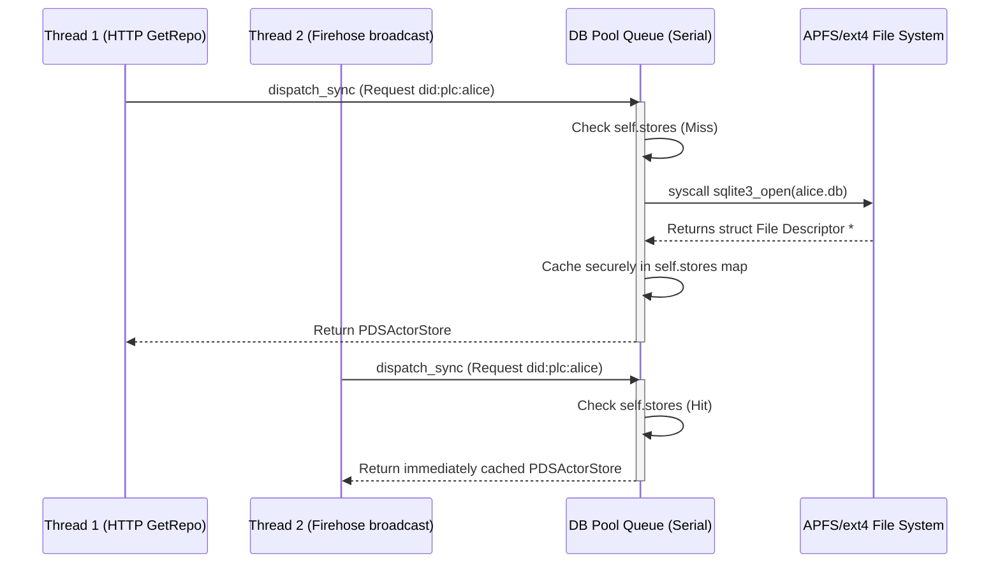

The `DatabasePool` is widely considered the single most complex and critical concurrency coordination bottleneck in the entire `ATProtoPDS` architecture. 

In a traditional web application, you typically have one giant PostgreSQL database. In an AT Protocol Personal Data Server (PDS), the architecture is fundamentally decentralized: potentially tens of thousands of users natively host their independent cryptographic repositories simultaneously on the local disk. From an engineering perspective, this means the backend must orchestrate **over 100,000 discrete `.db` SQLite files** efficiently, safely, and simultaneously without corrupting data or fatally exhausting the operating system's file descriptor limits.

This deep dive covers the three primary mechanisms `DatabasePool` gracefully employs to guarantee unyielding stability and highly parallel performance under massive concurrent load: mitigating TOCTOU race conditions, rigorously enforcing LRU file descriptor bounds, and cleanly circumventing filesystem-level inode degradation via prefix sharding.

## Preventing TOCTOU Bugs and DB-Opens

A **Time-of-check to time-of-use (TOCTOU)** race condition (categorized formally as CWE-367) occurs in multi-threaded environments when Thread A checks a shared state, gets briefly pre-empted by the OS kernel scheduler, and Thread B alters that exact state *before* Thread A resumes execution.

In a hyperactive PDS environment, the outbound Firehose and incoming HTTP sync requests are violently concurrent. If 50 different remote WebSocket relays requesting the Firehose updates for `@jack.bsky.social` hit the server at the exact same millisecond, a naive, un-synchronized Database Pool implementation might check memory and detect that `jack.db` isn't yet loaded. It would then recklessly spawn 50 concurrent `sqlite3_open` system calls targeting the exact same underlying file pointer on 50 different asynchronous threads. 

This deeply unsafe behavior immediately corrupts the OS POSIX byte-range locks, corrupts the WAL (Write-Ahead Log), and triggers a fatal `SIGABRT`, crashing the entire server.

### The Serial Dispatch Queue Lock

To fundamentally and completely prevent this, connection instantiation inside `ATProtoPDS` is forced onto a strictly serial, deeply synchronized Grand Central Dispatch (GCD) queue named `com.atproto.pds.databasepool`. This queue effectively acts as a granular, high-performance, immutable mutex lock.

```objc
// self.poolQueue is strictly instantiated as DISPATCH_QUEUE_SERIAL
- (nullable PDSActorStore *)storeForDid:(NSString *)did error:(NSError **)error {
    __block PDSActorStore *store = nil;

    dispatch_sync(self.poolQueue, ^{
        // 1. MUST BE UNDER LOCK: Thread A checks the shared state memory dictionary. 
        //    If Thread B already opened this db millseconds ago, we hit the cache instantly.
        store = self.stores[did];

        if (store) {
            self.lastAccessTime[did] = [NSDate date]; // Update access time for LRU Eviction
            return;
        }

        // 2. We are under the lock. Thread A is mathematically guaranteed 
        //    to be the ONLY thread executing an open sequence on this entire server.
        store = [PDSActorStore storeWithDid:did dbPath:dbPath error:&blockError];

        // 3. Save the pointer to the heap cache before gracefully releasing the lock.
        if (store) {
            self.stores[did] = store;
            self.lastAccessTime[did] = [NSDate date];
            self.openFileHandleCount++;
        }
    });

    return store;
}
```



This strict funneling architecture guarantees that regardless of inbound request concurrency spikes, only a single, hyper-safe file descriptor initialization occurs per core SQLite database.

## LRU File Eviction & Descriptor Bounds

Because a PDS server physically cannot keep 100,000 active SQLite file handles (`*FD`) open indefinitely in RAM, the `DatabasePool` implements an aggressive, thread-safe **Least Recently Used (LRU) Cache**. 

If a server blindly exceeds the strict UNIX boundaries for maximally open file descriptors (typically defined globally by `ulimit -n`), the application will suffer total socket starvation. The `HttpRouter` will abruptly fail to accept any new incoming TCP network connections, instantly taking the server completely offline.

### Eviction Mechanisms

The `DatabasePool` employs two critically complementary file eviction strategies:

1. **Synchronous Capacity Eviction (Emergency Release):**
   If the maximum configured pool size limit (e.g., 30,000 active handles) is fundamentally breached during a `dispatch_sync` database open request, the pool halts. It immediately calculates the oldest tracked entry inside `self.lastAccessTime` and brutally evicts it inline (`evictLRUStore()`) before proceeding to open the *new* database request. This guarantees the pool never permanently grows beyond its hard ceiling.
   
2. **Asynchronous Sweeping (Garbage Collection):**
   A low-priority background `dispatch_queue` (`com.atproto.pds.databasepool.eviction`) fires a sweeping background `NSTimer` every 60 seconds. It briefly locks the pool matrix, iterates linearly through the most recent access times, and proactively identifies completely stale databases that have remained totally untouched for over **300 seconds (5 minutes)**. It rigorously yields any pending WAL write transactions internally and explicitly calls `sqlite3_close()`.

By actively grooming the active handle set throughout both synchronous constraints and asynchronous sweeps, the PDS maintains a beautiful, perfectly predictable memory footprint and strictly honors the host system kernel limits.

## Prefix-Sharding Directories

It is a well-known vulnerability that standard Linux and macOS filesystems (like strictly ext4 or APFS trees) experience catastrophic $O(N)$ lookup degradation when naively placing 1,000,000 files in a single flat directory node. Any standard `stat`, `open`, or even bash `ls` command becomes profoundly and unusably slow as the underlying inode index heavily balloons to accommodate the massive tree. 

`DatabasePool` proactively and gracefully defeats this by strictly prefix-sharding user databases dynamically upon creation. Instead of lazily dumping handles into a flat map like `/repos/did:plc:z72i7hxjnkco.db`, it smartly parses the cryptographic string, isolates the exact method and unique prefix, and heavily nests the writes into predictable subdirectories.

### The Sharding Algorithm

Given a decentralized identifier (DID) like `did:plc:z72i7hxjnkco`:

1. System extracts the resolving method string (`plc`).
2. System extracts the first two string characters of the unique identifier hash (`z7`).
3. System mathematically constructs the deeply nested path: `{dbRoot}/plc/z7/did:plc:z72i7hxjnkco`.

> [!NOTE]
> The central infrastructure service database (`__service__`) entirely bypasses this nested sharding logic. It is decisively pinned directly to `{dbRoot}/service.db` for the absolute fastest instantaneous core system lookups.

By intentionally graphing and grouping DIDs structurally based on their string prefix, each individual filesystem folder dynamically remains extremely lean and small (rarely physically exceeding a few hundred files per folder). This architectural choice grants the Core Server layer $O(1)$ instantaneous disk lookups when booting cold queries off SSD storage arrays.

## Summary

The `DatabasePool` successfully virtualizes 100,000+ localized SQLite files into what logically appears to the rest of the high-level application as an incredibly responsive, seemingly infinite, concurrency-safe singular data store. 

By strategically funneling file instantiations through a serial GCD memory lock, strictly bounding RAM/kernel resources via mathematical LRU eviction, and physically isolating files structurally with prefix sharding, `ATProtoPDS` avoids the catastrophic, system-crashing pitfalls of raw scale on local standard filesystems.