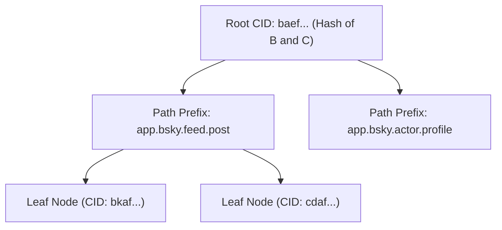

The absolute core data structure powering the entirety of the AT Protocol is the **Merkle Search Tree (MST)**. It is a highly deterministic, perfectly balanced cryptographic tree that gracefully acts as a key-value store mapping physical repository paths (e.g. `app.bsky.feed.post/3kabc123`) to unforgeable Content Identifiers (CIDs).

Because absolutely every node explicitly mathematically hashes its own underlying children, the single Root CID of the tree powerfully serves as a unified cryptographic summary of the user's *entire* decentralized repository.

## IPFS Content Identifiers (CIDs)

ATProto natively integrates profound ideas directly from the **InterPlanetary File System (IPFS)** to algorithmically build these mathematical tree pointers. Specifically, every single node pointer (edge) in an interconnected MST is definitively a `CID` (Content Identifier).

Unlike traditional web URLs that insecurely point to a physical **location** (`https://server.com/image.png`), which might silently change data maliciously tomorrow, a CID strictly points to the **content itself**. It is mathematically impossible for the content behind a CID to change without the CID itself completely changing.

Every CID deployed in the ATProto PDS is formatted explicitly following the rigid IPFS spec format:
1. **Multibase Prefix**: Defines the string encoding (e.g. `b` natively represents `base32`).
2. **CID Version**: Currently ATProto strictly only uses `CIDv1` across the network.
3. **Multicodec**: Defines exactly what underlying data type the hash points to. ATProto strictly uses `dag-cbor` (Directed Acyclic Graph mapped to Concise Binary Object Representation) for all repository records and `raw` for attached blob binaries.
4. **Multihash**: The cryptographic algorithm used (e.g., `sha2-256`) and the appended 32-byte hash digest itself.

Because CIDs inherently include the physical SHA-256 hash of their content, they absolutely cannot be mutated. If a user maliciously alters a single character in a blog post payload, the CID physically changes. Consequently, this violently invalidates the parent nodes in the MST mapping all the way recursively up the hierarchy to the singular Root CID.

## The Objective-C Repository Model

Our high-performance server implementation permanently resides under `ATProtoPDS/Sources/Repository/`. Because repeatedly calculating deeply nested SHA-256 hashes of CBOR-encoded objects is tremendously CPU-intensive, we rigorously optimize our MST implementation directly on the metal natively.

1. **Deterministic CBOR Serialization:** Standard JSON is physically ambiguous (e.g., whitespace variations, dictionary key ordering). We forcefully encode literally all tree nodes into strict DAG-CBOR (Concise Binary Object Representation) to irrevocably ensure absolute bit-for-bit mathematical equivalence across heterogeneous platforms.
2. **Lightning CID Generation:** The tree engine rapidly hashes the tight CBOR payload using native `CC_SHA256` (Apple's CoreCrypto) or `EVP_sha256` (OpenSSL) and cleanly formats it as a CIDv1 multihash entirely in memory without hitting the disk.
3. **Optimized Database Lookups:** Since aggressively loading an entire 2-million node tree into RAM is completely impossible for massive celebrity repositories, the virtual MST is heavily backed by the physical SQLite `DatabasePool`. We utilize advanced SQL logic to only traverse and pull specifically the exact sub-nodes that are strictly affected by a newly incoming HTTP write operation.

## Generating the Replicating CAR File

When a remote AppView or a Relay asks to actively "sync" a user repository across the internet (often via the `com.atproto.sync.getRepo` endpoint or the real-time websocket Firehose), we absolutely do not serialize and blindly send thousands of individual JSON objects in an array. 

Instead, the recursive MST engine efficiently yields all "dirty" or requested raw CIDs in a localized stream. These raw CBOR blocks are efficiently heavily encoded into a highly compact **CAR (Content Addressable aRchives)** streamable binary format.

The `Repository` Objective-C module fundamentally, essentially acts as a mathematically pure filesystem, where every single data block is addressable entirely by its inherent SHA-256 cryptographic hash. This phenomenal design makes the sync operation between the PDS and the AppView utterly, mathematically verifiable, definitively preventing any man-in-the-middle data forgery.
