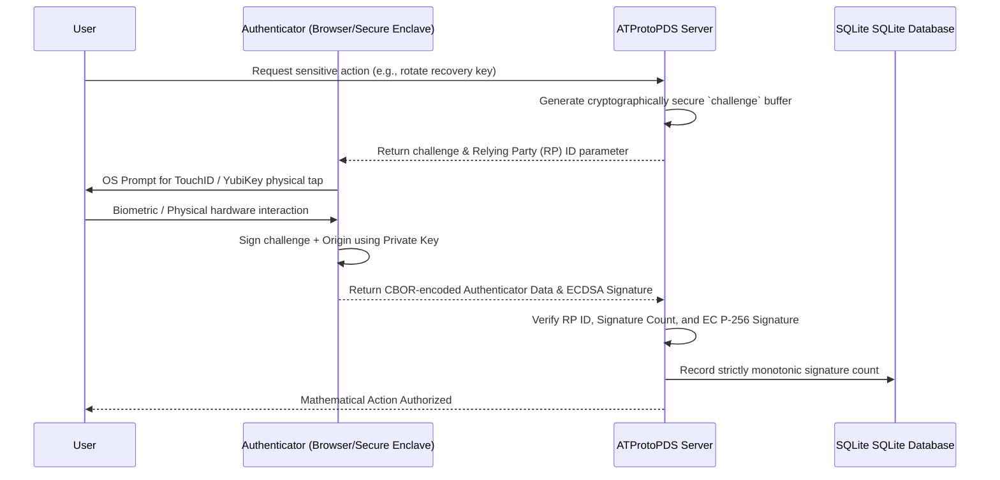

To fundamentally secure the PDS (Personal Data Server) administrative routes or highly sensitive identity-mutation endpoints (such as actively migrating a Decentralized Identifier (DID) to a new host or rotating a master recovery key), `ATProtoPDS` provides deep, native integrations with cryptographic hardware tokens directly in Objective-C. 

Relying solely on traditional passwords or emailed static codes for a decentralized identity server introduces incredibly severe, often unrecoverable phishing vectors. In a federated network like the AT Protocol, an account takeover does not just mean losing access to a website; it can lead to the malicious cryptographic transfer of the identity itself to another server, permanently locking out the original user forever. This document outlines the comprehensive hardware security mechanisms physically embedded into the PDS architecture.

## The Case Against Passwords in Decentralized Identity

In traditional web architectures, compromised credentials can often be mitigated through centralized support channels or password resets. In decentralized protocols, a compromised DID controlling private key is absolute. 

Standard authentication mechanisms, such as passwords, magic links, or SMS-based One Time Passwords (OTP), are structurally vulnerable to:
- **Phishing and Man-in-the-Middle (MITM) Attacks:** Real-time reverse proxies (like Evilginx) can perfectly intercept passwords and session cookies, bypassing standard OTPs by proxying the request to the real server.
- **Credential Stuffing:** Attackers reusing compromised passwords from other third-party website breaches.
- **Keyloggers and Malware:** Capturing manual keyboard input on user-compromised desktop devices.

To decisively mitigate these systemic risks, `ATProtoPDS` prioritizes un-phishable cryptographic proofs of identity via hardware authenticators.

---

## WebAuthn (FIDO2) and Passkeys

**Passkeys** and roaming hardware authenticators (like a physical USB NFC YubiKey or a Macbook's TouchID Secure Enclave) utilize the standard Web Authentication API (WebAuthn) to mathematically prove user presence and identity *without* ever transmitting a shared secret or password over the internet wire.

Instead of hashing a password, WebAuthn relies entirely on asymmetric public key cryptography. During registration, the authenticator hardware generates a unique key pair: the public key is registered with the PDS database, and the private key is permanently burned into the hardware device. The private key physically cannot be extracted or stolen by malware.

### The WebAuthn Ceremony: A Detailed Flow

When a user attempts a highly sensitive action, the PDS server proactively initiates a WebAuthn "ceremony". This rigorous process guarantees that the authentication attempt is cryptographically fresh, strictly bound to the correct domain, and actively authorized by the physical user.



1. **Challenge Generation:** The PDS generates a high-entropy, cryptographically secure 32-byte `challenge` buffer to definitively prevent replay attacks.
2. **User Interaction:** The user's browser securely prompts them to verify their identity via the operating system (e.g., tapping a security key or using TouchID/FaceID).
3. **Cryptographic Signature:** The hardware authenticator signs the challenge alongside the exact web Origin domain and returns a complex DAG-CBOR encoded payload.

### Objective-C Integration: `WebAuthnVerifier`

The PDS uses the proprietary Objective-C `WebAuthnVerifier` routing class to rigidly validate this payload. Because ATProto natively relies heavily on DAG-CBOR for its Merkle trees, the PDS is uniquely equipped to rapidly and securely decode the WebAuthn authenticator data bytes.

> [!NOTE]
> The `WebAuthnVerifier` relies exclusively on the `ATProtoCBORSerialization` core parsing library to safely parse the nested authenticator payload without exposing the server to malformed input buffer vulnerabilities or C-level heap overflows.

Here is the core mathematical verification logic natively implemented in the backend:

```objc
// 1. Verify the relying party (RP) ID mathematically matches our exact PDS domain.
// This ENTIRELY eliminates zero-day phishing, as the generated signature is 
// strictly bound to the domain. If EvilGinx intercepts this on "evil-bsky.com", 
// the RP hash will fundamentally differ and the validation will violently fail.
if (![authenticatorData.rpIdHash isEqualToData:[CryptoUtils sha256:domain]]) { 
    return @{ @"error": @"rpId_mismatch" }; 
}

// 2. Validate the strict monotonic signature counter to prevent cloned-key replay attacks.
// Physical hardware keys increment a counter on every single use. If the counter 
// unexpectedly physically goes backwards or stays the same, the key may have been physically cloned.
if (authenticatorData.signCount <= storedCredential.signCount) {
    return @{ @"error": @"cloned_key_detected" };
}

// 3. Verify the embedded EC P-256 signature against the stored credential public key.
BOOL isValid = [CryptoUtils verifyP256Signature:signature 
                                       overData:signedData 
                                 usingPublicKey:storedCredential.publicKey];

if (!isValid) {
    return @{ @"error": @"invalid_signature_math" };
}
```

> [!IMPORTANT]  
> You must ALWAYS enforce WebAuthn for administrative routes (such as `/xrpc/com.atproto.admin.*`) to absolutely prevent unauthorized server configuration changes by compromised session tokens.

---

## YubiKeyOATH: Hardware-Backed TOTP Fallback

As an incredibly robust fallback for headless API clients, automated CLI deployment scripts, or older hardware devices that fundamentally do not support the WebAuthn API, `ATProtoPDS` natively handles standard Time-Based One Time Passwords (TOTP). 

However, standard TOTP requires the user to open a 2FA app (like Apple Passwords or Google Authenticator) and manually type a 6-digit code on their keyboard. This manual entry can easily be intercepted by an MITM phishing proxy or secretly captured by an OS-level keylogger.

To decisively solve this, the backend utilizes the custom `YubiKeyOATH` module.

### Direct Smart Card Interaction

This module is designed to interact directly with the OATH applet running on a physical USB/NFC YubiKey connected to the server rack or client machine. By communicating over CCID (Chip Card Interface Device) low-level protocols natively compiled in macOS and Linux, the exchange happens entirely outside the reach of the web browser or standard keyboard input buffer.

```objc
// The YubiKeyOATHManager negotiates directly with the smart card silicon
// via PC/SC or Apple CryptoTokenKit depending strictly on the OS platform.
YubiKeyOATHManager *yubiKeyManager = [[YubiKeyOATHManager alloc] init];

// Send the raw TOTP challenge directly to the hardware token over USB.
// The user touches the physical gold contact on the key to authorize the electrical calculation.
[yubiKeyManager verifyCode:challenge 
                completion:^(BOOL success, NSError *error) {
    if (success) {
        // The human-readable 6-digit code was NEVER typed on a keyboard 
        // nor rendered on a screen, completely preventing key-logging and MITM interception.
        [self grantAdminAccess];
    } else {
        NSLog(@"Hardware TOTP verification failed due to CCID error: %@", error.localizedDescription);
    }
}];
```

By retrieving and verifying the calculated code directly via the USB/NFC hardware interface, the PDS aggressively ensures that even if the host machine is deeply compromised with a rootkit keylogger, the second-factor credential remains physically secure and un-phishable.

---

## Conclusion

Securing a Decentralized Identifier and the hard administrative boundaries of a federated Personal Data Server requires moving drastically beyond basic shared secrets. 

By comprehensively supporting both WebAuthn (Passkeys) for seamless browser-based flows and physical YubiKey challenge-responses for programmatic headless scenarios, `ATProtoPDS` enables true enterprise-grade security for user data. This strict defense-in-depth approach is deeply and natively integrated into the Objective-C networking and application layers, ensuring that sensitive identity-mutation endpoints remain impenetrable to global remote phishing and credential theft campaigns.
