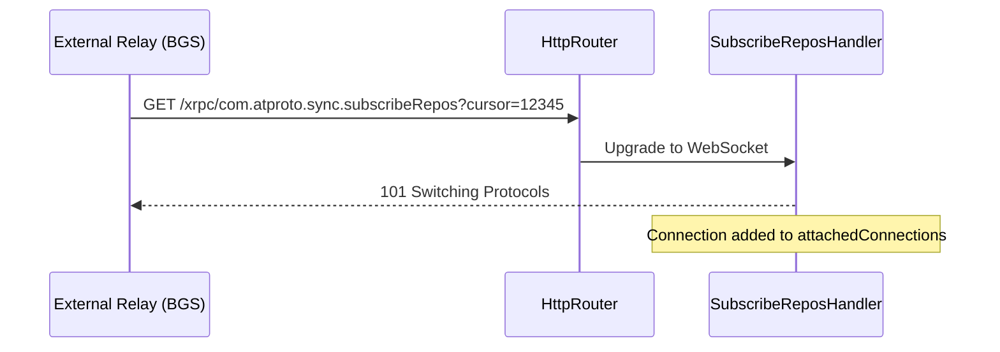

The crown jewel of a Personal Data Server (PDS) in the AT Protocol ecosystem is its ability to participate dynamically in the global federation. A PDS operating in isolation is largely invisible; to be part of the wider network, it must stream a massive "Firehose" of cryptographic repository mutations to the outer network via the `com.atproto.sync.subscribeRepos` endpoint. This streaming mechanism is what allows the Bluesky network to feel real-time and globally connected.

## What is a Firehose?

A Firehose is a permanently open WebSocket connection where the PDS continuously, and sequentially, emits events as they happen. These events are broadcasted synchronously alongside local database commits. Rather than external services continually polling the PDS for updates, the PDS aggressively pushes state changes down the socket, enabling near-instantaneous propagation of data.

When a user interacts with the network by writing data—such as creating a new post, liking a skeet, or following another account:
1. The local SQLite Database on the PDS is updated.
2. The user's Merkle Search Tree (MST) is re-rooted to include the new Content Identifier (CID).
3. The PDS packages this state delta into a DAG-CBOR payload.
4. The event is broadcasted immediately to all active WebSocket clients.

Typical consumers of this firehose include Relay servers (often called Big Graph Services or BGS) and AppViews (like the official Bluesky AppView), which aggregate data from thousands of PDS instances to present a unified chronological timeline to users.

### Event Kinds

There are three primary Event Kinds emitted over the `ATProtoPDS` firehose. Each serves a distinct purpose in keeping external consumers synchronized with the PDS's internal state:

- **`FirehoseEventKindCommit`**: A user updated their repository (e.g., liked, posted, deleted). This is the most common event type. This event contains the raw CAR (Content Addressable aRchives) blocks representing the exact Merkle Search Tree (MST) diff. Consumers apply these blocks to their local copy of the user's repository to mirror the changes.
- **`FirehoseEventKindIdentity`**: A user rotated their DID (Decentralized Identifier) recovery keys, updated their handle, or migrated to a new PDS. This signals to relays that they must re-fetch or re-verify the user's DID document.
- **`FirehoseEventKindError`**: A stream error occurred, or a requested sequence cursor is invalid. This informs the consumer that the connection must be closed or that they request an impossible state segment.

## Architecture: `SubscribeReposHandler`

To handle potentially thousands of demanding relays listening to your server simultaneously, our Objective-C backend utilizes a specialized `WebSocketServer` broadcasting architecture orchestrated by the `SubscribeReposHandler`. Performance and memory safety are critical here, as backpressure from slow consumers could otherwise crash the server.

### 1. Connection Lifecycle

Whenever a new WebSocket upgrade completes on `/xrpc/com.atproto.sync.subscribeRepos`, the HTTP router delegates the connection to the `SubscribeReposHandler`. 



### 2. Notification Broadcasts

Actor data is managed by the `PDSDatabasePool`. When the pool successfully commits a transaction locally via its Serial Write Queue, it fires a global `NSNotification` (`PDSRecordDidChangeNotification`). This notification acts as the trigger for the firehose, containing the raw block data and the affected repository's DID.

### 3. Event Dispatch & Serialization

The `SubscribeReposHandler` listens for this notification on its dedicated serial dispatch queue (`com.atproto.pds.subscribeRepos.events`). A deterministic serial queue ensures strict chronological ordering and guarantees that sequence numbering is monotonically increasing without race conditions.

The handler serializes the updated CAR blocks and dispatches an asynchronous socket write to *every* registered subscriber simultaneously.

```objc
// Simplified broadcast loop responding to a DB commit event
dispatch_async(self.eventQueue, ^{
    
    // 1. Serialize the new ATProto Record into a DAG-CBOR FirehoseCommitEvent
    NSData *cborEvent = [self serializeEvent:commitData];
    
    // 2. Wrap the CBOR payload mathematically into a WebSocket Binary Frame
    NSData *wsFrame = [self wrapInWebSocketBinaryFrame:cborEvent];
    
    // 3. Iterate over the active subscribers
    for (WebSocketConnection *sub in self.attachedConnections) {
        
        // 4. Fire a non-blocking TCP socket write across the network
        // Includes backpressure checks to drop slow consumers
        [self sendEventData:wsFrame toConnectionWithBackpressureCheck:sub];
    }
});
```

## Resilience and Scale

Operating a firehose at scale requires defensive programming. A public PDS is exposed to the open internet, meaning it must protect itself from resource exhaustion caused by misbehaving, malicious, or merely slow relays.

### Backpressure and Slow Consumers

Because the broadcast method pushes bytes to a non-blocking POSIX socket and executes asynchronously, **one slow external Relay cannot bottleneck the rest of the server**.

The `SubscribeReposHandler` implements strict backpressure limits:
- **`kSubscribeReposMaxPendingBytesDefault` (16MB):** Subscriptions are memory intensive. If a client's TCP window fills up and pending unsent bytes exceed 16MB in memory, the PDS considers the consumer too slow. It yields a `ConsumerTooSlow` error frame and forcefully drops the connection. This prevents memory bloat on the server and ensures fast consumers are not penalized by slow ones.

### Cursor Replay (Catching Up)

It is expected that relays will disconnect occasionally (e.g., due to network drops or restarts). When they reconnect, they provide a `cursor` (sequence number) in the connection URL query parameters to resume exactly where they left off without missing events.

- The PDS maintains a global, monotonically increasing sequence number (cursor) for every event in its `ServiceDatabases` (typically an auto-incrementing integer).
- Upon reconnection with a specific cursor, the `SubscribeReposHandler` fetches historical events occurring after that exact cursor and replays them rapidly in batches (`kSubscribeReposReplayBatchSize`).
- To prevent database abuse and excessive I/O, replays are capped (e.g., `kSubscribeReposMaxReplayEventsDefault` is typically limited to a few thousand). 
- If a relay falls too far behind the current state and requests a cursor that is older than the configured local retention, it receives an `OutdatedCursor` error. In this scenario, the relay must resynchronize the entire repository state over HTTP via standard sync endpoints (`com.atproto.sync.getRepo` or `com.atproto.sync.getBlocks`) before reconnecting to the real-time firehose.

## Conclusion

The Firehose is the beating heart of an ATProto PDS, delivering instant updates across the global network. By combining sequential event queues, strictly enforced backpressure limits, and non-blocking I/O architectures, the Objective-C PDS implementation efficiently fans-out thousands of repository mutations per second. This ensures robust federation without compromising the responsiveness or stability of local read/write endpoints.

> [!NOTE]
> Ensure your network infrastructure (like reverse proxies or load balancers) does not restrict long-lived HTTP/1.1 connections, or your firehose streams will be frequently terminated!
