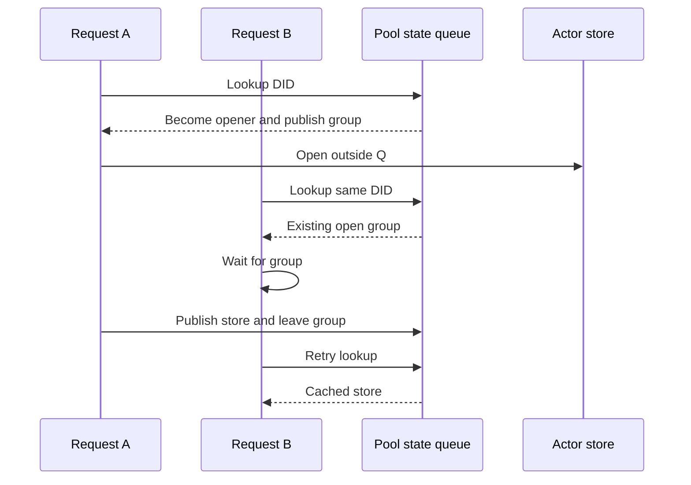

`PDSDatabasePool` caches one `PDSActorStore` per active repository DID. Each
actor store owns an actor-scoped SQLite database. The pool coordinates store
creation and eviction while allowing database work to run outside the pool's
state queue.

## Pool state

The serial queue `com.atproto.pds.databasepool` protects:

- the DID-to-store cache
- last-access timestamps
- active-use counts
- in-progress open groups
- the known-DID set and pool metrics

Callers must not perform actor database work on this queue. Holding the queue
across SQLite I/O would serialize unrelated repositories.

## Coordinated opens

The first request for an uncached DID creates a dispatch group and records it in
`pendingOpenGroups`. The pool then releases its state queue and opens the actor
store. Requests for the same DID find that group, wait for it, and retry the
cache lookup.



This avoids duplicate store objects without blocking every pool lookup behind
one filesystem open. Opening multiple SQLite connections to one database is
valid; the issue here is duplicate actor store ownership and lifecycle state,
not inevitable WAL corruption.

## Active-use tracking

`readWithDid:block:error:` and `transactWithDid:block:error:` increment an actor
store's active-use count before invoking the block and decrement it afterward.
Eviction skips stores with a nonzero count.

Code that calls `storeForDid:error:` directly receives the cached object but
does not acquire this lease. Long operations should use the read or transaction
APIs when they need eviction protection.

## Eviction

The public initializer configures a 60-second sweep interval and a five-minute
idle threshold. Sweeps remove inactive stores whose last access is older than
the threshold. When inserting into a full cache, the pool also attempts to evict
the least recently used inactive store.

Store closure runs on the eviction queue after the cache entry has been removed.
This keeps close work off the pool state queue.

`maxSize` is a cache target when every candidate is active, not permission to
close a store that a caller is using. Operators should size the pool and process
file-descriptor limit together and monitor `collectMetrics`.

## DID path sharding

Before deriving a path, the pool validates the DID. Actor databases are grouped
by DID method and the first two characters of the method-specific identifier:

```text
did:plc:z72i7hxjnkco
    -> <db-root>/plc/z7/did:plc:z72i7hxjnkco
```

The special `__service__` store uses `<db-root>/service.db`. Sharding keeps one
directory from collecting every actor database and gives operators a predictable
layout for backup and inspection.

Directory creation and path validation can fail. Callers must propagate the
returned error instead of constructing actor paths independently.
