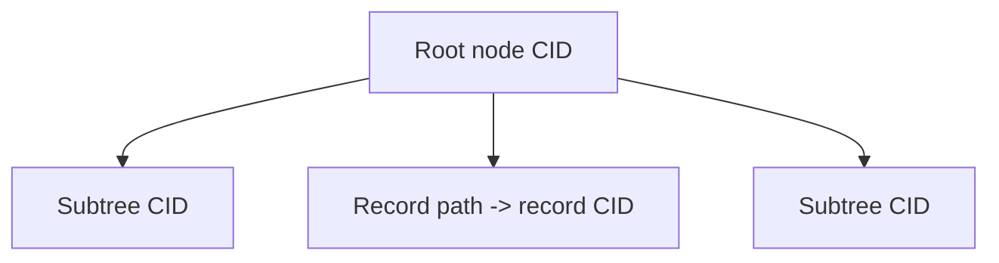

An AT Protocol repository stores record paths in a Merkle Search Tree (MST).
Each key has the form `<collection>/<record-key>`, and its value is the CID of
the corresponding record block.

The MST is deterministic: the key bytes determine an entry's tree layer, and
entries remain ordered by key. Two implementations given the same key-to-CID
mapping produce the same node blocks and root CID.

## Content identifiers

A CID identifies bytes rather than a storage location. AT Protocol repository
blocks normally use:

- CID version 1
- the `dag-cbor` multicodec for records, MST nodes, and commits
- the `sha2-256` multihash
- base32 when a CID is rendered as text

Blob CIDs use the `raw` multicodec. A CID is immutable by construction: changing
the encoded bytes changes the digest and therefore the CID.

MST nodes contain record entries and links to child nodes. Because each link is
another CID, a change to one record produces new blocks along the path to the
root. Unchanged subtrees retain their existing CIDs and can be reused.

## Deterministic layout

MST placement is derived from the leading zero pairs in a hash of the key. The
resulting levels have a probabilistic distribution, but no runtime randomness is
involved. This gives independent implementations the same layout without storing
balancing metadata.

Node entries use prefix-compressed keys. Nodes serialize to the canonical
DAG-CBOR shape defined by the AT Protocol repository specification. Encoders
must preserve the required field and entry order; ordinary JSON serialization is
not a substitute.

## Garazyk implementation

`Garazyk/Sources/Repository/MST.*` owns in-memory tree operations, node
encoding, CID calculation, diffs, and traversal. Persistence code resolves node
CIDs through a block provider and can load subtrees on demand.

Writers use copy-on-write nodes and publish a new root after the mutation is
complete. Readers capture a root snapshot before walking, so a concurrent
publication does not change the tree they are traversing.

The main operations are:

- `get:` to resolve a record path
- `put:valueCID:` to add or replace a record CID
- `delete:` to remove a path
- diff and proof traversal for synchronization
- CAR export for repository transfer

## Commits and CAR files

An MST root is referenced by a signed repository commit. The commit also
includes the repository DID, revision, and previous commit link. Consumers
verify the commit signature with the account signing key from the DID document.

A CAR v1 file packages the commit and referenced DAG-CBOR blocks as a
content-addressed stream. CAR readers must verify that each block's bytes match
its CID and that the commit points to the expected MST root. A valid container
alone does not establish repository authenticity; signature and structure checks
are separate requirements.
