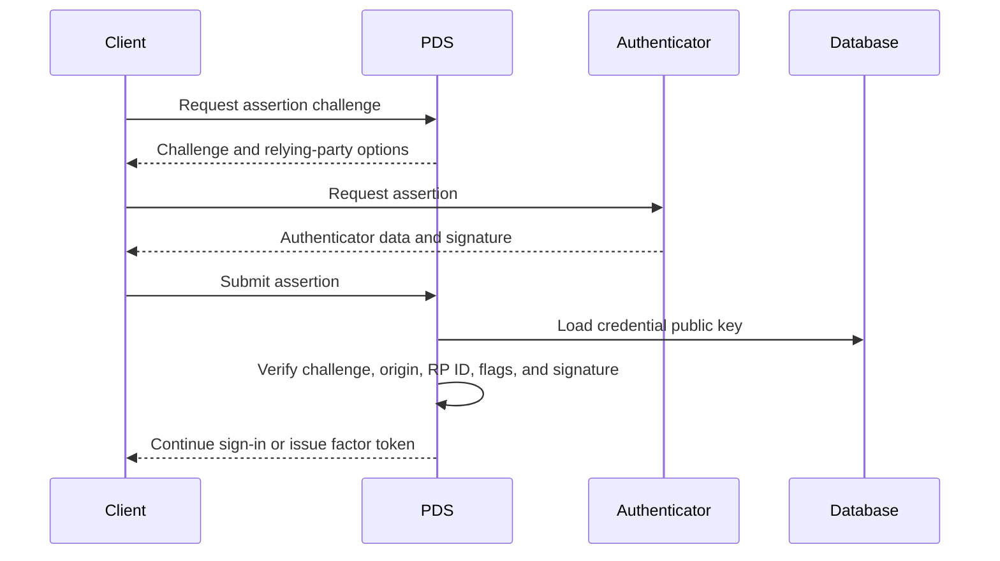

Garazyk supports WebAuthn credentials for passkey sign-in and account
second-factor checks. WebAuthn uses a public-key credential scoped to a relying
party, which resists credential replay on a different origin.

Passkeys are not guaranteed to live on one physical device. Some platform
providers synchronize them across a user's devices. The security contract is the
WebAuthn ceremony and credential policy, not an assumption that every private
key is non-exportable hardware.

## Registration

During registration, the server sends a random challenge and relying-party
configuration to the browser. The authenticator creates a credential and returns
an attestation object plus client data.

The server validates:

- the challenge and expected ceremony type
- the browser origin and relying-party ID hash
- authenticator-data framing and flags
- the credential ID and public key encoding
- the configured user-verification requirement

Garazyk stores the credential ID, public key, account DID, and signature counter
in the service database.

## Authentication

Authentication uses a fresh challenge associated with an OAuth or second-factor
session:

`WebAuthnVerifier` parses the client and authenticator data, reconstructs the
signed bytes, and verifies the assertion with the stored key. P-256 WebAuthn
verification accepts both low-S and high-S ECDSA signatures, as required for
interoperability with authenticators.

Signature counters require careful handling. A positive counter that moves
backwards can indicate a cloned authenticator, but authenticators are allowed to
report zero. Do not reject every repeated zero as a clone.

## Second-factor tokens

`PDSSecondFactorService` creates short-lived WebAuthn challenges for accounts
configured to require a second factor. A successful assertion yields a
short-lived factor token. Sensitive account and administrative operations can
require that token in addition to the primary session.

Challenge and factor-token state is time-bounded and single-use. Callers should
treat timeout, invalid assertion, unavailable credential, and expired token as
distinct failures.

## TOTP and YubiKey status

`TOTPService` provides software TOTP verification. The `YubiKeyOATHManager` type
remains as a compatibility boundary, but the PDS process does not implement
YubiKey discovery, CCID access, or hardware OATH credential management. Hardware
methods return `YubiKeyOATHErrorNotImplemented`.

Use a YubiKey as a WebAuthn security key when hardware-backed authentication is
required. Do not configure the current OATH helper as though it talks to a USB
or NFC token.

## Operational guidance

- Serve WebAuthn endpoints only over the expected HTTPS origin.
- Generate challenges with a cryptographically secure random source.
- Bind challenges to the account and ceremony that created them.
- Consume challenges and factor tokens once.
- Store public credential material, never authenticator private keys.
- Keep password or recovery flows separate and rate-limited.
- Log failure categories without logging assertion payloads or session secrets.
