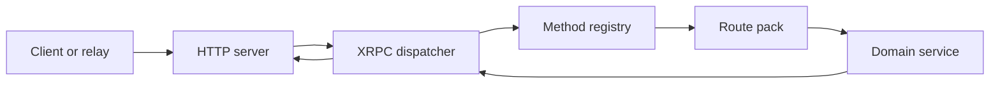

The AT Protocol separates account identity, personal data hosting, and
application views. A Personal Data Server (PDS) hosts repositories and account
services. Relays distribute repository events, and AppViews index records into
application-specific products such as feeds and search.

## Identity: DIDs and handles

An AT Protocol account has two public identifiers:

- A handle is a domain name intended for people to read and type. An account can
  change its handle.
- A decentralized identifier (DID) is the stable account identifier used in
  records and protocol references.

A handle resolves to a DID through either a DNS TXT record at
`_atproto.<handle>` or the HTTPS resource
`https://<handle>/.well-known/atproto-did`. Clients must confirm that the
resolved DID document claims the same handle before treating the pair as valid.

The DID document publishes the account's signing key and PDS service endpoint.
Garazyk supports the AT Protocol DID methods `did:plc` and `did:web`.

> [!NOTE]
> `did:plc` keeps identity updates in the PLC operation log and supports key
> rotation and PDS migration. A `did:web` identifier is bound to its domain, so
> losing control of that domain also loses control of the identifier.

### Safe handle resolution

Handle resolution performs outbound network requests using attacker-controlled
domain names. Garazyk applies `SSRFValidator` before connecting so loopback,
link-local, private, and other blocked destinations cannot be used to reach
internal services.

Resolution code must apply the same policy after every DNS lookup and redirect.
A hostname that was safe when first resolved can otherwise redirect or rebind to
a blocked address.

## XRPC and lexicons

XRPC maps namespaced methods to HTTP requests. Each method has an NSID such as
`com.atproto.server.createSession`. Lexicon documents define method parameters,
input encoding, output schema, and errors.

XRPC defines three method types:

- Queries use HTTP GET and carry parameters in the query string.
- Procedures use HTTP POST and may carry a JSON, DAG-CBOR, or binary body
  declared by the lexicon.
- Subscriptions start as HTTP requests and continue as event streams, commonly
  over WebSocket.

Lexicons also define repository record types such as `app.bsky.feed.post`.
Validation belongs at the wire boundary: handlers should reject malformed
parameters and bodies before they reach storage or service code.

## Garazyk request path

Garazyk registers XRPC methods by NSID and routes each request through the
relevant route pack:

The dispatcher is responsible for protocol-level parsing and response encoding.
Route packs enforce authentication and endpoint-specific input rules, then call
services that own repository, account, identity, or moderation behavior.

Use the repository's generated NSID constants when registering methods. This
keeps registrations aligned with the checked-in lexicons and lets the coverage
tooling detect missing endpoints.

## Repository identity

Repository records use the account DID in AT URIs and commit metadata. The PDS
signs repository commits with the account signing key published in the DID
document. Consumers can verify the commit signature and content-addressed root
without trusting the PDS transport that delivered the data.

Handles remain presentation and discovery names. Protocol data should store DIDs
wherever a stable account reference is required.
