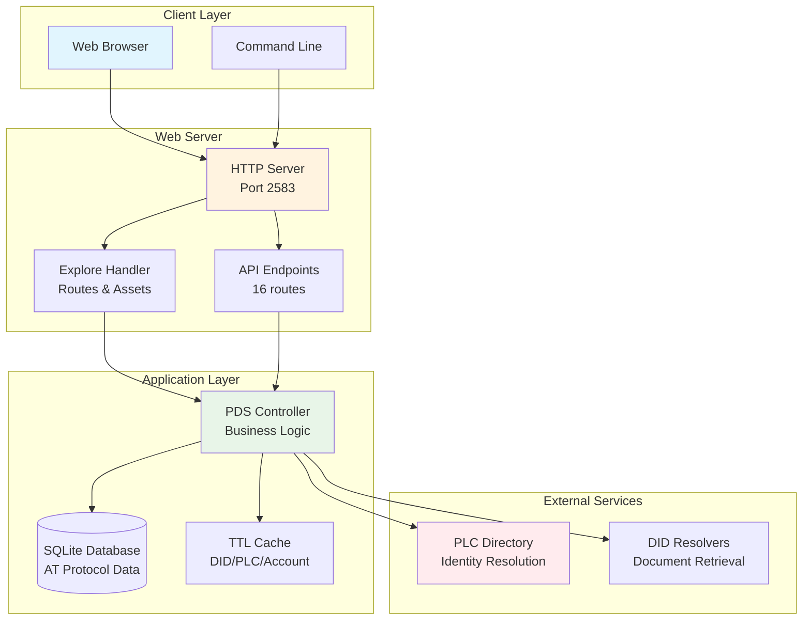

# NSPds - ATProto Personal Data Server

Standards-compliant AT Protocol Personal Data Server (PDS) implementation written in Objective-C for macOS.

## Features

- **AT Protocol Compliant** - Full implementation of AT Protocol specifications (DAG-CBOR, CAR v1, Firehose)
- **Secure Authentication** - OAuth 2.0, DPoP (Demonstrating Proof-of-Possession), and JTI replay protection
- **Biometric Security** - Hardware-backed cryptographic key storage using Secure Enclave & Keychain
- **Client-Side Caching** - 5-10 minute TTL reduces repeat loads from 600ms to 250ms
- **Parallel API Calls** - Promise.all reduces page loads by 58%
- **Interactive Explorer** - Web-based UI for exploring AT Protocol data
- **Auto-Generated API Docs** - OpenAPI 3.0 specification with interactive Swagger UI
- **Unified Logging** - Structured JSON logging with component filtering and request correlation
- **Comprehensive Test Suite** - 900+ tests across protocol, auth, repository, and integration layers

## Table of Contents

- [Quick Start](#quick-start)
- [Building from Source](#building-from-source)
- [Using the Explorer](#using-the-explorer)
- [API Documentation](#api-documentation)
- [Architecture](#architecture)
- [Development](#development)
- [Troubleshooting](#troubleshooting)
- [Contributing](#contributing)

## Quick Start

### Prerequisites

- macOS 14.0 or later
- Xcode 15.0 or later
- [XcodeGen](https://github.com/yonaskolb/XcodeGen) (`brew install xcodegen`)
- CMake 3.21 or later (`brew install cmake`)

### Installation

```bash
# Clone the repository
git clone https://github.com/jvalinsky/NSPds.git
cd NSPds

# Generate the project
xcodegen generate

# Build the CLI tool
xcodebuild -scheme ATProtoPDS-CLI build

# Start the server
./build/bin/atprotopds-cli serve
```

The server will start on `http://localhost:2583` by default.

### First Steps

1. **Show Help**: `./build/bin/atprotopds-cli help`
2. **Check Health**: `./build/bin/atprotopds-cli health --verbose`
3. **List Accounts**: `./build/bin/atprotopds-cli account list`
4. **Create Record**: `./build/bin/atprotopds-cli repo create-record <did> <col> <rkey> <json>`
5. **Open the Explorer**: Visit `http://localhost:2583/explore/`

## Building from Source

### Using XcodeGen & CMake (Recommended)

The project uses a unified CMake build system wrapped by XcodeGen.

```bash
# Regenerate project if project.yml or CMakeLists.txt changes
xcodegen generate

# Build CLI Tool
xcodebuild -scheme ATProtoPDS-CLI build
# Binary at: ./build/bin/atprotopds-cli

# Build & Run Unit Tests
xcodebuild -scheme AllTests build
./build/tests/AllTests
# Output: Tests run: <current suite count>, Failures: 0

# Build Fuzzers
xcodebuild -scheme Fuzzers build

# Wipe and Rebuild (Fresh Start)
./scripts/wipe_and_rebuild.sh
```

### Using Make (Legacy Support)

```bash
# Build all targets
make build

# Run tests
make test
```

### Dependencies

The project uses:
- **SQLite** for data persistence
- **OpenSSL** for cryptographic operations
- **libsecp256k1** for AT Protocol signing
- **Foundation** and **Security** frameworks

## Using the Explorer

### Web Interface

The explorer provides an interactive web interface for exploring AT Protocol data:

#### Main Features

- **DID Resolution**: Look up decentralized identifiers and handles
- **Repository Exploration**: Browse accounts, collections, and records
- **CID Decoding**: Decode and analyze Content Identifiers
- **PLC Operations**: View Personal Ledger Computer operation logs

#### Navigation

1. **Lookup Panel**: Enter DID or handle in the left sidebar
2. **Account List**: Click on any account to explore their data
3. **Collections**: Browse record collections within repositories
4. **Records**: View individual records with full content
5. **CID Decoder**: Analyze Content Identifiers

#### Keyboard Shortcuts

- `Enter` in lookup field: Resolve identity
- `Enter` in CID field: Decode CID

### API Endpoints

All functionality is available via REST API:

```bash
# Get all accounts
curl http://localhost:2583/explore/api/accounts

# Get repository description
curl "http://localhost:2583/explore/api/describe?did=did:plc:..."

# Get records for a collection
curl "http://localhost:2583/explore/api/account-records?did=did:plc:...&collection=app.bsky.feed.post"
```

## API Documentation

### Interactive Documentation

Visit `http://localhost:2583/explore/api/docs` for interactive Swagger UI documentation.

### OpenAPI Specification

Download the complete OpenAPI 3.0 specification:

- **YAML**: `http://localhost:2583/explore/api/openapi.yaml`
- **JSON**: `http://localhost:2583/explore/api/openapi.yaml?format=json`

### Endpoint Overview

| Category | Endpoints | Description |
|----------|-----------|-------------|
| **Accounts** | `/accounts`, `/account-details` | Account management |
| **Repositories** | `/repositories`, `/describe` | Repository operations |
| **Records** | `/account-records`, `/record`, `/record-details`, `/create-record` | Record management |
| **Identity** | `/lookup`, `/did`, `/plc-log` | Identity resolution |
| **Content** | `/cid-decode`, `/cid-info`, `/blob` | Content handling |
| **Collections** | `/collections` | Collection browsing |

### Authentication

Write and administrative endpoints require authenticated tokens (Bearer JWT). Public read endpoints remain available without auth where applicable.

## Architecture

### System Components



### Performance Optimizations

- **Client-Side Caching**: 5-10 minute TTL for different data types
- **Parallel API Calls**: `Promise.all` reduces loading from 600ms to 250ms
- **Server-Side Caching**: 1-24 hour TTL for external API responses
- **Rate Limiting Protection**: Prevents plc.directory abuse

### Data Flow

1. **Client Request** → HTTP Server
2. **Route Resolution** → Appropriate handler
3. **Cache Check** → Return cached data if fresh
4. **Database Query** → Fetch from SQLite if needed
5. **External API** → Resolve DID/PLC if required
6. **Response** → JSON/YAML/HTML to client

## Development

### Project Structure

```
NSPds/
├── ATProtoPDS/                    # Main Xcode project
│   ├── Sources/
│   │   ├── App/Explore/           # Web explorer
│   │   │   ├── Assets/            # HTML/CSS/JS
│   │   │   └── ExploreHandler.m   # Web routes
│   │   ├── CLI/                   # Command-line interface
│   │   ├── Core/                  # Core AT Protocol logic
│   │   └── Network/               # HTTP server
│   └── Tests/                     # Unit and integration tests
├── docs/                          # Documentation
│   ├── LOGGING.md                 # Detailed logging system documentation
│   ├── guides/                    # Setup, user, and developer guides
│   ├── architecture/              # System diagrams and data models
│   ├── security/                  # Security plans, reports, and audits
│   ├── plans/                     # Historical implementation plans
│   └── research/                  # Research and reference material
├── tests/                         # Test suites
│   └── fixtures/                  # Test data files
├── fuzzing/                       # Fuzz testing infrastructure
├── scripts/                       # Build and utility scripts
└── README.md                      # This file
```

### Adding New Endpoints

1. **Create Handler Method** in `ExploreHandler.m`:
   ```objc
   - (void)handleApiNewEndpoint:(NSDictionary *)params response:(HttpResponse *)response {
       // Implementation
   }
   ```

2. **Add Route** in `handleApiRequest:`:
   ```objc
   else if ([endpoint isEqualToString:@"new-endpoint"]) {
       [self handleApiNewEndpoint:params response:response];
   }
   ```

3. **Add OpenAPI Descriptor** in `allEndpointDescriptors`:
   ```objc
   [descriptors addObject:[APIEndpointDescriptor descriptorWithPath:@"/explore/api/new-endpoint"
                                                             method:@"get"
                                                            summary:@"New endpoint description"
                                                       endpointName:@"new-endpoint"
                                                       operationId:@"newEndpoint"
                                                              tags:@[@"Category"]
                                                         parameters:@[]
                                                         responses:@[successResponse]]];
   ```

4. **Add Frontend Code** if needed in `Assets/js/`

### Testing

```bash
# Run all tests
make test

# Build and run unit tests with xcodebuild
xcodebuild -scheme AllTests -project ATProtoPDS.xcodeproj build
./build/tests/AllTests
# Expected: Failures: 0

# Run specific test suite
xcodebuild -project ATProtoPDS.xcodeproj -scheme AllTests test

# Integration testing
./scripts/test_server.sh
```

**Test Status:**
- `./build/tests/AllTests` passing (suite count varies by build/config)
- CLI functionality verified
- Integration tests passing

### Code Style

- **Objective-C**: Follow Apple's coding guidelines
- **JavaScript**: Modern ES6+ with modules
- **Documentation**: Inline comments for complex logic
- **Commits**: Clear, descriptive commit messages

## Troubleshooting

### Common Issues

#### Server Won't Start
```bash
# Check if port is in use
lsof -i :2583

# Kill existing process
pkill -f "atprotopds"

# Check server logs
tail -f server.log
```

#### Database Errors
```bash
# Reset database
rm -f data/pds.db
./scripts/start_server.sh  # Will recreate database
```

#### Build Failures
```bash
# Clean and rebuild
make clean && make build

# Check Xcode version
xcodebuild -version

# Update dependencies
make deps
```

#### Performance Issues
- **Slow initial load**: Check internet connection (external API calls)
- **Repeated slow loads**: Clear browser cache or restart server
- **High CPU usage**: Check for infinite loops in logs

### Debug Mode

```bash
# Run with verbose logging
./atprotopds-cli serve --verbose

# Check cache status
curl http://localhost:2583/explore/api/debug

# Monitor API calls
tail -f server.log | grep "handleApi"
```

### Getting Help

1. **Check Logs**: `tail -f server.log`
2. **API Status**: `curl http://localhost:2583/explore/api/accounts`
3. **Documentation**: `http://localhost:2583/explore/api/docs`
4. **Issues**: [GitHub Issues](https://github.com/jvalinsky/NSPds/issues)

## Security

### Current Security Features

- **Input Validation**: All API parameters validated
- **SQL Injection Protection**: Parameterized queries
- **Rate Limiting Ready**: Cache prevents abuse
- **HTTPS Ready**: TLS termination can be added
- **OAuth 2.0 & DPoP**: Full implementation of ATProto OAuth profile with DPoP binding
- **Biometric Keys**: Private keys stored in Secure Enclave/Keychain with biometric access control

### Security Testing

```bash
# Run security tests
make security-test

# Check for vulnerabilities
make audit
```

### Reporting Security Issues

Please report security issues privately to [security@jvalinsky.com](mailto:security@jvalinsky.com)

## Contributing

### Development Workflow

1. **Fork** the repository
2. **Create** a feature branch: `git checkout -b feature/your-feature`
3. **Make** your changes with tests
4. **Run** tests: `make test`
5. **Commit** with clear messages
6. **Push** and create pull request

### Code Review Process

- All changes require review
- Tests must pass
- Documentation must be updated
- Security review for API changes

### Areas for Contribution

- **Performance Optimization**: More caching strategies
- **New Features**: Additional AT Protocol support
- **UI/UX**: Better web interface
- **Testing**: More comprehensive test coverage
- **Documentation**: User guides and tutorials

## License

Licensed under the MIT License. See [LICENSE](LICENSE) for details.

## Acknowledgments

- **AT Protocol** - The protocol this server implements
- **Blue Sky** - Creators of the AT Protocol
- **SQLite** - Database engine
- **OpenSSL** - Cryptographic operations

## Changelog

### v1.1.0 (Current)
- **Full ATProto Compliance**: Canonical DAG-CBOR encoding, CAR v1 emission, correct CID-link framing
- **Firehose V2**: Spec-compliant `subscribeRepos` stream with real back-fill and cursor support
- **Advanced Security**: OAuth 2.0 Request Object signing, DPoP, and Biometric Keychain integration
- **Performance**: Optimized MST rebuilding and parallel request handling
- **Testing**: Expanded suite to 901+ tests covering all edge cases

See [SESSION_SUMMARY.md](docs/SESSION_SUMMARY.md) for detailed implementation notes.
