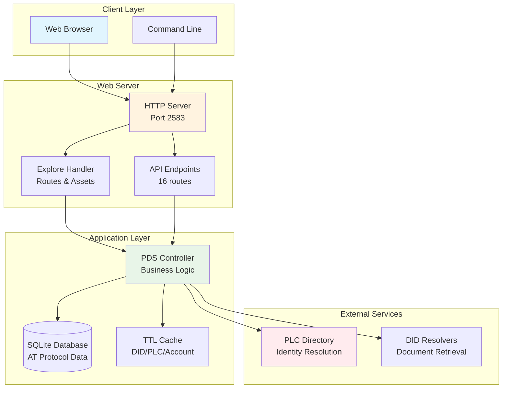

# September - ATProto Personal Data Server

Standards-compliant AT Protocol Personal Data Server (PDS) implementation written in Objective-C for macOS and Linux/GNUstep.

## Features

- **AT Protocol Compliant** - Full implementation of AT Protocol specifications (DAG-CBOR, CAR v1, Firehose)
- **Secure Authentication** - OAuth 2.0, DPoP (Demonstrating Proof-of-Possession), and JTI replay protection
- **Biometric Security** - Hardware-backed cryptographic key storage using Secure Enclave & Keychain
- **Client-Side Caching** - 5-10 minute TTL reduces repeat loads from 600ms to 250ms
- **Parallel API Calls** - Promise.all reduces page loads by 58%
- **Interactive Explorer** - Web-based UI for exploring AT Protocol data
- **Auto-Generated API Docs** - OpenAPI 3.0 specification with interactive Swagger UI
- **Unified Logging** - Structured JSON logging with component filtering and request correlation
- **Test Coverage** - 1017 tests across protocol, auth, repository, and integration layers

## Table of Contents

- [Quick Start](#quick-start)
- [Building from Source](#building-from-source)
- [Using the Explorer](#using-the-explorer)
- [API Documentation](#api-documentation)
- [Architecture](#architecture)
- [Development](#development)
- [Troubleshooting](#troubleshooting)
- [Contributing](#contributing)

## Quick Start

### Prerequisites

- macOS 14.0+ with Xcode 15.0+, or Linux with GNUstep
- [XcodeGen](https://github.com/yonaskolb/XcodeGen) (`brew install xcodegen`) (macOS)
- CMake 3.21 or later (`brew install cmake`)

### Installation

```bash
# Clone the repository
git clone https://github.com/jvalinsky/September.git
cd September

# Generate the project (macOS)
xcodegen generate

# Build the CLI tool
xcodebuild -scheme ATProtoPDS-CLI build

# Start the server
./build/bin/kaszlak serve
```

The server will start on `http://localhost:2583` by default.

### First Steps

1. **Show Help**: `kaszlak help`
2. **Check Health**: `kaszlak health`
3. **List Accounts**: `kaszlak account list`
4. **Create Invite Code**: `kaszlak invite create`
5. **Repository Operations**: `kaszlak repo`
6. **Open the Explorer**: Visit `http://localhost:2583/explore/`

**Available commands**: `account`, `admin`, `daemon`, `health`, `help`, `init`, `install`, `invite`, `nuke-data`, `oauth`, `repo`, `serve`, `version`

## Documentation

The complete **PDS Objective-C Implementation Guide** is available at:

📖 **[https://pds.garazyk.xyz/docs](https://pds.garazyk.xyz/docs)**

### Quick Links

- **[Getting Started](https://pds.garazyk.xyz/docs/01-getting-started/overview)** — What is a PDS and why Objective-C
- **[Architecture Overview](https://pds.garazyk.xyz/docs/01-getting-started/architecture-overview)** — System components and design patterns
- **[API Reference](https://pds.garazyk.xyz/docs/11-reference/api-reference)** — XRPC endpoints and specifications
- **[Troubleshooting Guide](https://pds.garazyk.xyz/docs/11-reference/troubleshooting)** — Common issues and solutions

The guide covers:
- Core AT Protocol concepts (DAG-CBOR, CAR, MST, cryptography)
- Application layer services and patterns
- Network layer (HTTP, XRPC, routing)
- Database architecture and SQLite patterns
- Authentication (JWT, OAuth 2.0, DPoP)
- Repository protocol and blob storage
- Firehose and WebSocket streaming
- Platform compatibility (macOS and Linux/GNUstep)
- Production deployment and operations

### Advanced Topics

The guide includes comprehensive coverage of production-ready features:

- **Security & Hardening** — [Secrets management](https://pds.garazyk.xyz/docs/06-authentication/secrets-management), [input validation](https://pds.garazyk.xyz/docs/04-network-layer/input-validation), [security best practices](https://pds.garazyk.xyz/docs/06-authentication/security-best-practices)
- **Performance & Reliability** — [Rate limiting](https://pds.garazyk.xyz/docs/04-network-layer/rate-limiting), [DoS protection](https://pds.garazyk.xyz/docs/04-network-layer/dos-protection), [blob optimization](https://pds.garazyk.xyz/docs/07-repository-protocol/blob-optimization)
- **Operations & Monitoring** — [Metrics collection](https://pds.garazyk.xyz/docs/11-reference/metrics-collection), [logging strategy](https://pds.garazyk.xyz/docs/11-reference/logging-strategy), [alerting](https://pds.garazyk.xyz/docs/11-reference/alerting)
- **Database Management** — [Migration strategy](https://pds.garazyk.xyz/docs/05-database-layer/migration-strategy), [zero-downtime migrations](https://pds.garazyk.xyz/docs/05-database-layer/zero-downtime-migrations), [data integrity](https://pds.garazyk.xyz/docs/05-database-layer/data-integrity)
- **Blob Management** — [Lifecycle](https://pds.garazyk.xyz/docs/07-repository-protocol/blob-lifecycle), [garbage collection](https://pds.garazyk.xyz/docs/07-repository-protocol/blob-garbage-collection), [quotas](https://pds.garazyk.xyz/docs/07-repository-protocol/blob-quotas)
- **Identity & PLC** — [PLC directory](https://pds.garazyk.xyz/docs/02-core-concepts/plc-directory), [DID updates](https://pds.garazyk.xyz/docs/02-core-concepts/did-document-updates), [failover strategies](https://pds.garazyk.xyz/docs/11-reference/plc-failover)

## Building from Source

### Using XcodeGen & CMake (Recommended)

The project uses a unified CMake build system wrapped by XcodeGen.

```bash
# Regenerate project if project.yml or CMakeLists.txt changes
xcodegen generate

# Build CLI Tool
xcodebuild -scheme ATProtoPDS-CLI build
# Binary at: ./build/bin/kaszlak

# Build & Run Unit Tests
xcodebuild -scheme AllTests build
./build/tests/AllTests
# Output: Tests run: 1017, Failures: 0

# Build Fuzzers
xcodebuild -scheme Fuzzers build

# Wipe and Rebuild (Fresh Start)
./scripts/wipe_and_rebuild.sh
```

### Direct CMake (Linux / GNUstep)

```bash
mkdir build && cd build
cmake .. -DCMAKE_BUILD_TYPE=Debug
make -j$(nproc)
# Binaries at: ./build/bin/kaszlak, ./build/bin/campagnola, ./build/tests/AllTests
```

### Executables

| Binary | CMake Target | Description |
|--------|-------------|-------------|
| `kaszlak` | `september` | PDS CLI (`./build/bin/kaszlak`) |
| `campagnola` | `atproto-plc` | Standalone PLC server on port 2582 (`./build/bin/campagnola`) |
| `AllTests` | `AllTests` | Test runner (`./build/tests/AllTests`) |

### Dependencies

The project uses:
- **SQLite** for data persistence
- **OpenSSL** for cryptographic operations
- **libsecp256k1** for AT Protocol signing
- **Foundation** and **Security** frameworks

## Using the Explorer

### Web Interface

The explorer provides an interactive web interface for exploring AT Protocol data:

#### Main Features

- **DID Resolution**: Look up decentralized identifiers and handles
- **Repository Exploration**: Browse accounts, collections, and records
- **CID Decoding**: Decode and analyze Content Identifiers
- **PLC Operations**: View Personal Ledger Computer operation logs

#### Navigation

1. **Lookup Panel**: Enter DID or handle in the left sidebar
2. **Account List**: Click on any account to explore their data
3. **Collections**: Browse record collections within repositories
4. **Records**: View individual records with full content
5. **CID Decoder**: Analyze Content Identifiers

#### Keyboard Shortcuts

- `Enter` in lookup field: Resolve identity
- `Enter` in CID field: Decode CID

### API Endpoints

All functionality is available via REST API:

```bash
# Get all accounts
curl http://localhost:2583/explore/api/accounts

# Get repository description
curl "http://localhost:2583/explore/api/describe?did=did:plc:..."

# Get records for a collection
curl "http://localhost:2583/explore/api/account-records?did=did:plc:...&collection=app.bsky.feed.post"
```

## API Documentation

### Interactive Documentation

Visit `http://localhost:2583/explore/api/docs` for interactive Swagger UI documentation.

### OpenAPI Specification

Download the complete OpenAPI 3.0 specification:

- **YAML**: `http://localhost:2583/explore/api/openapi.yaml`
- **JSON**: `http://localhost:2583/explore/api/openapi.yaml?format=json`

### Endpoint Overview

| Category | Endpoints | Description |
|----------|-----------|-------------|
| **Accounts** | `/accounts`, `/account-details` | Account management |
| **Repositories** | `/repositories`, `/describe` | Repository operations |
| **Records** | `/account-records`, `/record`, `/record-details`, `/create-record` | Record management |
| **Identity** | `/lookup`, `/did`, `/plc-log` | Identity resolution |
| **Content** | `/cid-decode`, `/cid-info`, `/blob` | Content handling |
| **Collections** | `/collections` | Collection browsing |

### Authentication

Write and administrative endpoints require authenticated tokens (Bearer JWT). Public read endpoints remain available without auth where applicable.

## Architecture

### System Components



### Performance Optimizations

- **Client-Side Caching**: 5-10 minute TTL for different data types
- **Parallel API Calls**: `Promise.all` reduces loading from 600ms to 250ms
- **Server-Side Caching**: 1-24 hour TTL for external API responses
- **Rate Limiting Protection**: Prevents plc.directory abuse

### Data Flow

1. **Client Request** → HTTP Server
2. **Route Resolution** → Appropriate handler
3. **Cache Check** → Return cached data if fresh
4. **Database Query** → Fetch from SQLite if needed
5. **External API** → Resolve DID/PLC if required
6. **Response** → JSON/YAML/HTML to client

## Development

### Project Structure

```
September/
├── ATProtoPDS/
│   ├── Sources/
│   │   ├── Admin/                 # Admin endpoints
│   │   ├── App/                   # App view & explorer
│   │   ├── AppView/               # App view service
│   │   ├── Auth/                  # OAuth 2.0 & DPoP
│   │   ├── Blob/                  # Blob storage
│   │   ├── CLI/                   # Command-line interface (kaszlak)
│   │   ├── Compat/                # Linux/GNUstep compatibility layer
│   │   ├── Core/                  # Core AT Protocol (CBOR, CAR, MST)
│   │   ├── Database/              # SQLite persistence
│   │   ├── Debug/                 # Debug utilities
│   │   ├── Email/                 # Email services
│   │   ├── Federation/            # Federation support
│   │   ├── Identity/              # DID & handle resolution
│   │   ├── Lexicon/               # Lexicon validation
│   │   ├── Metrics/               # Metrics collection
│   │   ├── Network/               # HTTP & WebSocket server
│   │   ├── PLC/                   # PLC directory interaction
│   │   ├── Repository/            # Repository & MST
│   │   ├── Security/              # Key management & crypto
│   │   ├── Services/              # Service layer
│   │   └── Sync/                  # Firehose & repo sync
│   └── Tests/                     # Unit and integration tests
├── Tests/e2e/                     # End-to-end tests (Node.js/Playwright)
├── docs/                          # Documentation
├── docker/                        # Docker configs & deployment
├── scripts/                       # ~55 shell scripts
├── skills/                        # Audit skills
├── lexicons/                      # AT Protocol lexicons
├── fuzzing/                       # Fuzz testing infrastructure
└── README.md
```

### Adding New Endpoints

1. **Create Handler Method** in `ExploreHandler.m`:
   ```objc
   - (void)handleApiNewEndpoint:(NSDictionary *)params response:(HttpResponse *)response {
       // Implementation
   }
   ```

2. **Add Route** in `handleApiRequest:`:
   ```objc
   else if ([endpoint isEqualToString:@"new-endpoint"]) {
       [self handleApiNewEndpoint:params response:response];
   }
   ```

3. **Add OpenAPI Descriptor** in `allEndpointDescriptors`:
   ```objc
   [descriptors addObject:[APIEndpointDescriptor descriptorWithPath:@"/explore/api/new-endpoint"
                                                             method:@"get"
                                                            summary:@"New endpoint description"
                                                       endpointName:@"new-endpoint"
                                                       operationId:@"newEndpoint"
                                                              tags:@[@"Category"]
                                                         parameters:@[]
                                                         responses:@[successResponse]]];
   ```

4. **Add Frontend Code** if needed in `Assets/js/`

### Testing

```bash
# Build and run unit tests
xcodebuild -scheme AllTests build
./build/tests/AllTests
# Expected: Tests run: 1017, Failures: 0

# Integration testing
./scripts/test_server.sh
```

**Test Status:**
- `./build/tests/AllTests` passing with 1017 tests
- CLI functionality verified
- Integration tests passing

### Code Style

- **Objective-C**: Follow Apple's coding guidelines
- **JavaScript**: Modern ES6+ with modules
- **Documentation**: Inline comments for complex logic
- **Commits**: Clear, descriptive commit messages

## Troubleshooting

### Common Issues

#### Server Won't Start
```bash
# Check if port is in use
lsof -i :2583

# Kill existing process
pkill -f "kaszlak"

# Check server logs
tail -f server.log
```

#### Database Errors
```bash
# Reset database
rm -f data/pds.db
./build/bin/kaszlak serve  # Will recreate database
```

#### Build Failures
```bash
# Wipe and rebuild
./scripts/wipe_and_rebuild.sh

# Check Xcode version
xcodebuild -version
```

#### Performance Issues
- **Slow initial load**: Check internet connection (external API calls)
- **Repeated slow loads**: Clear browser cache or restart server
- **High CPU usage**: Check for infinite loops in logs

### Debug Mode

```bash
# Run with verbose logging
./build/bin/kaszlak serve --verbose

# Check cache status
curl http://localhost:2583/explore/api/debug

# Monitor API calls
tail -f server.log | grep "handleApi"
```

### Getting Help

1. **Check Logs**: `tail -f server.log`
2. **API Status**: `curl http://localhost:2583/explore/api/accounts`
3. **Documentation**: `http://localhost:2583/explore/api/docs`
4. **Issues**: [GitHub Issues](https://github.com/jvalinsky/September/issues)

## Security

### Current Security Features

- **Input Validation**: All API parameters validated
- **SQL Injection Protection**: Parameterized queries
- **Rate Limiting Ready**: Cache prevents abuse
- **HTTPS Ready**: TLS termination can be added
- **OAuth 2.0 & DPoP**: Full implementation of ATProto OAuth profile with DPoP binding
- **Biometric Keys**: Private keys stored in Secure Enclave/Keychain with biometric access control

### Security Testing

```bash
# Static analysis
cd build && cmake .. -DCMAKE_EXPORT_COMPILE_COMMANDS=ON && cd ..
clang-tidy -p build ATProtoPDS/Sources/Repository/CBOR.m

# Fuzz testing
./build/fuzzing/fuzz_xrpc fuzzing/corpus_xrpc/xrpc_valid_create.txt
```

### Reporting Security Issues

Please report security issues privately to [security@jvalinsky.com](mailto:security@jvalinsky.com)

## Operations

### Testing
To run the automated test suite:
```bash
./scripts/run-tests.sh
```

### Backups
This project includes an automated backup script `scripts/backup_pds.sh`.
It safely backs up running SQLite databases using the `.backup` command.

**Usage:**
```bash
./scripts/backup_pds.sh --data-dir /path/to/data --backup-dir /path/to/backups
```
Recommended: Schedule this via cron daily.

### Restore
To restore a database from a backup:
1. Extract the backup archive: `tar -xzf pds-backup-....tar.gz`
2. Stop the PDS server.
3. Replace the target database file with the backup copy.
   - For service DB: `cp backup/service.sqlite /path/to/data/service.sqlite`
   - For user DB: `cp backup/user/did.../data.sqlite /path/to/data/.../did.../data.sqlite`
4. Restart the PDS server.

### Debugging
A database dump utility is provided to inspect PDS data:

```bash
# Dump service database schema and info
./scripts/db_dump.sh service

# Dump a specific user's database
./scripts/db_dump.sh did:plc:1234...

# Dump a specific table from a user's DB
./scripts/db_dump.sh did:plc:1234... record
```

## Deployment

### Docker

The Docker image is built as `nspds:local` with container name `nspds`. Production Docker Compose lives at `docker/pds/docker-compose.yml`.

```bash
# Build Docker image
docker build -t nspds:local .

# Production deployment (from docker/pds/ directory)
cd docker/pds
docker compose up -d
docker compose logs -f pds

# Create invite codes
docker exec nspds kaszlak invite create
```

## Contributing

### Development Workflow

1. **Fork** the repository
2. **Create** a feature branch: `git checkout -b feature/your-feature`
3. **Make** your changes with tests
4. **Run** tests: `./build/tests/AllTests`
5. **Commit** with clear messages
6. **Push** and create pull request

### Code Review Process

- All changes require review
- Tests must pass
- Documentation must be updated
- Security review for API changes

### Areas for Contribution

- **Performance Optimization**: More caching strategies
- **New Features**: Additional AT Protocol support
- **UI/UX**: Better web interface
- **Testing**: Add coverage for untested modules and failure paths
- **Documentation**: User guides and tutorials

## License

Licensed under the MIT License. See [LICENSE](LICENSE) for details.

## Acknowledgments

- **AT Protocol** - The protocol this server implements
- **Blue Sky** - Creators of the AT Protocol
- **SQLite** - Database engine
- **OpenSSL** - Cryptographic operations

## Changelog

### Latest
- **PLC Hardening**: Spec-compliant operation signing with correct prev CID calculation
- **Server Rotation Key**: Dedicated PLC signing key with persistent storage
- **DID Resolution Security**: Redirect rejection, proper Accept headers
- **submitPlcOperation Validation**: Full validation before forwarding to PLC directory
- **Email Token Flow**: Email-based confirmation for PLC operations (with testing fallback)
- **CI/CD Improvements**: Caching, job dependencies, PLC module clang-tidy, ShellCheck

### v1.1.0
- **Full ATProto Compliance**: Canonical DAG-CBOR encoding, CAR v1 emission, correct CID-link framing
- **Firehose V2**: Spec-compliant `subscribeRepos` stream with real back-fill and cursor support
- **Advanced Security**: OAuth 2.0 Request Object signing, DPoP, and Biometric Keychain integration
- **Performance**: Reduced MST rebuild cost and request fan-out latency on hot paths
- **Testing**: Expanded suite to 1017 tests covering all edge cases
