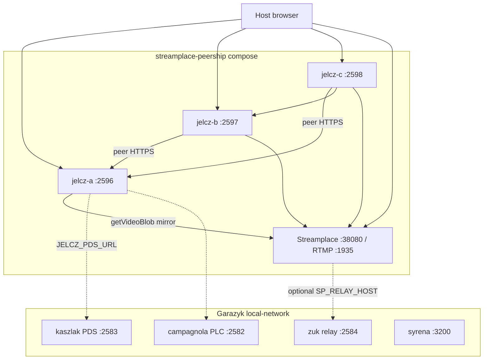

# Streamplace + multi-jelcz peership Docker demo

Operator guide (docs index entry):
[`docs/20-explanation/guides/streamplace-jelcz-peership-lab.md`](../../docs/20-explanation/guides/streamplace-jelcz-peership-lab.md).

Lab stack that combines:

1. **Garazyk local ATProto network** (PLC, PDS, relay, AppView, …)
2. **One Streamplace node** (video origin — test stream and/or RTMP ingest)
3. **Three `jelcz` peers** that HTTPS-peer Streamplace and each other

This is the WS15 / WS16 Phase 2 story: **content-addressed bytes over HTTPS**,
not Streamplace’s live iroh mesh (that remains blocked under WS16 Phase 4+).



## What this proves

| Claim | How |
| --- | --- |
| Streamplace is the **origin** for live/VOD bytes | `JELCZ_STREAMPLACE_MIRROR_BASE=http://streamplace:38080` |
| Browser never needs Streamplace for **jelcz playback** | Demo UI on each jelcz rewrites playlists to that instance |
| Multiple jelcz instances **peer each other** | B/C use `JELCZ_PEER_HTTPS_PROVIDERS`; smoke seeds A → pull B/C |
| Local ATProto is available for identity / later origin records | Shared Docker network with `local-pds` / `local-plc` |

## What this deliberately does **not** do

- **iroh / `broadcast.origin` tickets** — WS16 Phase 4+; sidecar not in this image
- **Merge Streamplace’s embedded PDS into kaszlak** — separate identity planes; attribution DID is operator-configured
- **Production WebRTC** — Streamplace docs recommend `--net=host` for WebRTC UDP; this compose uses bridge + published TCP ports for HLS/`getVideoBlob` labs
- **Auto-syndicate every stream** — empty `JELCZ_P2P_ALLOWED_*` blocks origin-JSON auto-ingest (env peer list still works)

## Ports (chosen to avoid local-network collisions)

| Service | Host port | Notes |
| --- | --- | --- |
| Streamplace HTTP | **38080** | Upstream default public HTTP |
| Streamplace RTMP | **1935** | Optional OBS / ffmpeg publish |
| jelcz-a | **2596** | Seed / primary peer UI |
| jelcz-b | **2597** | Peers A |
| jelcz-c | **2598** | Peers A+B |
| local-network video | 2586 | Untouched (separate service) |
| local-network PDS2 | 2587 | Untouched |

## Quick start

```bash
# From repo root — stages Linux jelcz, brings up ATProto + this stack, runs smoke.
./scripts/demo/streamplace_peership_up.sh

# Optional RTMP publisher profile (ffmpeg testsrc → Streamplace):
./scripts/demo/streamplace_peership_up.sh --publish

# Status / URLs
./scripts/demo/streamplace_peership_up.sh --status

# Mesh + optional Streamplace catalog probe
./scripts/demo/streamplace_peership_smoke.sh

# Tear down peership stack only (leaves ATProto network up)
./scripts/demo/streamplace_peership_down.sh

# Tear down peership + ATProto
./scripts/demo/streamplace_peership_down.sh --atproto
```

### Manual compose

```bash
deno run -A scripts/stage_binaries.ts
./scripts/scenarios/setup_local_network.sh

export GARAZYK_ATPROTO_NET=local-network_local_net
docker compose -f docker/streamplace-peership/docker-compose.yml up -d --build
```

If the external network name differs (`docker network ls`), set
`GARAZYK_ATPROTO_NET`.

## Operator URLs

| UI | URL |
| --- | --- |
| jelcz-a peership demo | http://127.0.0.1:2596/demo/streamplace |
| jelcz-b | http://127.0.0.1:2597/demo/streamplace |
| jelcz-c | http://127.0.0.1:2598/demo/streamplace |
| Streamplace | http://127.0.0.1:38080/ |
| PDS describeServer | http://127.0.0.1:2583/xrpc/com.atproto.server.describeServer |

## Environment knobs

See [`.env.example`](.env.example). Important ones:

| Variable | Purpose |
| --- | --- |
| `STREAMPLACE_TEST_STREAM` | Built-in Streamplace test stream on boot (default true) |
| `STREAMPLACE_NO_FIREHOSE` | Isolate from public Bluesky firehose (default true) |
| `STREAMPLACE_ATTRIBUTION_DID` | `did=` for getVideoBlob egress accounting |
| `JELCZ_PEER_HTTPS_PROVIDERS` | Set per-service in compose (A empty; B→A; C→A,B) |
| `JELCZ_P2P_ALLOWED_STREAMERS` | Consent for origin-record auto-ingest |

## Failure modes (read this when something is red)

1. **`staging/bin/jelcz` missing / Mach-O** — run `deno run -A scripts/stage_binaries.ts` on a machine that can build Linux ELF (Docker builder). `--check` verifies ELF.
2. **External network not found** — start ATProto first; confirm `docker network ls \| grep local-network`.
3. **Streamplace unhealthy** — image pull, CPU, or `/api/healthz` path drift; check `docker compose logs streamplace`. First boot can take >30s.
4. **Catalog empty / peer live fails** — test stream may need a minute; try `--publish` RTMP profile; public `stream.place` is not required for the CA mesh smoke.
5. **Browser WebRTC to Streamplace fails** — expected on bridge networking; use jelcz demo HLS path or host-network Streamplace outside this compose.
6. **jelcz can’t resolve `local-pds`** — not on `local-network_local_net`; fix `GARAZYK_ATPROTO_NET`.

## Architecture notes

### Two identity planes

Streamplace runs an **embedded PDS** (see their “Embedded PDS” blog). Garazyk
runs **kaszlak**. This demo does not unify them. Jelcz uses Streamplace as an
**untrusted HTTPS origin** (ADR 0036) and optionally talks to Garazyk PDS for
service config. Future WS16 Phase 3 (announce origins) needs an explicit DID
story before jelcz can publish `broadcast.origin` / `tools.garazyk.video.origin`.

### Why three jelcz containers

- **A** = first CA seed / Streamplace puller  
- **B** = proves peer-of-peer over HTTPS without Streamplace  
- **C** = multi-provider ranking (`A,B` + Streamplace bootstrap)

The smoke script asserts A→B and A→C `peered-verified` with identical bytes.

### Image split

| Image | Role |
| --- | --- |
| `oci.stream.place/streamplace` | Upstream Streamplace (no Garazyk rebuild) |
| `garazyk/jelcz-peer:local` | [`Dockerfile.jelcz`](Dockerfile.jelcz) — jelcz + demo UI |

## Related

- [WS15 Streamplace VOD peership](../../docs/plans/workstreams/15-streamplace-vod-peership.md)
- [WS16 Jelcz P2P peership](../../docs/plans/workstreams/16-jelcz-p2p-peership.md)
- [Host mesh without Docker](../../scripts/demo/jelcz_https_mesh_demo.sh)
- [Local ATProto network](../../scripts/scenarios/setup_local_network.sh)
