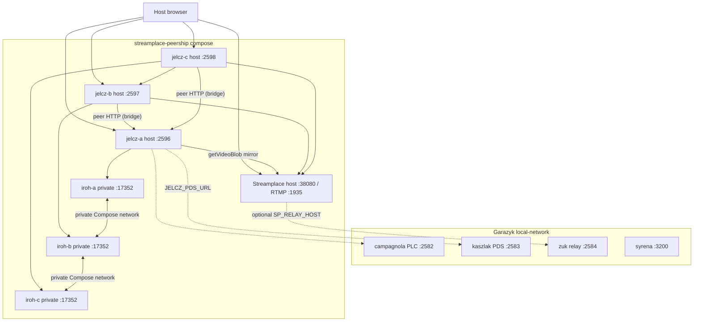

# Streamplace + multi-jelcz peership Docker demo

Operator guide (docs index entry):
[`docs/20-explanation/guides/streamplace-jelcz-peership-lab.md`](../../docs/20-explanation/guides/streamplace-jelcz-peership-lab.md).

Lab stack that combines:

1. **Garazyk local ATProto network** (PLC, PDS, relay, AppView, …)
2. **One Streamplace node** (video origin — test stream and/or RTMP ingest)
3. **Three `jelcz` peers** that HTTP-peer over the Compose bridge network

This canonical lab uses plain HTTP for container-to-container `getVideoBlob`
transfers, so its smoke and scenario assert `http-peer`. It is not a TLS test.
WS15 remains the production HTTPS fallback and browser-facing serve path; this
lab neither provisions TLS nor claims to exercise a TLS handshake. WS16 Track A
adds an `iroh-blobs` **lab** path, not Streamplace's live iroh protocol (a
separate Track B acceptance profile).



## What this proves

| Claim | How |
| --- | --- |
| Streamplace is the **origin** for live/VOD bytes | `JELCZ_STREAMPLACE_MIRROR_BASE=http://streamplace:38080` |
| Browser never needs Streamplace for **jelcz playback** | Demo UI on each jelcz rewrites playlists to that instance |
| Multiple jelcz instances **HTTP-peer over the bridge network** | B uses `http://jelcz-a:2596`; smoke asserts `http-peer` after A → B |
| Local ATProto is available for identity / later origin records | Shared Docker network with `local-pds` / `local-plc` |
| Track A iroh is a node-to-node lab path | Each jelcz talks to its un-published sidecar over Compose DNS |

## What this deliberately does **not** do

- **Streamplace live iroh / `broadcast.origin` tickets** — use the separate
  opt-in Track B profile below; the default lab remains Track A only
- **Merge Streamplace’s embedded PDS into kaszlak** — separate identity planes; attribution DID is operator-configured
- **Production WebRTC** — Streamplace docs recommend `--net=host` for WebRTC UDP; this compose uses bridge + published TCP ports for HLS/`getVideoBlob` labs
- **Auto-syndicate every stream** — empty `JELCZ_P2P_ALLOWED_*` blocks origin-JSON auto-ingest (env peer list still works)

## Ports (chosen to avoid local-network collisions)

| Service | Default host port | Notes |
| --- | --- | --- |
| Streamplace HTTP | **38080** | Upstream default public HTTP |
| Streamplace RTMP | **1935** | Optional OBS / ffmpeg publish |
| jelcz-a | **2596** | Seed / primary peer UI |
| jelcz-b | **2597** | Peers A |
| jelcz-c | **2598** | Peers A+B |
| iroh sidecars | *not published* | Compose-network-only IPC on port 17352 |
| local-network video | 2586 | Untouched (separate service) |
| local-network PDS2 | 2587 | Untouched |

## Quick start

```bash
# One-time configuration: pin the images you have tested. The compose file
# rejects blank values and never substitutes `latest`.
cp docker/streamplace-peership/.env.example docker/streamplace-peership/.env
# The example supplies a tested Streamplace digest. Set FFMPEG_IMAGE only if
# using --publish, to a tested immutable tag or digest.

# From repo root — stages Linux jelcz and brings up ATProto + this stack.
./scripts/demo/streamplace_peership_up.sh

# Optional RTMP publisher profile (ffmpeg testsrc → Streamplace):
./scripts/demo/streamplace_peership_up.sh --publish

# Status / URLs
./scripts/demo/streamplace_peership_up.sh --status

# Mesh + optional Streamplace catalog probe
./scripts/demo/streamplace_peership_smoke.sh

# Tear down peership stack only (leaves ATProto network up)
./scripts/demo/streamplace_peership_down.sh

# Tear down peership + ATProto
./scripts/demo/streamplace_peership_down.sh --atproto
```

For a clean, disposable acceptance run, use a unique Compose project and then
remove only its volumes:

```bash
./scripts/demo/streamplace_peership_up.sh --fresh
COMPOSE_PROJECT_NAME=streamplace-peership-acceptance-... ./scripts/demo/streamplace_peership_smoke.sh
./scripts/demo/streamplace_peership_down.sh --project-name streamplace-peership-acceptance-... --wipe
```

The normal `.env` project name (`streamplace-peership-demo`) is intentionally
persistent; omit `--wipe` when you want to retain that demo's Streamplace and
jelcz data. `--project-name` lets concurrent lab runs retain isolated
containers, networks, and Compose-owned volumes. Their data planes are separate
project networks; only jelcz-a also joins the shared ATProto control-plane
network for PDS/PLC access, so duplicate service aliases cannot cross-wire the
peers. Compose does not allocate host ports: concurrent projects must set
distinct `*_HOST_PORT` values in separate env files (or otherwise choose
distinct overrides) before starting.

The startup wrapper also injects `JELCZ_DEMO_API_TOKEN` and the private
`JELCZ_IROH_SIDECAR_CAPABILITY` into every jelcz and Track A sidecar. If
you leave it blank in `.env`, it generates a random token in an ignored,
project-specific runtime env file and prints a command that loads its two
fixed-format records through `streamplace_peership_runtime_env.sh` before
running smoke. The loader rejects symlinks, unexpected records, unsafe owner or
mode, and unsafe parent-directory permissions. It never prints the token
itself. Keep that file local; set the token explicitly in `.env` only when an
operator needs a stable lab token.

### Manual compose

```bash
deno run -A scripts/stage_binaries.ts
./scripts/scenarios/setup_local_network.sh

docker compose --env-file docker/streamplace-peership/.env \
  --env-file docker/streamplace-peership/.env.streamplace-peership-demo.runtime \
  --project-name streamplace-peership-demo \
  -f docker/streamplace-peership/docker-compose.yml up -d --build
```

The second env file must contain a non-empty `JELCZ_DEMO_API_TOKEN`. The
wrapper creates it with mode 0600; for a fully manual run, generate and protect
an equivalent token before invoking Compose.

If the external network name differs (`docker network ls`), set
`GARAZYK_ATPROTO_NET`.

## Operator URLs

| UI | URL |
| --- | --- |
| jelcz-a peership demo | http://127.0.0.1:2596/demo/streamplace |
| jelcz-b | http://127.0.0.1:2597/demo/streamplace |
| jelcz-c | http://127.0.0.1:2598/demo/streamplace |
| Streamplace | http://127.0.0.1:38080/ |
| PDS describeServer | http://127.0.0.1:2583/xrpc/com.atproto.server.describeServer |

## Environment knobs

Copy and fill [`.env.example`](.env.example); the scripts consistently pass
that resulting `.env` with Compose's `--env-file`. Important ones:

| Variable | Purpose |
| --- | --- |
| `STREAMPLACE_TEST_STREAM` | Built-in Streamplace test stream on boot (default true) |
| `STREAMPLACE_IMAGE` | Tested immutable Streamplace digest (override only with another tested ref) |
| `FFMPEG_IMAGE` | Required tested immutable FFmpeg tag/digest when using `--publish` |
| `LAB_BIND_ADDRESS` | Published-port bind address (default `127.0.0.1`) |
| `LAB_PUBLIC_HOST` | Hostname in browser-facing URLs (default `127.0.0.1`) |
| `STREAMPLACE_NO_FIREHOSE` | Isolate from public Bluesky firehose (default true) |
| `STREAMPLACE_WIDE_OPEN` | Lab-only convenience (default true); set false for any shared deployment |
| `STREAMPLACE_ATTRIBUTION_DID` | `did=` for getVideoBlob egress accounting |
| `JELCZ_PEER_HTTPS_PROVIDERS` | Historical name; accepts HTTP(S) provider bases. The canonical bridge lab sets B→A as `http://jelcz-a:2596`; WS15 production fallback uses HTTPS. |
| `JELCZ_P2P_ALLOWED_STREAMERS` | Consent for origin-record auto-ingest |
| `JELCZ_DEMO_API_TOKEN` | Optional stable demo API token; blank creates a random per-project runtime token |
| `JELCZ_IROH_SIDECAR_CAPABILITY` | Track A sidecar bearer capability; blank creates a random per-project runtime capability |

## Failure modes (read this when something is red)

1. **Required image is unset** — copy `.env.example` to `.env`; for `--publish`, set `FFMPEG_IMAGE` to an exact tested tag or digest.
2. **`staging/bin/jelcz` missing / Mach-O** — run `deno run -A scripts/stage_binaries.ts` on a machine that can build Linux ELF (Docker builder). `--check` verifies ELF.
3. **External network not found** — start ATProto first; confirm `docker network ls \| grep local-network`.
4. **Streamplace unhealthy** — image pull, CPU, or `/api/healthz` path drift; check `docker compose logs streamplace`. First boot can take >30s.
5. **Catalog empty / peer live fails** — test stream may need a minute; try `--publish` RTMP profile; public `stream.place` is not required for the CA mesh smoke.
6. **Browser WebRTC to Streamplace fails** — expected on bridge networking; use jelcz demo HLS path or host-network Streamplace outside this compose.
7. **jelcz can’t resolve `local-pds`** — not on `local-network_local_net`; fix `GARAZYK_ATPROTO_NET`.

## Architecture notes

### Two identity planes

Streamplace runs an **embedded PDS** (see their “Embedded PDS” blog). Garazyk
runs **kaszlak**. This demo does not unify them. Jelcz uses Streamplace as an
**untrusted HTTP(S) origin** (ADR 0036) and optionally talks to Garazyk PDS for
service config. Origin publication uses an explicit operator/PDS account: the
optional `streamplace_peership_federation_smoke.sh` creates disposable local
credentials, recreates only Docker jelcz-a, verifies the origin record through
PDS `getRecord`, retracts it, and revokes the app password. It does not prove
relay discovery or cross-PDS federation.

### Why three jelcz containers

- **A** = first CA seed / Streamplace puller  
- **B** = proves peer-of-peer over bridge-network HTTP without Streamplace
- **C** = multi-provider ranking (`A,B` + Streamplace bootstrap)

The smoke script asserts A→B `http-peer` and A→C `iroh-peer`, each
`peered-verified` with identical bytes. It does not assert true TLS.

### Image split

| Image | Role |
| --- | --- |
| `oci.stream.place/streamplace` | Upstream Streamplace (no Garazyk rebuild) |
| `garazyk/jelcz-peer:local` | [`Dockerfile.jelcz`](Dockerfile.jelcz) — jelcz + demo UI |
| `garazyk/jelcz-iroh-sidecar:local` | [`Dockerfile.iroh-sidecar`](Dockerfile.iroh-sidecar) — Track A blob IPC, private to the Compose network |

### Reproducibility check

`./scripts/demo/check_streamplace_peership_compose.sh` validates the required
image contract, loopback default binds, private sidecar isolation, and both
default and overridden port/network/project-name interpolation. It only runs
`docker compose config`; it neither creates containers nor pulls images.

## Track B: live Streamplace iroh acceptance

Track B is an externally operated acceptance profile, not an extension of the
default mesh demo. It consumes a host-visible `subscribeRepos` endpoint,
requires a real `place.stream.broadcast.origin` commit after a same-endpoint
cursor baseline, and sends that exact record to Jelcz's protected origin route.
It proves its live transfer through the bridge's persistent session report.

Copy `.env.example` to `.env` and `track-b.env.example` to `track-b.env`. Set
the immutable images, publisher DID, bridge token, host firehose URL, and
Jelcz host/token; `JELCZ_TRACK_B_API_TOKEN` must match the base
`JELCZ_DEMO_API_TOKEN`. Keep tokens outside source control. Then start only the
`track-b` profile and export the same inputs for Scenario 101:

```bash
docker compose \
  --env-file docker/streamplace-peership/.env \
  --env-file docker/streamplace-peership/track-b.env \
  -f docker/streamplace-peership/docker-compose.yml \
  -f docker/streamplace-peership/docker-compose.track-b.yml \
  --project-name streamplace-peership-track-b \
  --profile track-b up -d --build

set -a
source docker/streamplace-peership/.env
source docker/streamplace-peership/track-b.env
set +a
JELCZ_STREAMPLACE_TRACK_B_LAB=1 deno task hamownia run --no-setup 101
```

Track B forces `JELCZ_P2P=0`, clears every Track A sidecar URL, and assigns the
`iroh-a`, `iroh-b`, and `iroh-c` services to the `track-a` profile. Scenario
101 refuses acceptance if a Track A container is running. Its static
configuration check is `./scripts/demo/check_streamplace_track_b_compose.sh`.
The same private bridge image also runs six unpublished, lab-only fault peers.
Scenario 101 consumes their real NodeTickets through `docker compose exec` and
requires observed wrong-streamer, wrong-ALPN, authenticated-identity spoof,
corrupt-MUXL, oversize-segment, and bounded dropped-Subscribe retry evidence.
Raw tickets are never added to scenario artifacts.

As of 2026-08-13, this is a verified acceptance procedure, not recorded live
acceptance evidence. Phase 36 remains blocked until Phase 35 completes and a
dated Scenario 101 run passes against the required pinned publisher image.

## Related

- [WS15 Streamplace VOD peership](../../docs/plans/workstreams/15-streamplace-vod-peership.md)
- [WS16 Jelcz P2P peership](../../docs/plans/workstreams/16-jelcz-p2p-peership.md)
- [Host mesh without Docker](../../scripts/demo/jelcz_https_mesh_demo.sh)
- [Local ATProto network](../../scripts/scenarios/setup_local_network.sh)
