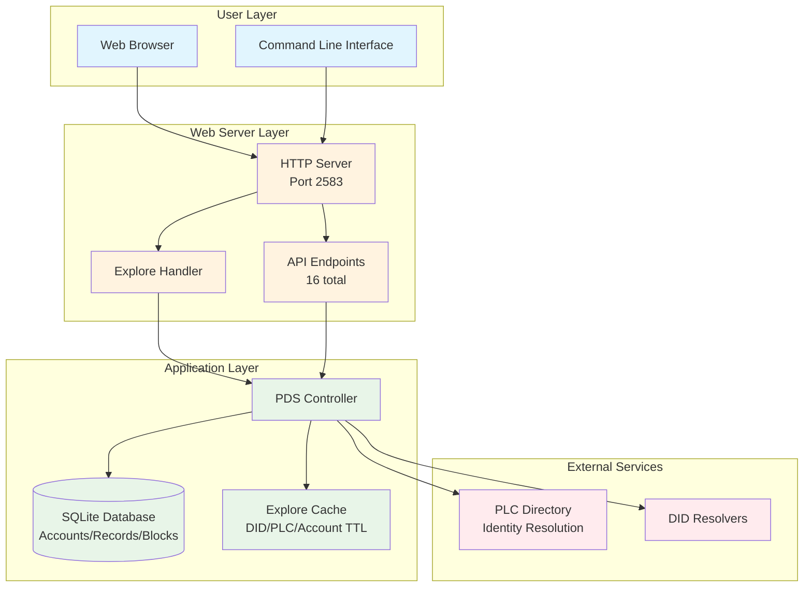
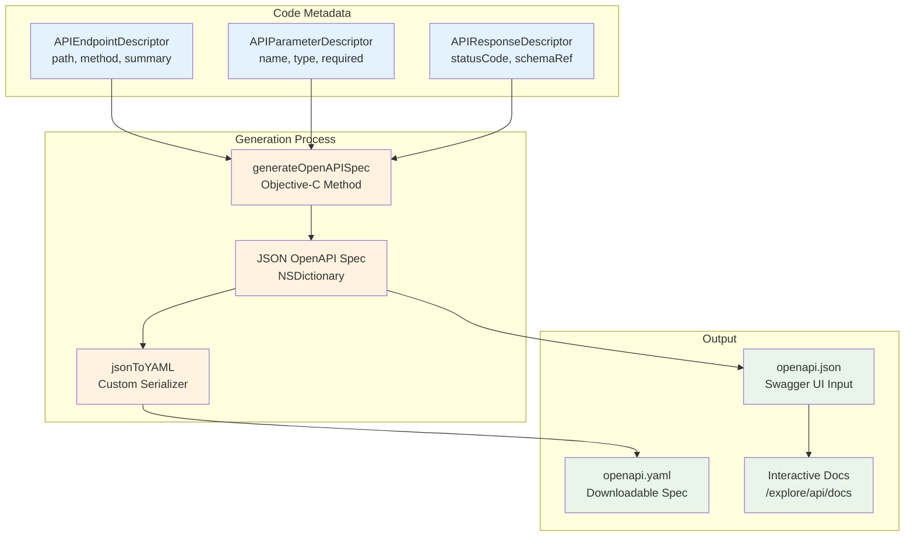
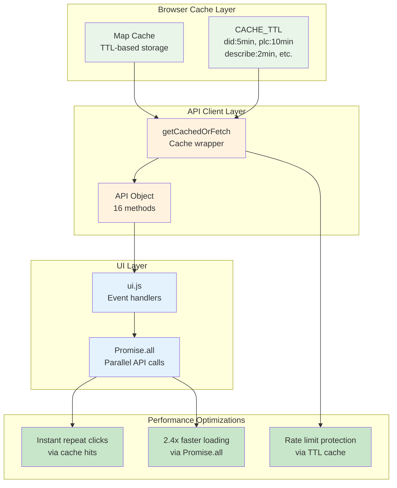
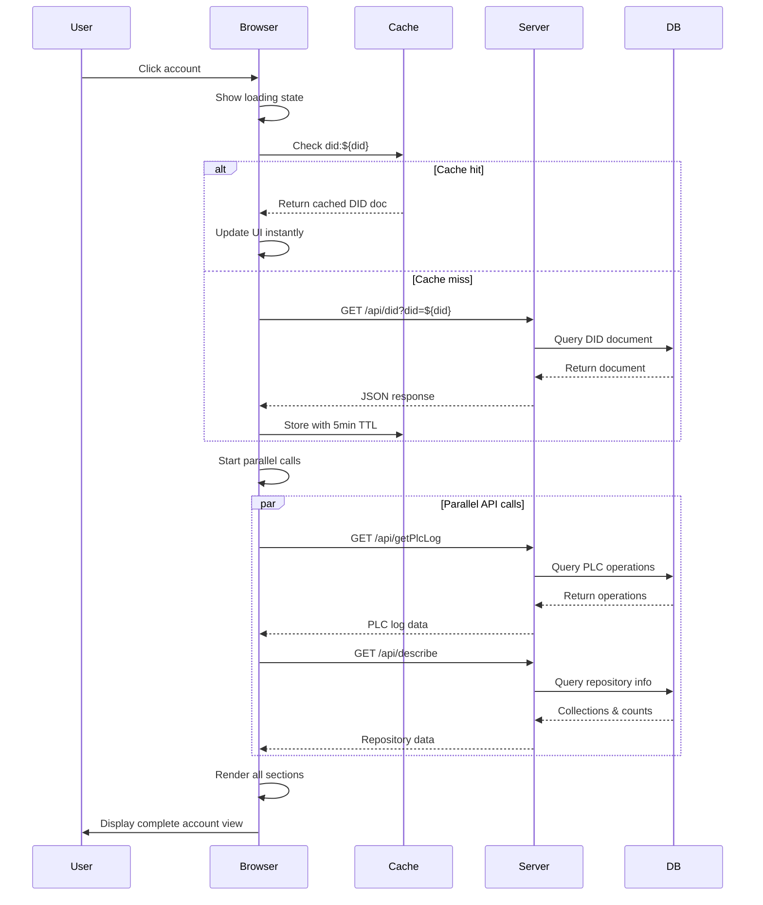
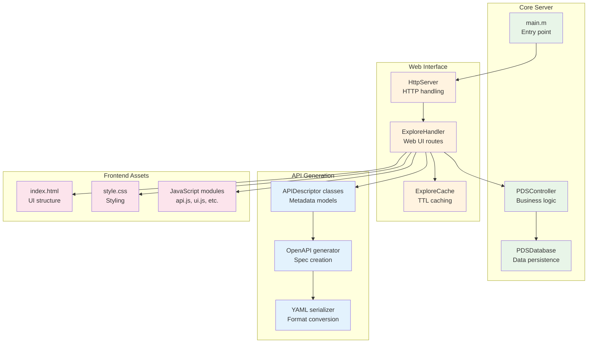

# ATProto PDS Architecture Diagrams

## System Overview



## OpenAPI Auto-Generation Flow



## Frontend Performance Architecture



## API Endpoint Organization

```mermaid
graph TD
    subgraph "Account Management"
        Accounts[GET /accounts<br/>operationId: listAccounts]
        AccountDetails[GET /account-details<br/>operationId: getAccountDetails]
    end

    subgraph "Repository Operations"
        Repositories[GET /repositories<br/>operationId: listRepositories]
        Describe[GET /describe<br/>operationId: describeRepository]
    end

    subgraph "Record Management"
        AccountRecords[GET /account-records<br/>operationId: listAccountRecords]
        Record[GET /record<br/>operationId: getRecord]
        RecordDetails[GET /record-details<br/>operationId: getRecordDetails]
        CreateRecord[POST /create-record<br/>operationId: createRecord]
    end

    subgraph "Identity Services"
        Lookup[GET /lookup<br/>operationId: resolveIdentity]
        DID[GET /did<br/>operationId: getDidDocument]
        PlcLog[GET /plc-log<br/>operationId: getPlcLog]
    end

    subgraph "Content Services"
        CidDecode[GET /cid-decode<br/>operationId: decodeCid]
        CidInfo[GET /cid-info<br/>operationId: getCidInfo]
        Blob[GET /blob<br/>operationId: getBlob]
    end

    subgraph "Collection Management"
        Collections[GET /collections<br/>operationId: listCollections]
    end

    Accounts --> A[Tags: Accounts]
    AccountDetails --> A
    Repositories --> B[Tags: Repositories]
    Describe --> B
    AccountRecords --> C[Tags: Records]
    Record --> C
    RecordDetails --> C
    CreateRecord --> C
    Lookup --> D[Tags: Identity]
    DID --> D
    PlcLog --> D
    CidDecode --> E[Tags: Content]
    CidInfo --> E
    Blob --> E
    Collections --> F[Tags: Collections]

    style A fill:#e3f2fd
    style B fill:#e3f2fd
    style C fill:#e3f2fd
    style D fill:#e3f2fd
    style E fill:#e3f2fd
    style F fill:#e3f2fd
```



## Data Flow: Account Loading



## Component Dependencies



## Performance Timeline

```mermaid
gantt
    title UI Loading Performance Timeline
    dateFormat  HH:mm:ss
    axisFormat %M:%S

    section Before (Sequential)
    DID Document Load    :done, 0, 200ms
    PLC Operations Load  :done, 200ms, 200ms
    Repository Describe   :done, 400ms, 200ms
    Total Load Time       :done, 0, 600ms

    section After (Parallel + Cache)
    Cache Check (Instant) :done, 0, 10ms
    Parallel API Calls    :done, 10ms, 240ms
    Total Load Time       :done, 0, 250ms
    Performance Gain      :done, 0, 350ms
```

## Cache Strategy Overview

```mermaid
stateDiagram-v2
    [*] --> API_Call_Requested
    API_Call_Requested --> Cache_Check: Check cache key

    Cache_Check --> Cache_Hit: Data exists & fresh
    Cache_Check --> Cache_Miss: Data missing or stale

    Cache_Hit --> Return_Cached_Data
    Return_Cached_Data --> [*]

    Cache_Miss --> Network_Request: Make API call
    Network_Request --> Store_In_Cache: On success
    Network_Request --> Return_Error: On failure

    Store_In_Cache --> Return_Fresh_Data
    Return_Error --> [*]
    Return_Fresh_Data --> [*]

    note right of Cache_Check : TTL varies by endpoint:\n• DID docs: 5min\n• PLC logs: 10min\n• Records: 2-5min
    note right of Network_Request : Protects against\nplc.directory rate limits

## Related Documentation

### Architecture Documents
- [README.md](README.md) - Architecture documentation index
- [ARCHITECTURE_ANALYSIS.md](ARCHITECTURE_ANALYSIS.md) - Component analysis for diagrams above

### Diagram Documents
- [DIAGRAMS_MERMAID.md](DIAGRAMS_MERMAID.md) - Protocol flow diagrams
- [DIAGRAM_QUICK_REFERENCE.md](DIAGRAM_QUICK_REFERENCE.md) - Diagram selection guide
- [DEVELOPMENT_WORKFLOWS.md](DEVELOPMENT_WORKFLOWS.md) - Development process diagrams

### Related Guides
- [../guides/DEVELOPER_GUIDE.md](../guides/DEVELOPER_GUIDE.md) - Developer onboarding guide
```