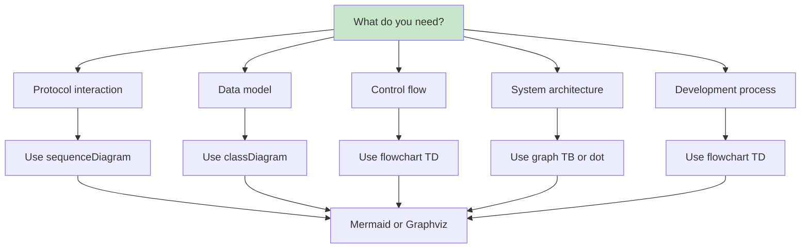
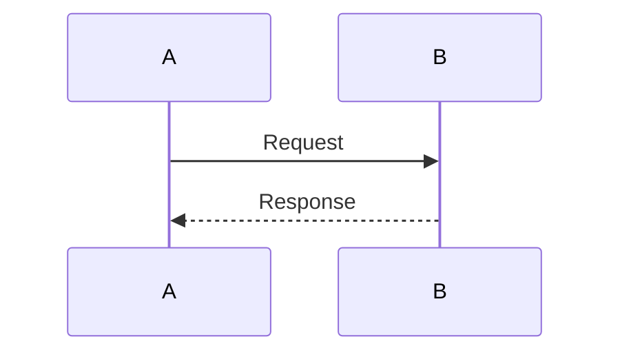
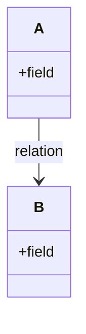
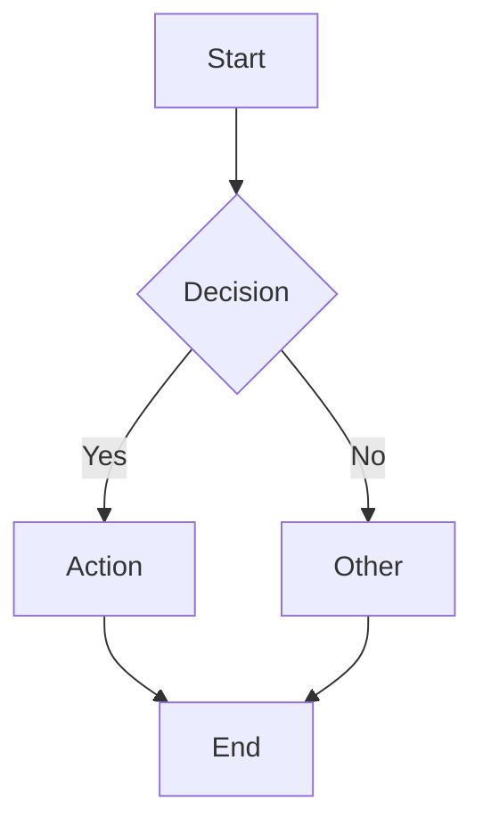
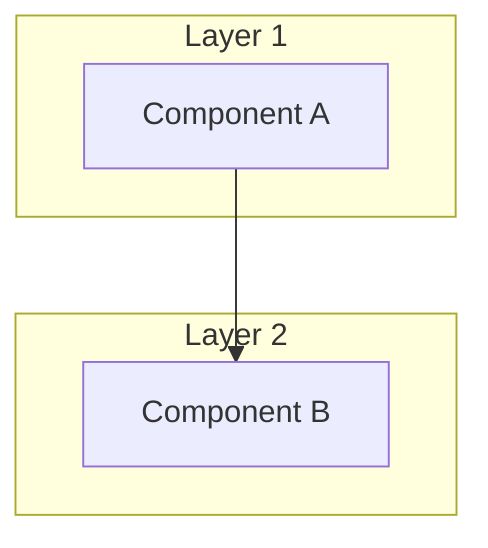
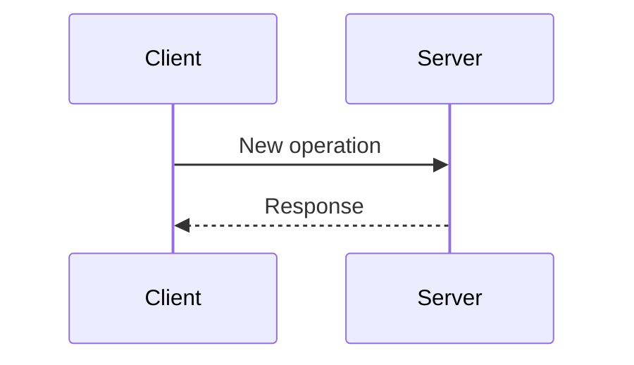

# Diagram Quick Reference

A condensed guide to all diagrams available in this project.

## Available Diagram Files

| File | Type | Purpose |
|------|------|---------|
| `ARCHITECTURE_DIAGRAMS.md` | Mermaid | System overview, flows, sequences |
| `DIAGRAMS_MERMAID.md` | Mermaid | ATProto-specific protocols & models |
| `DEVELOPMENT_WORKFLOWS.md` | Mermaid | Dev processes, debugging, testing |
| `high_level_architecture.dot` | Graphviz | Full system architecture |
| `request_flow.dot` | Graphviz | HTTP request pipeline |
| `database_schema.dot` | Graphviz | SQLite schema relationships |
| `authentication_flow.dot` | Graphviz | Auth process (JWT, OAuth, 2FA) |
| `repository_engine.dot` | Graphviz | MST/CAR content-addressable storage |
| `firehose_sync.dot` | Graphviz | Real-time event streaming |
| `module_dependencies.dot` | Graphviz | Inter-module dependencies |
| `request_flow.dot` | Graphviz | API request handling |

## Diagram by Use Case

### Understanding the System
```
Start with: ARCHITECTURE_DIAGRAMS.md
→ high_level_architecture.dot
→ module_dependencies.dot
```

### Working with ATProto Protocols
```
Start with: DIAGRAMS_MERMAID.md
→ XRPC protocol flows
→ Repository operations
→ OAuth2 sequence
```

### Development Tasks
```
Start with: DEVELOPMENT_WORKFLOWS.md
→ Build and run process
→ Test pyramid
→ Debugging flowchart
```

### Database Work
```
Start with: database_schema.dot
→ Check entity relationships
→ Understand transactions
```

### Authentication
```
Start with: authentication_flow.dot
→ JWT token flow
→ Session management
→ OAuth2 process
```

## Quick Diagram Selection



## Generate Graphviz Diagrams

```bash
cd docs/architecture

# Generate all as PNG
for f in *.dot; do
    name="${f%.dot}"
    dot -Tpng "$f" -o "${name}.png"
done

# Generate as SVG (better quality)
dot -Tsvg "$f" -o "${name}.svg"
```

## Diagram Color Legend

| Color | Meaning | Hex |
|-------|---------|-----|
| Green | Start/End/Success | #c8e6c9 |
| Blue | Processes/Actions | #bbdefb |
| Orange | Decisions/Checks | #ffe0b2 |
| Red | Errors/Failures | #ffcdd2 |
| Yellow | Data/Tokens | #fff9c4 |

## Common Patterns

### Sequence Diagram (Timing)


### Class Diagram (Data)


### Flowchart (Logic)


### Architecture (Components)


## Adding New Diagrams

When adding diagrams:

1. **Choose the right type** - Match diagram to purpose
2. **Keep it simple** - One concept per diagram
3. **Use consistent colors** - Follow the color legend
4. **Label clearly** - Descriptive node names
5. **Add to this file** - Reference in quick navigation

### Example: Adding a New Protocol Flow



Add to: `docs/architecture/DIAGRAMS_MERMAID.md`

## Related Documentation

### Architecture Documents
- [README.md](README.md) - Architecture documentation index
- [ARCHITECTURE_ANALYSIS.md](ARCHITECTURE_ANALYSIS.md) - Component analysis for diagram context

### Diagram Documents
- [ARCHITECTURE_DIAGRAMS.md](ARCHITECTURE_DIAGRAMS.md) - System overview diagrams
- [DIAGRAMS_MERMAID.md](DIAGRAMS_MERMAID.md) - Protocol flow diagrams
- [DEVELOPMENT_WORKFLOWS.md](DEVELOPMENT_WORKFLOWS.md) - Development process diagrams
