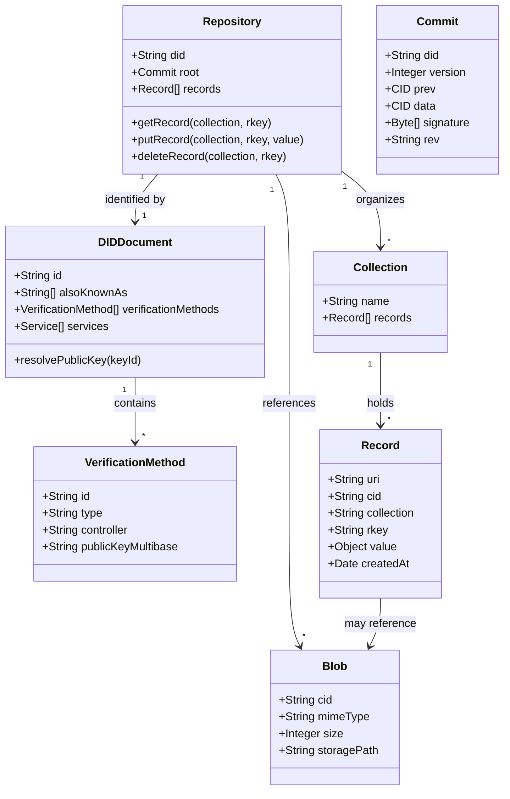
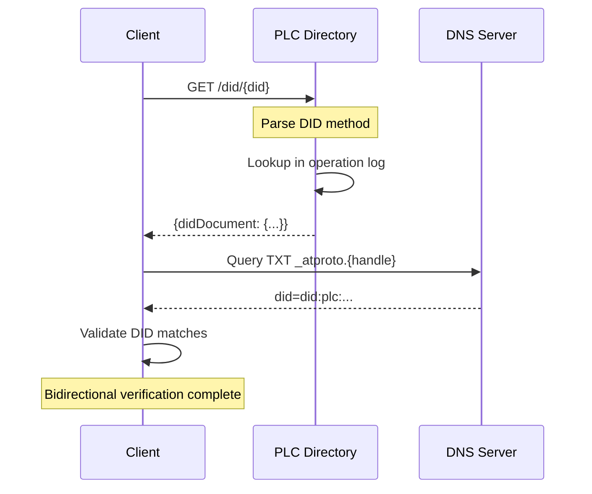
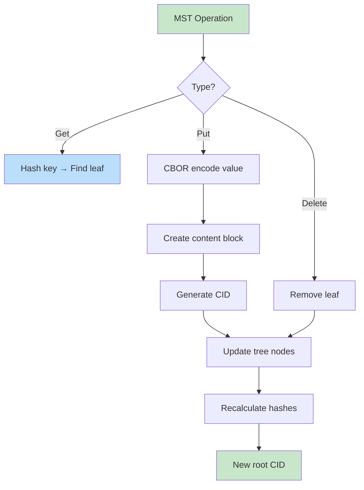

# atproto Data Models Research

## Overview

AT Protocol (atproto) is a collection of protocol components that provide a generic framework for interoperable social web applications, using global aggregations of interlinked, self-certifying data records.

## Data Model Overview



---

## 1. DID (Decentralized Identifier) Implementation and Resolution

### 1.1 Supported DID Methods

AT Protocol supports two primary DID methods:

**did:plc** - A novel DID method developed by Bluesky, based on self-authenticating operation logs with authority rooted in rotatable cryptographic keys.

**did:web** - A W3C draft specification based on HTTPS well-known endpoints.

### 1.2 DID Document Structure

```json
{
  "@context": "https://www.w3.org/ns/did/v1",
  "id": "did:plc:ewvi7nxzyoun6zhxrhs64oiz",
  "alsoKnownAs": ["at://alice.com"],
  "verificationMethod": [{
    "id": "did:plc:ewvi7nxzyoun6zhxrhs64oiz#atproto",
    "type": "Multikey",
    "controller": "did:plc:ewvi7nxzyoun6zhxrhs64oiz",
    "publicKeyMultibase": "zQ3shZc2QzApp2oymGvQbzP8eKheVshBHbU4ZYjeXqwSKEn6N"
  }],
  "service": [{
    "id": "#atproto_pds",
    "type": "AtprotoPersonalDataServer",
    "serviceEndpoint": "https://pds.example.com"
  }]
}
```

### DID Resolution Flow



### 1.3 Handle Resolution

Handles are DNS hostnames that must be bidirectionally validated:

1. **DNS TXT Record Method**: `_atproto.handle.example.com` with `did=did:web:example.com`

2. **HTTPS Well-Known**: `/.well-known/atproto-did` returns the full DID

---

## 2. Repository Structure - Merkle Search Trees

### 2.1 Merkle Search Tree (MST) Overview

The repository data structure is a key/value content-addressed Merkle Search Tree, functioning as a key/value store. This enables:
- Verifiable diff operations
- Cryptographic authentication
- O(log n) key lookup with bounded tree depth

### MST Operations



Reference implementations:
- **TypeScript**: `packages/repo` in main Bluesky repository
- **Go**: `github.com/bluesky-social/indigo/atproto/repo`
- **Rust**: `adenosine/src/mst.rs`

### 2.2 Repository Data Model

```go
type Commit struct {
    DID     string    `json:"did" cborgen:"did"`
    Version int64     `json:"version"` // currently: 3
    Prev    *cid.Cid  `json:"prev"`
    Data    cid.Cid   `json:"data"`
    Sig     []byte    `json:"sig,omitempty"`
    Rev     string    `json:"rev,omitempty"`
}
```

### 2.3 CAR (Content Addressable aRchive) Files

```python
from atproto import CAR, Client

client = Client()
client.login('my-handle', 'my-password')

repo = client.com.atproto.sync.get_repo({
    'did': client.me.did
})

car_file = CAR.from_bytes(repo)
print(car_file.root)  # Root CID
print(car_file.blocks)  # All blocks in repository
```

---

## 3. Lexicon Schemas and Data Validation

### 3.1 Lexicon Structure

Lexicons are identified by Namespace Identifiers (NSIDs):

```json
{
  "lexicon": 1,
  "id": "app.bsky.feed.post",
  "defs": {
    "main": {
      "type": "record",
      "key": "tid",
      "record": {
        "type": "object",
        "required": ["text", "createdAt"],
        "properties": {
          "text": { "type": "string", "maxLength": 3000 },
          "createdAt": { "type": "string", "format": "datetime" },
          "reply": { "type": "ref", "ref": "#replyRef" },
          "embed": { "type": "union", "refs": ["#image", "#video"] }
        }
      }
    }
  }
}
```

### 3.2 XRPC (Extensible RPC)

```typescript
import { LexiconDoc } from '@atproto/lexicon'
import { XrpcClient } from '@atproto/xrpc'

const pingLexicon = {
  lexicon: 1,
  id: 'io.example.ping',
  defs: {
    main: {
      type: 'query',
      description: 'Ping the server',
      parameters: {
        type: 'params',
        properties: { message: { type: 'string' } }
      },
      output: {
        encoding: 'application/json',
        schema: {
          type: 'object',
          required: ['message'],
          properties: { message: { type: 'string' } }
        }
      }
    }
  }
}
```

---

## 4. Record Types and Operations

### 4.1 Operation Types

```go
type Operation struct {
    Action  string    // "create", "update", "delete"
    Collection string // e.g., "app.bsky.feed.post"
    Rkey     string   // Record key
    Record   []byte   // CBOR-encoded record
    CID      *cid.Cid // Content identifier
}
```

### 4.2 Record Structure

```json
{
  "$type": "app.bsky.feed.post",
  "text": "Hello AT Protocol!",
  "createdAt": "2024-01-15T10:30:00Z",
  "reply": {
    "root": "at://did:plc:xyz/app.bsky.feed.post/3klmno456",
    "parent": "at://did:plc:xyz/app.bsky.feed.post/3klmno456"
  },
  "embed": {
    "$type": "app.bsky.embed.images",
    "images": [...]
  }
}
```

---

## 5. Commit and Signature Verification

### 5.1 Commit Structure

```go
type Commit struct {
    DID     string    `json:"did"`
    Version int64     `json:"version"`  // Repo version (3)
    Prev    *cid.Cid  `json:"prev"`     // Previous commit CID
    Data    cid.Cid   `json:"data"`     // MST root CID
    Sig     []byte    `json:"sig"`      // Cryptographic signature
    Rev     string    `json:"rev"`      // Revision string
}
```

### 5.2 Signature Verification Flow

```go
func VerifyCommitSignature(ctx context.Context, dir identity.Directory, 
    msg *comatproto.SyncSubscribeRepos_Commit) error {
    
    // 1. Get signing key from DID document
    didDoc, err := dir.GetDocument(ctx, msg.commit.DID)
    if err != nil {
        return err
    }
    
    // 2. Extract atproto signing key
    pubkey := extractAtprotoKey(didDoc)
    
    // 3. Verify signature
    return msg.commit.VerifySignature(pubkey)
}
```

---

## 6. ATP URI and Handle Resolution

### 6.1 AT URI Structure

```
at://<authority>/<collection>/<rkey>

// Examples
at://did:plc:ewvi7nxzyoun6zhxrhs64oiz/app.bsky.feed.post/3kghpsza2uu2j
at://alice.com/app.bsky.actor.profile/self
```

### 6.2 NSID Syntax

NSIDs (Namespace Identifiers) follow the pattern: `authority.domain.name`

```
app.bsky.feed.post          → authority: bsky.app
com.example.api.getData     → authority: example.com
edu.university.dept.blog    → authority: university.edu
```

### 6.3 TID (Timestamp Identifiers)

```typescript
// TID format: 14-character base32 timestamp + random
// Example: 3kghpsza2uu2j
```

---

## 7. Collections and Indexes

### 7.1 Core Collections

| Collection | Purpose |
|-----------|---------|
| `com.atproto.lexicon.schema` | Lexicon schema definitions |
| `com.atproto.identity.handle` | Handle registration |
| `app.bsky.actor.profile` | Profile data |
| `app.bsky.feed.post` | Posts |
| `app.bsky.feed.like` | Likes |
| `app.bsky.graph.follow` | Follows |
| `app.bsky.graph.block` | Blocks |

---

## 8. Sync and Federation Protocols

### 8.1 Firehose (Event Stream)

```go
// Subscribe to all repo commits
type SyncSubscribeRepos_Commit struct {
    Seq     int64    `json:"seq"`
    Did     string   `json:"did"`
    Commit  *Commit  `json:"commit"`
    Rev     string   `json:"rev"`
    Since   string   `json:"since,omitempty"`
    TooBig  bool     `json:"tooBig,omitempty"`
    Blocks  []byte   `json:"blocks,omitempty"`
}
```

### 8.2 OAuth Authentication

```typescript
// AT Protocol OAuth flow
// - Authorization code grant with PKCE
// - DPoP (Demonstration of Proof-of-Possession)
// - Pushed Authentication Requests (PAR)

const authParams = {
    client_id: 'https://myapp.com',
    redirect_uri: 'https://myapp.com/callback',
    scope: 'atproto write:repo read:repo',
    aud: 'https://pds.example.com',
    // ... PKCE parameters
}
```

---

## 9. Network Architecture

### 9.1 Service Roles

```
┌─────────────────────────────────────────────────────────────┐
│                      Client Applications                     │
└─────────────────────────────────────────────────────────────┘
                              │
                              ▼
┌─────────────────────────────────────────────────────────────┐
│                    Application Index (AppView)              │
└─────────────────────────────────────────────────────────────┘
                              │
                              ▼
┌─────────────────────────────────────────────────────────────┐
│                         Relay                               │
└─────────────────────────────────────────────────────────────┘
                              │
         ┌────────────────────┼────────────────────┐
         ▼                    ▼                    ▼
┌──────────────┐    ┌──────────────┐    ┌──────────────┐
│   PDS 1      │    │   PDS 2      │    │   PDS N      │
└──────────────┘    └──────────────┘    └──────────────┘
```

---

## 10. Key Specifications

| Spec | URL |
|------|-----|
| Architecture | https://atproto.com/specs/atp |
| Data Model | https://atproto.com/specs/data-model |
| Repository | https://atproto.com/specs/repository |
| Lexicon | https://atproto.com/specs/lexicon |
| XRPC | https://atproto.com/specs/xrpc |
| DID | https://atproto.com/specs/did |
| Handle | https://atproto.com/specs/handle |

---

## 11. Security Considerations

1. **Repository Signing**: All commits signed with account's private key
2. **Bidirectional Handle Validation**: Handle must resolve to DID and vice versa
3. **OAuth with DPoP**: Token binding to prevent replay attacks
4. **Service Auth JWTs**: Signed requests between services
5. **MST Authentication**: Tree structure enables cryptographic verification
6. **Blob References**: Content-addressed to prevent tampering

## Related Documentation

### Architecture Documents
- [README.md](README.md) - Architecture documentation index
- [atproto_pds_architecture.md](atproto_pds_architecture.md) - PDS role in ecosystem and API endpoints
- [XRPC_PROTOCOL_REFERENCE.md](XRPC_PROTOCOL_REFERENCE.md) - NSID syntax and method patterns
- [ARCHITECTURE_ANALYSIS.md](ARCHITECTURE_ANALYSIS.md) - Repository engine component analysis

### Diagram Documents
- [DIAGRAMS_MERMAID.md](DIAGRAMS_MERMAID.md) - Data model class diagrams

### Related Tests
- [../tests/01-repository/mst.md](../tests/01-repository/mst.md) - MST interoperability tests
- [../tests/01-repository/car-cbor.md](../tests/01-repository/car-cbor.md) - CAR and CBOR tests
