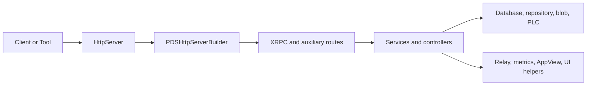

# Codebase Map

## Overview

Read Garazyk as a set of collaborating subsystems rather than a monolith. The project has four contributor surfaces:

- Runtime code in `Garazyk/Sources/`
- Tests in `Garazyk/Tests/`
- Deployment assets in `docker/`
- Canonical docs in `docs/`

This page helps you navigate the codebase after your first build.

## Standalone Binaries

While most logic is in the `ATProtoPDS` framework, the repository produces several specialized binaries:

| Binary | Subsystem | Purpose |
| --- | --- | --- |
| `kaszlak` | PDS | The primary Personal Data Server CLI and daemon. |
| `syrena` | AppView | The standalone AppView for feed and profile indexing. |
| `zuk` | Relay | An AT Protocol relay for firehose aggregation. |
| `campagnola` | PLC | A standalone PLC directory server. |

## Runtime Layout

| Area | What it owns | Where to start |
| --- | --- | --- |
| App | Application composition, composition root, configuration, standalone runtimes | `Garazyk/Sources/App/`, `PDSApplication`, `PDSConfiguration`, `AppViewRuntime`, `RelayRuntime`, `PLCRuntime` |
| Network | HTTP routing, Sans-I/O protocol sessions, auth gates, route registration | `Garazyk/Sources/Network/`, `PDSHttpServerBuilder`, `HttpProtocolSession` |
| Database | Service DBs, actor stores, pooling, migrations, monitoring | `Garazyk/Sources/Database/` |
| Repository | MST, CAR, commit logic, repository state | `Garazyk/Sources/Repository/`, `Garazyk/Sources/Core/Repositories/` |
| Auth | JWT, DPoP, OAuth, verifier helpers, signing paths | `Garazyk/Sources/Auth/`, `Garazyk/Sources/Auth/Crypto/`, `Garazyk/Sources/Auth/Verifier/`, `Garazyk/Sources/Auth/OAuthProvider/`, `Garazyk/Sources/Auth/PDS/` |
| Services | Account, record, admin, safety, phone verification, high-level business logic | `Garazyk/Sources/Services/PDS/`, `Garazyk/Sources/App/Services/` |
| Identity | Handle validation, DID resolution, DNS verification | `Garazyk/Sources/Identity/` |
| PLC | DID/PLC operations, auditor, replayer, PLC server | `Garazyk/Sources/PLC/` |
| Sync, Relay, and Federation | Firehose, relay behavior, aggregation, federation flows | `Garazyk/Sources/Sync/`, `Garazyk/Sources/Relay/`, `Garazyk/Sources/Federation/` |
| AppView and UI | Read-model services plus contributor-facing browser tools | `Garazyk/Sources/AppView/`, `Garazyk/Sources/App/Explore/`, `Garazyk/Sources/App/CappuccinoUI/`, `Garazyk/Sources/App/AdminUI/` |
| CLI and Admin | Operator workflows and admin surfaces | `Garazyk/Sources/CLI/`, `Garazyk/Sources/Admin/` |
| Supporting subsystems | Blob storage, media transcoding, metrics, lexicon validation, compatibility shims, logging | `Garazyk/Sources/Blob/`, `Garazyk/Sources/Media/`, `Garazyk/Sources/Metrics/`, `Garazyk/Sources/Lexicon/`, `Garazyk/Sources/Compat/`, `Garazyk/Sources/Debug/` |

## Read Order for New Contributors

If you are onboarding to the codebase, read in this order:

1. [Overview](./overview) for the architectural vocabulary.
2. [Request Lifecycle](./request-lifecycle) to understand the end-to-end path.
3. `Garazyk/Sources/App/PDSConfiguration.{h,m}` to learn what can be configured.
4. `Garazyk/Sources/Network/PDSHttpServerBuilder.m` to see what the server exposes.
5. `Garazyk/Sources/Network/XrpcMethodRegistry.m` to see how protocol methods are wired.
6. One service path you care about, usually `PDSAccountService` or `PDSRecordService` in `Garazyk/Sources/Services/PDS/`.
7. The matching test area in `Garazyk/Tests/App/Services/`.

That sequence gives you the system boundary, the routing surface, then one domain slice with tests.

## How the Major Subsystems Fit Together

Most feature work involves extending a service and exposing it through the network surface, rather than just adding a route:

1. Extend a service or controller.
2. Expose it through the correct network surface.
3. Update configuration or tests.
4. Document the operational consequences.

## Test/Runtime Mirroring

The test tree mirrors the runtime tree, making navigation easier:

| Runtime area | Test area |
| --- | --- |
| `Garazyk/Sources/Auth/` | `Garazyk/Tests/Auth/` |
| `Garazyk/Sources/Network/` | `Garazyk/Tests/Network/`, `Garazyk/Tests/XRPC/` |
| `Garazyk/Sources/Database/` | `Garazyk/Tests/Database/` |
| `Garazyk/Sources/Repository/` | `Garazyk/Tests/Repository/` |
| `Garazyk/Sources/AppView/` | `Garazyk/Tests/AppView/`, `Garazyk/Tests/AppViewServer/` |
| `Garazyk/Sources/Email/` | `Garazyk/Tests/Email/` |
| `Garazyk/Sources/PLC/` | `Garazyk/Tests/PLC/`, `Garazyk/Tests/plc_e2e/` |
| `Garazyk/Sources/Services/` | `Garazyk/Tests/App/Services/` |

Use [Testing Map](../11-reference/testing-map) when you need the contributor workflow instead of the raw directory listing.

## Deployment and Operations Files

Contributor docs often drift when the deployment assets are ignored. The production path in this repository is explicit:

- `docker/pds/docker-compose.yml` is the canonical compose entrypoint.
- `docker/pds/config.json` is the example production config checked into the repo.
- `docker/Dockerfile.gnustep` is the production build target for Linux deployment.

If a docs page says something operational, verify it against those files first.

## Canonical vs Archival Docs

`docs/` is the canonical docs site for this pass. Some directories still contain useful detail but should be treated as deep reference or historical context:

- `docs/tests/`
- `docs/oauth2/`
- `docs/security/`
- `docs/architecture/`
- report and migration files at the top level

When you add or rewrite contributor-facing docs, link to those areas deliberately instead of assuming readers will discover them.

## Related Reading

- [Request Lifecycle](./request-lifecycle)
- [Setup](./setup)
- [Architecture Overview](./architecture-overview)
- [API Reference](../11-reference/api-reference)
- [Testing Map](../11-reference/testing-map)
- [Explorer, OpenAPI & UI](../11-reference/explorer-openapi-ui)

## Related

- [Documentation Map](../11-reference/documentation-map.md)
- [Contributor Guide](../index.md)
- [Repository Documentation Index](../repo-index/index.md)

