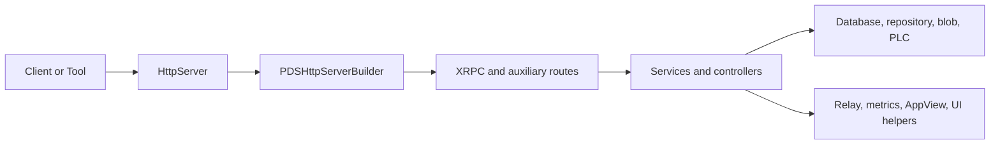

# Codebase Map

## Overview

September is easiest to understand when you stop thinking about it as one monolith and start reading it as a set of collaborating subsystems. The project has four contributor surfaces:

- Runtime code in `Garazyk/Sources/`
- Tests in `Garazyk/Tests/`
- Deployment assets in `docker/`
- The canonical docs site in `docs/`

This page is the shortest route from "I can build it" to "I know where to change it."

## Runtime Layout

| Area | What it owns | Where to start |
| --- | --- | --- |
| App | Application composition, configuration, shared services, web UIs | `Sources/App/`, `PDSApplication`, `PDSConfiguration` |
| Network | HTTP routing, XRPC dispatch, auth gates, route registration | `Sources/Network/`, `PDSHttpServerBuilder`, `XrpcMethodRegistry` |
| Database | Service DBs, actor stores, pooling, migrations, monitoring | `Sources/Database/` |
| Repository | MST, CAR, commit logic, repository state | `Sources/Repository/`, `Sources/Core/Repositories/` |
| Auth | JWT, DPoP, OAuth, verifier helpers, signing paths | `Sources/Auth/`, `Sources/AuthCrypto/`, `Sources/AuthVerifier/`, `Sources/OAuthProvider/`, `Sources/PDSAuth/` |
| Services | Account, record, admin, phone verification, higher-level business logic | `Sources/Services/`, `Sources/App/Services/` |
| Identity and PLC | Handle validation, DID/PLC operations, PLC server | `Sources/Identity/`, `Sources/PLC/` |
| Sync and Federation | Firehose, relay behavior, cross-PDS flows | `Sources/Sync/`, `Sources/Federation/` |
| AppView and UI | Read-model services plus contributor-facing browser tools | `Sources/AppView/`, `Sources/App/Explore/`, `Sources/App/CappuccinoUI/`, `Sources/App/AdminUI/` |
| CLI and Admin | Operator workflows and admin surfaces | `Sources/CLI/`, `Sources/Admin/` |
| Supporting subsystems | Blob storage, metrics, lexicon validation, compatibility shims, logging | `Sources/Blob/`, `Sources/Metrics/`, `Sources/Lexicon/`, `Sources/Compat/`, `Sources/Debug/` |

## Read Order for New Contributors

If you are onboarding to the codebase, read in this order:

1. [Overview](./overview) for the architectural vocabulary.
2. [Request Lifecycle](./request-lifecycle) to understand the end-to-end path.
3. `Garazyk/Sources/App/PDSConfiguration.{h,m}` to learn what can be configured.
4. `Garazyk/Sources/Network/PDSHttpServerBuilder.m` to see what the server actually exposes.
5. `Garazyk/Sources/Network/XrpcMethodRegistry.m` to see how protocol methods are wired.
6. One service path you care about, usually `PDSAccountService` or `PDSRecordService`.
7. The matching test area in `Garazyk/Tests/`.

That sequence gives you the system boundary, the routing surface, then one domain slice with tests.

## How the Major Subsystems Fit Together

The practical point is that most feature work is not "add a route." It is:

1. extend a service or controller,
2. expose it through the correct network surface,
3. update configuration or tests if needed,
4. document the operational consequences.

## Tests Mirror the Runtime

The test tree mostly mirrors the runtime tree, which is a useful navigation trick:

| Runtime area | Test area |
| --- | --- |
| `Sources/Auth/` | `Tests/Auth/` |
| `Sources/Network/` | `Tests/Network/`, `Tests/XRPC/` |
| `Sources/Database/` | `Tests/Database/` |
| `Sources/Repository/` | `Tests/Repository/` |
| `Sources/AppView/` | `Tests/AppView/` |
| `Sources/Email/` | `Tests/Email/` |
| `Sources/PLC/` | `Tests/PLC/`, `Tests/plc_e2e/` |

Use [Testing Map](../11-reference/testing-map) when you need the contributor workflow instead of the raw directory listing.

## Deployment and Operations Files

Contributor docs often drift when the deployment assets are ignored. The production path in this repository is explicit:

- `docker/pds/docker-compose.yml` is the canonical compose entrypoint.
- `docker/pds/config.json` is the example production config checked into the repo.
- `docker/Dockerfile.gnustep` is the production build target for Linux deployment.

If a docs page says something operational, verify it against those files first.

## Canonical vs Archival Docs

`docs/` is the canonical docs site for this pass. Some directories still contain useful detail but should be treated as deep reference or historical context:

- `docs/tests/`
- `docs/oauth2/`
- `docs/security/`
- `docs/architecture/`
- report and migration files at the top level

When you add or rewrite contributor-facing docs, link to those areas deliberately instead of assuming readers will discover them.

## Related Reading

- [Request Lifecycle](./request-lifecycle)
- [Setup](./setup)
- [Testing Map](../11-reference/testing-map)
- [Explorer, OpenAPI & UI](../11-reference/explorer-openapi-ui)
