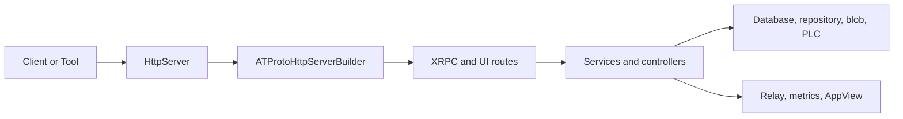

# Codebase Map

Garazyk is organized into several collaborating subsystems across four primary areas:
- **Core Logic**: `Garazyk/Sources/`
- **Tests**: `Garazyk/Tests/`
- **Deployment**: `docker/`
- **Documentation**: `docs/`

## Specialized Binaries

The `ATProtoPDS` framework contains the core logic, which is used to produce several specialized binaries:

| Binary | Subsystem | Purpose |
| --- | --- | --- |
| `kaszlak` | PDS | Primary Personal Data Server CLI and daemon. |
| `syrena` | AppView | Standalone AppView for feed and profile indexing. |
| `zuk` | Relay | AT Protocol relay for firehose aggregation. |
| `campagnola` | PLC | Standalone PLC directory server. |

## Source Layout (`Garazyk/Sources/`)

| Directory | Responsibility | Key Symbols |
| --- | --- | --- |
| `App/` | Composition root, configuration, and app lifecycle. | `PDSApplication`, `ATProtoServiceConfiguration` |
| `Network/` | HTTP routing, protocol sessions, and auth gates. | `HttpServer`, `XrpcDispatcher` |
| `Database/` | Service DBs, actor stores, pooling, and migrations. | `PDSDatabasePool`, `PDSServiceDatabases` |
| `Repository/` | MST, CAR, commit logic, and repository state. | `PDSRepository`, `PDSMST` |
| `Auth/` | JWT, DPoP, OAuth, and signing paths. | `XrpcAuthHelper`, `OAuth2Handler` |
| `Services/` | High-level business logic (Account, Record, Admin). | `PDSAccountService`, `PDSRecordService` |
| `Identity/` | Handle validation and DID resolution. | `PDSIdentityService` |
| `PLC/` | DID/PLC operations, auditor, and replayer. | `PDSPLCClient` |
| `Sync/`, `Relay/` | Firehose, relay behavior, and federation. | `PDSRelayService` |
| `AppView/` | Read-models and indexing logic. | `SyrenaAppView` |
| `CLI/` | Operator workflows and command-line parsing. | `PDSCLI` |
| `Blob/` | Blob storage, quotas, and media handling. | `PDSBlobService` |

## Onboarding Path

1. [Overview](./overview) — High-level architecture and vocabulary.
2. [Request Lifecycle](./request-lifecycle) — Trace a request end-to-end.
3. `ATProtoServiceConfiguration.m` — Configuration surface.
4. `ATProtoHttpServerBuilder.m` — Server setup and routing.
5. `XrpcMethodRegistry.m` — Protocol method registration.
6. `Garazyk/Sources/Services/PDS/` — Core service logic.
7. `Garazyk/Tests/App/Services/` — Corresponding service tests.

## Subsystem Interaction

## Test Structure

The test tree mirrors the source layout for easy navigation:

| Source Area | Test Area |
| --- | --- |
| `Garazyk/Sources/Auth/` | `Garazyk/Tests/Auth/` |
| `Garazyk/Sources/Network/` | `Garazyk/Tests/Network/` |
| `Garazyk/Sources/Database/` | `Garazyk/Tests/Database/` |
| `Garazyk/Sources/Repository/` | `Garazyk/Tests/Repository/` |
| `Garazyk/Sources/Services/` | `Garazyk/Tests/App/Services/` |

## Related Reading

- [Architecture Overview](./architecture-overview) — Detailed system design.
- [Setup Guide](./setup) — Get the project running.
- [Testing Map](../11-reference/testing-map) — Comprehensive guide to testing.
- [Documentation Map](../11-reference/documentation-map.md) — Index of all documentation.
