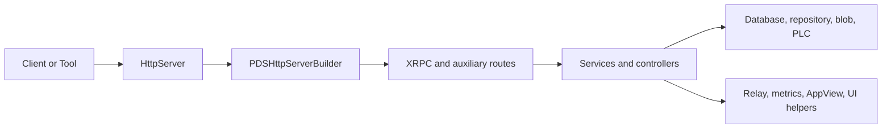

# Codebase Map

Garazyk is organized into collaborating subsystems across four primary surfaces:
- **Runtime code**: `Garazyk/Sources/`
- **Tests**: `Garazyk/Tests/`
- **Deployment assets**: `docker/`
- **Documentation**: `docs/`

## Specialized Binaries
The `ATProtoPDS` framework contains the core logic, while the repository produces several specialized binaries:

| Binary | Subsystem | Purpose |
| --- | --- | --- |
| `kaszlak` | PDS | Primary Personal Data Server CLI and daemon. |
| `syrena` | AppView | Standalone AppView for feed and profile indexing. |
| `zuk` | Relay | AT Protocol relay for firehose aggregation. |
| `campagnola` | PLC | Standalone PLC directory server. |

## Runtime Layout

| Area | Responsibility | Entry Point |
| --- | --- | --- |
| **App** | Composition root, configuration, and runtimes. | `Garazyk/Sources/App/`, `PDSApplication` |
| **Network** | HTTP routing, protocol sessions, and auth gates. | `Garazyk/Sources/Network/`, `PDSHttpServerBuilder` |
| **Database** | Service DBs, actor stores, pooling, and migrations. | `Garazyk/Sources/Database/` |
| **Repository** | MST, CAR, commit logic, and state. | `Garazyk/Sources/Repository/` |
| **Auth** | JWT, DPoP, OAuth, and signing paths. | `Garazyk/Sources/Auth/` |
| **Services** | High-level business logic (Account, Record, Admin). | `Garazyk/Sources/Services/PDS/` |
| **Identity** | Handle validation and DID resolution. | `Garazyk/Sources/Identity/` |
| **PLC** | DID/PLC operations, auditor, and replayer. | `Garazyk/Sources/PLC/` |
| **Sync/Relay** | Firehose, relay behavior, and federation. | `Garazyk/Sources/Sync/`, `Garazyk/Sources/Relay/` |
| **AppView/UI** | Read-models and contributor tools. | `Garazyk/Sources/AppView/`, `Garazyk/Sources/App/AdminUI/` |
| **CLI/Admin** | Operator workflows and admin surfaces. | `Garazyk/Sources/CLI/`, `Garazyk/Sources/Admin/` |
| **Support** | Blobs, media, metrics, and compatibility shims. | `Garazyk/Sources/Blob/`, `Garazyk/Sources/Metrics/` |

## Onboarding Path
1. [Overview](./overview) — Architectural vocabulary.
2. [Request Lifecycle](./request-lifecycle) — End-to-end request flow.
3. `Garazyk/Sources/App/PDSConfiguration.m` — Configuration surface.
4. `Garazyk/Sources/Network/PDSHttpServerBuilder.m` — Server surface and routing.
5. `Garazyk/Sources/Network/XrpcMethodRegistry.m` — Protocol method wiring.
6. `Garazyk/Sources/Services/PDS/` — Specific service logic (e.g., `PDSAccountService`).
7. `Garazyk/Tests/App/Services/` — Matching service tests.

## Subsystem Interaction

Feature development typically involves extending a service and exposing it through the network surface:
1. Extend the relevant service or controller.
2. Expose the functionality through a network surface.
3. Update configuration and tests.
4. Document operational consequences.

## Test/Runtime Mirroring
The test tree mirrors the runtime layout:

| Runtime Area | Test Area |
| --- | --- |
| `Garazyk/Sources/Auth/` | `Garazyk/Tests/Auth/` |
| `Garazyk/Sources/Network/` | `Garazyk/Tests/Network/` |
| `Garazyk/Sources/Database/` | `Garazyk/Tests/Database/` |
| `Garazyk/Sources/Repository/` | `Garazyk/Tests/Repository/` |
| `Garazyk/Sources/PLC/` | `Garazyk/Tests/PLC/` |
| `Garazyk/Sources/Services/` | `Garazyk/Tests/App/Services/` |

## Deployment Assets
The production path is defined by these canonical files:
- `docker/pds/docker-compose.yml`: Primary entrypoint.
- `docker/pds/config.json`: Example production configuration.
- `docker/Dockerfile.gnustep`: Production build target for Linux.

## Documentation Structure
The `docs/` directory contains the canonical documentation. Related deep reference or historical material is located in:
- `docs/tests/`
- `docs/oauth2/`
- `docs/security/`
- `docs/architecture/`

## Related

- [Request Lifecycle](./request-lifecycle)
- [Setup](./setup)
- [Architecture Overview](./architecture-overview)
- [API Reference](../11-reference/api-reference)
- [Testing Map](../11-reference/testing-map)
- [Documentation Map](../11-reference/documentation-map.md)

