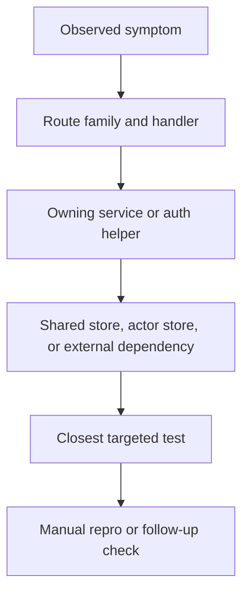

# Local Debug Workflow

## Goal

Use this page to establish a repeatable debugging workflow: identify the failing symptom, find the owning route and service, inspect the storage boundary, and run the smallest relevant test.

## Full Flow

## Effective Debugging

Garazyk's layered architecture makes blind searches inefficient; they often lead to related files rather than the actual owner. A more efficient workflow:

1. Classify the surface.
2. Follow the runtime path.
3. Confirm the storage or side-effect boundary.
4. Run the smallest useful test.

This keeps debugging anchored to the request path instead of the largest class with a familiar name.

## Walkthrough: A Failing Record Write

Use a broken `com.atproto.repo.createRecord` request as a model:

1. Reproduce the failing request locally and record the status code and error body.
2. Confirm the route family is `/xrpc/*`, not Explorer or UI.
3. Inspect the domain method and `PDSRecordService` before touching database code.
4. If the service result is wrong, inspect the actor-store transaction and commit metadata path.
5. Run `PDSRecordServiceTests` or the closest integration test before the full suite.

This sequence mirrors the runtime and prevents misclassifying validation bugs as repository corruption.

## Four Key Questions

Ask these before deep debugging:

- Did the request hit the expected handler?
- Did auth or validation stop the request before the service logic?
- Which database family owns the data?
- Which targeted test should fail if the hypothesis is right?

Answering these makes debugging easier.

## Where To Debug

- See [Request Lifecycle](./request-lifecycle) to identify the failing stage.
- Check the network layer for routing or auth issues.
- Check the service layer when the request reaches the right owner but behaves incorrectly.
- See [Testing Map](../11-reference/testing-map) to find the right test surface.

## Tests That Should Fail If This Changes

- `Garazyk/Tests/App/PDSApplicationTests.m`
- `Garazyk/Tests/Network/ATProtoHttpServerBuilderTests.m`
- `Garazyk/Tests/App/Services/PDSRecordServiceTests.m`
- `Garazyk/Tests/Auth/OAuth2HandlerTests.m`

## Appendix

### Minimal local loop

1. reproduce one failing request
2. map it to route and service
3. inspect the owning store boundary
4. run the narrowest matching test
5. repeat only after the failure mode changes

## Related

- [Documentation Map](../11-reference/documentation-map.md)
- [Contributor Guide](../index.md)

