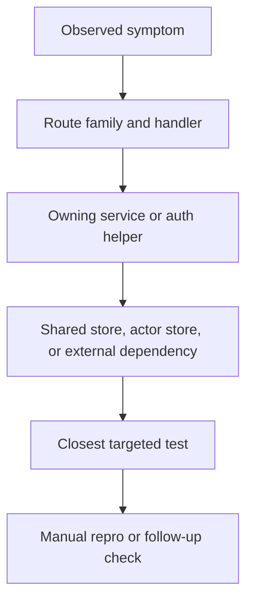

# Local Debug Workflow

## Goal

Read this page when you want a repeatable contributor workflow for debugging locally: start from the failing symptom, identify the owning route and service, inspect the storage boundary, and then run the smallest test surface that can falsify your theory.

## Full Flow

## Why This Workflow Beats Random Grepping

September has enough layers that a blind search often finds a related file before it finds the owning file. The faster workflow is:

1. classify the surface,
2. follow the runtime path,
3. confirm the storage or side-effect boundary,
4. run the smallest useful test.

That keeps local debugging anchored to the actual request path instead of the largest class with a familiar name.

## Walkthrough: A Failing Record Write

Use a broken `com.atproto.repo.createRecord` request as the model.

1. Reproduce the failing request locally and record the exact status code and error body.
2. Confirm the route family is `/xrpc/*`, not Explorer or UI.
3. Inspect the domain method and `PDSRecordService` path before touching database code.
4. If the service result looks wrong, inspect the actor-store transaction and commit metadata path.
5. Run `PDSRecordServiceTests` or the closest integration test before running the full suite.

That sequence mirrors the real runtime and prevents you from misclassifying a validation bug as a repository corruption bug.

## The Four Default Questions

Ask these before deeper debugging:

- Did the request hit the handler you think it did?
- Did auth or validation stop the request before service logic?
- Which database family owns the data you expected to change?
- Which targeted test should fail if your hypothesis is right?

Most local debugging gets easier as soon as those four answers are concrete.

## Where To Debug When This Breaks

- Start in [Request Lifecycle](./request-lifecycle) when you are not sure which stage owns the failure.
- Start in the network layer when the wrong route or auth path handles the request.
- Start in the service layer when the request reaches the right owner but the behavior is wrong.
- Start in [Testing Map](../11-reference/testing-map) when you know the owning subsystem but not the right test surface.

## Tests That Should Fail If This Changes

- `Garazyk/Tests/App/PDSApplicationTests.m`
- `Garazyk/Tests/Network/PDSHttpServerBuilderTests.m`
- `Garazyk/Tests/App/Services/PDSRecordServiceTests.m`
- `Garazyk/Tests/Auth/OAuth2HandlerTests.m`

## Appendix

### Minimal local loop

1. reproduce one failing request
2. map it to route and service
3. inspect the owning store boundary
4. run the narrowest matching test
5. repeat only after the failure mode changes
