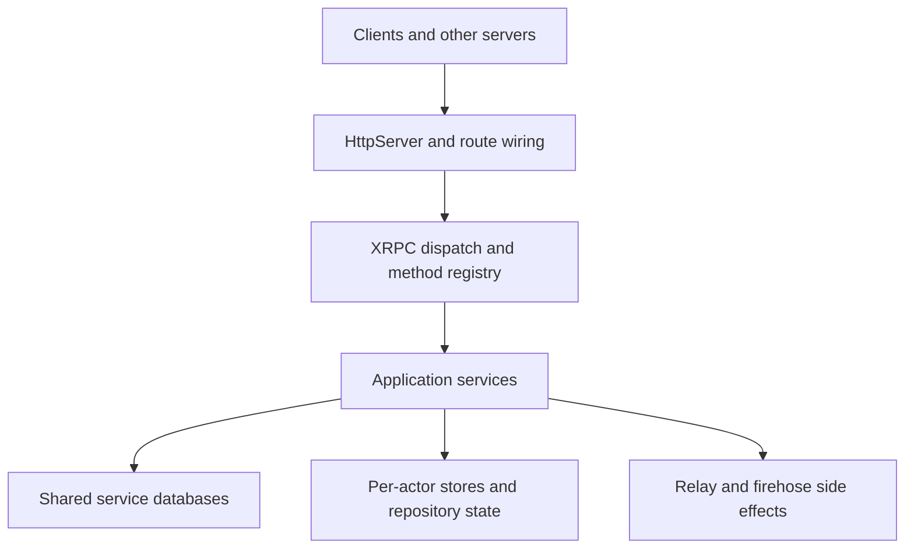

# Getting Started with PDS

Garazyk is an Objective-C Personal Data Server (PDS) for the AT Protocol. It serves XRPC endpoints, manages per-account repositories, streams firehose events, and provides contributor tools like the Explorer and browser-based Admin UI.

## Architecture

Garazyk emphasizes:

- Transport, routing, and persistence implemented in a small runtime.
- Cross-platform support for macOS and Linux (via GNUstep).
- ATProto primitives (DIDs, repos, sync, auth) implemented in the repository.
- Explicit boundaries between request handling, services, and storage.

## Reading Path

1. [Setup Guide](./setup) — Install tools and build the project.
2. [Codebase Map](./codebase-map) — Navigate the source tree.
3. [Request Lifecycle](./request-lifecycle) — Trace a request from transport to persistence.
4. [AT Protocol Basics](../02-core-concepts/atproto-basics) — Understand DIDs, repos, and XRPC.
5. [Services Overview](../03-application-layer/services-overview) — Explore the high-level business logic.

## Implementation Details

- [Architecture Overview](./architecture-overview) — Detailed system design.
- [Startup and Boot Sequence](./startup-and-boot-sequence) — How the server initializes.
- [Local Debug Workflow](./local-debug-workflow) — Efficiently developing and debugging.
- [HTTP Request and Route Pipeline](../04-network-layer/http-request-and-route-pipeline) — Deep dive into the network layer.
- [Shared vs Actor Database Boundary](../05-database-layer/shared-vs-actor-database-boundary) — Data isolation strategy.

## Troubleshooting

- [Troubleshooting Reference](../11-reference/troubleshooting)
- [Tutorials](../10-tutorials/index)

## Related

- [Documentation Map](../11-reference/documentation-map.md)
- [Contributor Guide](../index.md)

