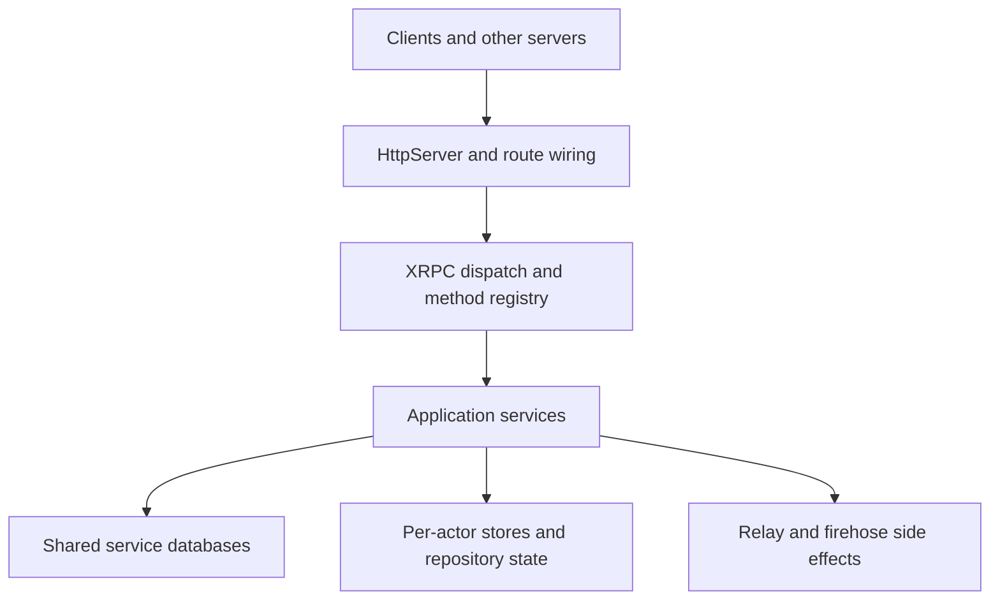

# Getting Started with PDS

## What Garazyk Is

Garazyk is an Objective-C Personal Data Server for the AT Protocol. It serves ATProto endpoints, stores per-account repositories, exposes a firehose stream, and ships contributor tooling such as Explorer and the browser UI.

This guide is organized for contributors, not just operators. The summary pages explain what each subsystem is for, and the companion deep dives show one real path through the codebase.

## Why This Implementation Looks The Way It Does

The codebase optimizes for a few explicit goals:

- a small runtime with direct control over transport, routing, and persistence
- cross-platform support across macOS and GNUstep
- repository-grounded implementation of ATProto concepts such as DIDs, repos, sync, and auth
- contributor-visible boundaries between request handling, services, and storage

Those boundaries are the main thing to learn first. Once they are clear, the rest of the codebase becomes much easier to navigate.

## Architecture At A Glance

## How To Read This Guide

Use the site in this order:

1. learn the request path and the codebase map
2. understand the service and storage boundaries
3. use the deep dives when you need one concrete runtime flow
4. use tutorials when you want a contributor walkthrough

The docs are intentionally split this way so the top-level pages stay readable without hiding the implementation detail you need later.

## Recommended Starting Path

- [Setup](./setup)
- [Codebase Map](./codebase-map)
- [Request Lifecycle](./request-lifecycle)
- [AT Protocol Basics](../02-core-concepts/atproto-basics)
- [Services Overview](../03-application-layer/services-overview)

## Go Deeper

- [Startup and Boot Sequence](./startup-and-boot-sequence)
- [Local Debug Workflow](./local-debug-workflow)
- [HTTP Request and Route Pipeline](../04-network-layer/http-request-and-route-pipeline)
- [Shared vs Actor Database Boundary](../05-database-layer/shared-vs-actor-database-boundary)

## Next Steps

- If you are new to the repo, continue with [Setup](./setup) and [Codebase Map](./codebase-map).
- If you are chasing a bug, start with [Request Lifecycle](./request-lifecycle) and [Troubleshooting](../11-reference/troubleshooting).
- If you want a guided implementation path, use the [Tutorials](../10-tutorials/index).
