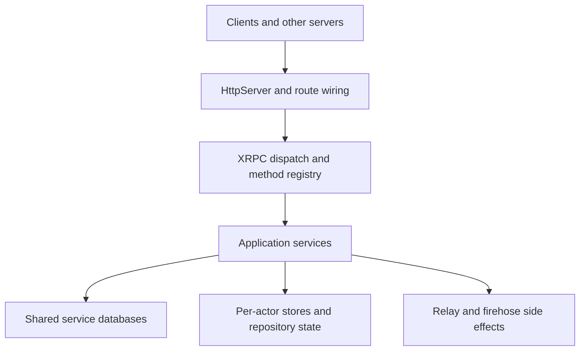

# Getting Started with PDS

Garazyk is an Objective-C Personal Data Server (PDS) for the AT Protocol. It serves XRPC endpoints, manages per-account repositories, streams firehose events, and provides contributor tools like the Explorer and browser-based Admin UI.

## Architecture

Garazyk emphasizes:

- Direct control over transport, routing, and persistence in a small runtime.
- Native cross-platform support for macOS and GNUstep.
- ATProto primitives (DIDs, repos, sync, auth) implemented directly in the repository.
- Explicit boundaries between request handling, services, and storage.

## Reading Path

1. [Setup](./setup)
2. [Codebase Map](./codebase-map)
3. [Request Lifecycle](./request-lifecycle)
4. [AT Protocol Basics](../02-core-concepts/atproto-basics)
5. [Services Overview](../03-application-layer/services-overview)

## Implementation Details

- [Startup and Boot Sequence](./startup-and-boot-sequence)
- [Local Debug Workflow](./local-debug-workflow)
- [HTTP Request and Route Pipeline](../04-network-layer/http-request-and-route-pipeline)
- [Shared vs Actor Database Boundary](../05-database-layer/shared-vs-actor-database-boundary)

## Troubleshooting

- [Troubleshooting](../11-reference/troubleshooting)
- [Tutorials](../10-tutorials/index)

## Related

- [Documentation Map](../11-reference/documentation-map.md)
- [Contributor Guide](../index.md)
- [Repository Documentation Index](../repo-index/index.md)

