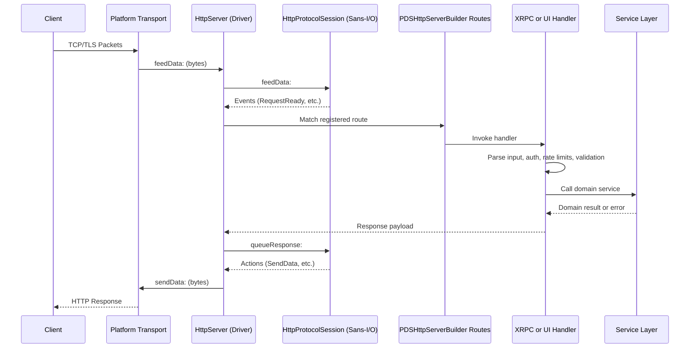

# Request Lifecycle

Garazyk processes requests through a defined sequence: transport, protocol dispatch, service logic, and persistence.

## The Request Path

## Stage 1: Transport and Routing

The `HttpServer` handles raw byte streams and TLS. It uses a [Sans-I/O architecture](../04-network-layer/sans-io) where the protocol logic (`HttpProtocolSession`) is decoupled from the socket.

- **Routing**: `PDSHttpServerBuilder` defines the order of route registration.
- **Static Assets**: The Explorer and Admin UI assets are served directly via the builder.

### Primary Endpoints
- `/xrpc/*`: AT Protocol methods.
- `/api/pds/*`: Operator-facing inspection and OpenAPI docs.
- `/ui/*`: Admin UI.
- `/oauth/*` and `/.well-known/*`: Identity and discovery.

## Stage 2: Protocol Dispatch

The XRPC layer standardizes how protocol methods are handled:
- `XrpcDispatcher`: Normalizes requests, looks up handlers, and ensures consistent error shapes.
- `XrpcMethodRegistry`: Maps NSIDs to Objective-C blocks.

Auth verification (JWT, DPoP) and input validation occur at this stage. See the [XRPC Dispatch](../04-network-layer/xrpc-dispatch) guide for more.

## Stage 3: Service Logic

Domain-specific logic is encapsulated in the service layer:
- **Account**: Lifecycle and session management.
- **Repository**: Record CRUD and MST mutations.
- **Blob**: Binary storage and quota enforcement.

Services are coordinated through the `PDSApplication` facade. Explore the [Services Overview](../03-application-layer/services-overview) for details.

## Stage 4: Persistence

Garazyk uses a bifurcated storage model:
- **Shared Databases**: System-wide state like user accounts and DIDs.
- **Actor Databases**: Per-account repository state, including MSTs and records.

See [Shared vs Actor Database Boundary](../05-database-layer/shared-vs-actor-database-boundary) for the rationale.

## Stage 5: Side Effects

Mutations trigger secondary operations:
- **Relay Notifications**: Relays are notified of repository changes.
- **Firehose**: Events are pushed to the `subscribeRepos` stream.
- **Metrics**: Operational telemetry is captured.

## Common Request Patterns

### XRPC Write Flow
1. Route matches `/xrpc/...`.
2. Dispatcher resolves the NSID and verifies auth.
3. Domain service mutates the actor database.
4. Repository state is updated (MST), and relays are notified.
5. Response returns the new state (e.g., CID of the new record).

### Inspection Flow
Endpoints under `/api/pds/*` allow operators to inspect server state and review generated documentation without going through the protocol dispatch.

## Debugging by Symptom

| Symptom | Primary Check |
| --- | --- |
| 404 or wrong handler | `PDSHttpServerBuilder` registration order. |
| Auth failure | `XrpcAuthHelper` and config settings. |
| Logic error | Domain service implementation. |
| State corruption | Repository or database layer logic. |

## Related Reading

- [Codebase Map](./codebase-map) — Locate relevant source files.
- [Architecture Overview](./architecture-overview) — System-wide design.
- [HTTP Server](../04-network-layer/http-server) — Deep dive into the transport layer.

