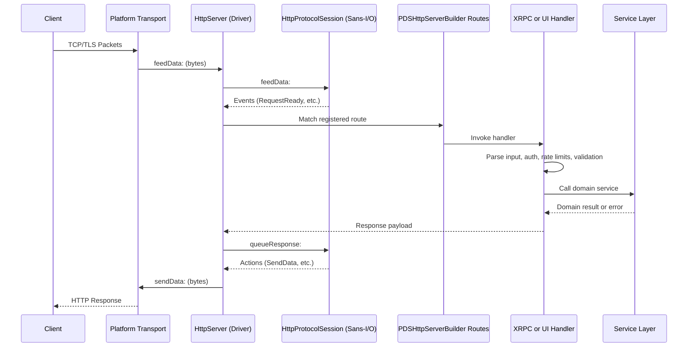

# Request Lifecycle

Garazyk processes requests through a sequence: transport, protocol dispatch, service logic, and persistence. 

## The Request Path

## Stage 1: Transport and Routing
`HttpServer` handles raw byte streams. `PDSHttpServerBuilder` defines route registration order.

- **Route registration**: If a request misses a handler, verify registration order in the builder.
- **Static assets**: Explorer and Admin UI assets are served directly by the builder.
- **Environment**: Configuration differences between local and production environments often affect builder routing.

### Builder Endpoints
- `/xrpc/*`: Protocol methods.
- `/api/pds/*`: Explorer and OpenAPI inspection.
- `/ui`: Admin UI.
- `/api/mst/*`: MST inspection utilities.
- `/oauth/*` and `/.well-known/*`: Auth and discovery.

## Stage 2: Protocol Dispatch
The XRPC layer handles normalization and registration:
- `XrpcDispatcher`: Normalizes requests, looks up methods, and standardizes error shapes.
- `XrpcMethodRegistry`: Maps NSIDs to Objective-C handler blocks.
- **Auth and Validation**: Auth helpers and input validation run during dispatch.

## Stage 3: Service Logic
Domain-specific logic resides in the service layer:
- **Account Flows**: Account and authentication services.
- **Repository Writes**: Record and repository services.
- **Blob Management**: Blob storage and quota logic.
- **Admin/AppView**: Dedicated controllers and services.

This layer enforces business rules and protocol semantics.

## Stage 4: Persistence
Storage is bifurcated:
- **Service Databases**: Shared operational state (users, DIDs).
- **Actor Databases**: Per-account repository state (MST, records).

Failures in one storage path do not necessarily indicate health issues in the other.

## Stage 5: Side Effects
Specific requests trigger secondary operations:
- **Repository Mutations**: Update MST state and notify relays.
- **Streaming**: Sync endpoints use long-lived WebSocket connections.
- **Telemetry**: Metrics and logs capture operational context.

## Common Request Patterns

### XRPC Write Flow
1. Route matches `/xrpc/...`.
2. Dispatcher resolves the NSID.
3. Auth and validation run.
4. Service mutates actor state.
5. Repository and relay side effects execute.
6. Response returns state metadata.

### Inspection Flow
Endpoints under `/api/pds/*` expose server state and generated OpenAPI documentation for operators.

### Admin UI Flow
The Admin UI (`/ui`) and Explorer assets validate route wiring before making API calls into `/api/pds/*` or `/xrpc/*`.

## Debugging by Symptom

| Symptom | Primary Check |
| --- | --- |
| 404 or wrong handler | `PDSHttpServerBuilder` registration |
| Auth failure | XRPC auth helpers and config |
| Logic error | Service layer |
| State corruption | Database and repository code |
| UI rendering issues | `/ui` asset path or `/api/pds/*` responses |

## Related

- [Codebase Map](./codebase-map)
- [Services Overview](../03-application-layer/services-overview)
- [HTTP Server](../04-network-layer/http-server)
- [Documentation Map](../11-reference/documentation-map.md)

