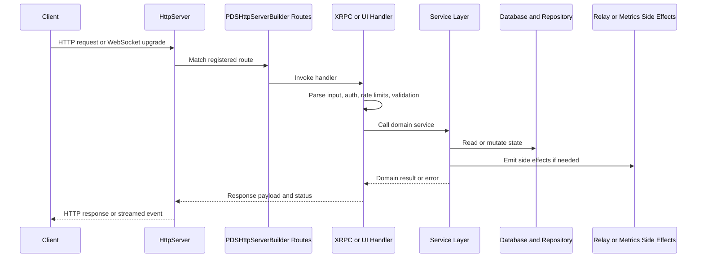

# Request Lifecycle

## Overview

A useful mental model for September is: transport first, protocol second, service logic third, persistence last. When you debug a bug, you are usually finding the stage where that chain stopped behaving as expected.

This page describes the normal flow for a request that enters the PDS and the places contributors most often need to inspect.

## The Main Path

## Stage 1: Transport and Route Selection

`HttpServer` handles the raw request. `PDSHttpServerBuilder` decides which routes exist and in what order they are registered.

That distinction matters:

- If the request never hits the expected handler, inspect route registration first.
- If a static asset, Explorer endpoint, or `/ui` page behaves oddly, inspect `PDSHttpServerBuilder` before you inspect business logic.
- If behavior differs between production and local runs, compare the builder configuration, not just the handler code.

Useful surfaces exposed by the builder include:

- `/xrpc/*` for protocol methods
- `/api/pds/*` for Explorer and OpenAPI inspection endpoints
- `/ui` for the Cappuccino-based browser UI
- `/api/mst/*` for MST viewer utilities
- `/oauth/*` and `/.well-known/*` for auth and discovery

## Stage 2: Protocol Dispatch and Guard Rails

For XRPC methods, the next stop is the dispatch and registration layer:

- `XrpcDispatcher` handles request normalization, method lookup, and shared error shaping.
- `XrpcMethodRegistry` maps NSIDs such as `com.atproto.repo.createRecord` to the actual Objective-C handler blocks.
- Auth helpers, rate limiting, and request validation run here or immediately around it.

This stage answers questions like:

- Is the method registered at all?
- Is the caller authorized for this method?
- Did the request fail because of validation, not service logic?
- Is the response shape coming from the protocol adapter rather than the service?

## Stage 3: Service Layer Decisions

Once the request reaches a service, the logic becomes domain-specific:

- Account flows go through account and auth services.
- Repository writes involve record plus repository services.
- Blob flows involve blob storage and quota logic.
- Admin and AppView flows use their own service/controller slices.

This is where the "why" of the application lives:

- business rules,
- protocol semantics,
- side-effect ordering,
- and coordination between subsystems.

If the bug is "the route works but the behavior is wrong," you are usually here.

## Stage 4: Persistence and Repository State

The persistence layer is split on purpose:

- service databases hold shared operational state,
- actor databases hold per-account repository state,
- repository code manages MST and commit integrity on top of that storage.

This separation explains a lot of contributor confusion. A successful account lookup does not prove a repository write path is healthy, because those operations do not hit the same storage path.

Use the database layer docs when you need to answer:

- Which store owns this data?
- Is this a shared-service concern or a per-actor concern?
- Does the failure come from migrations, pooling, or repository integrity?

## Stage 5: Side Effects

Some requests end with a response and no more work. Others trigger secondary paths:

- record writes can update repository state and fire relay notifications,
- sync endpoints can stream events rather than return a single payload,
- metrics and logs record operational context,
- UI endpoints may aggregate several service calls for contributor tooling.

These side effects matter because bugs often show up there first. A request may succeed locally while relay propagation, metrics, or the read-model surface stays wrong.

## Three Common Request Shapes

### XRPC write flow

This is the most important contributor path:

1. route matches `/xrpc/...`
2. dispatcher resolves NSID
3. auth and validation run
4. service mutates actor state
5. repository and relay side effects occur
6. response returns new state metadata

### Explorer or OpenAPI inspection flow

These are not protocol methods. They are contributor and operator tools served under `/api/pds/*`.

Their job is to expose readable state, generated OpenAPI output, and debugging views without forcing you through a client app.

### Static or UI flow

Routes like `/ui` and the legacy Explorer assets mostly validate the route wiring and static asset path first, then make API calls back into `/api/pds/*` or `/xrpc/*`.

When a UI looks broken, always ask whether the failure is:

- static asset delivery,
- UI-side request construction,
- or the underlying API response.

## Where to Debug by Symptom

| Symptom | Start here |
| --- | --- |
| 404 or wrong handler | `PDSHttpServerBuilder` route registration |
| method exists but auth fails | XRPC auth helpers and configuration |
| request validates but behavior is wrong | service layer |
| write succeeds but state looks corrupted | database and repository code |
| UI renders nothing | `/ui` asset path, `/api/pds/*` responses, then controller logic |
| OpenAPI docs drift from behavior | Explorer handler descriptors and API docs page |

## Related Reading

- [Codebase Map](./codebase-map)
- [Services Overview](../03-application-layer/services-overview)
- [HTTP Server](../04-network-layer/http-server)
- [XRPC Dispatch](../04-network-layer/xrpc-dispatch)
- [Explorer, OpenAPI & UI](../11-reference/explorer-openapi-ui)
