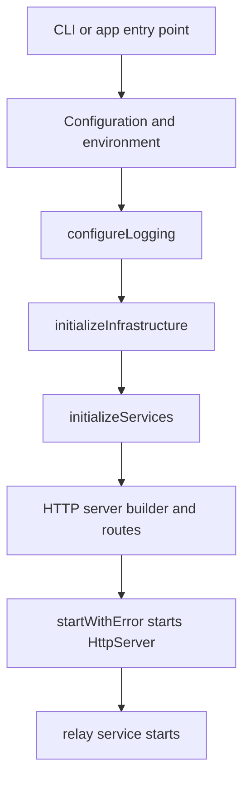

# Startup and Boot Sequence

## Goal

Use this page to debug server failures during startup or to understand how configuration, infrastructure, services, and routes assemble.

## Full Flow

## Startup Boundaries

Startup problems differ from request problems. `PDSApplication` performs several tasks before answering routes:

- Validates runtime identity.
- Prepares data paths and infrastructure.
- Creates shared services.
- Wires the HTTP server.
- Starts listening and enables relay side effects.

If the process dies early, inspecting endpoint code is inefficient.

## PDSApplication Sequence

The core sequence in `Garazyk/Sources/App/PDSApplication.m`:

1. Load configuration and configure logging.
2. Initialize infrastructure, including key managers and databases.
3. Enforce production identity checks (issuer must be a public HTTPS identity).
4. Compose services on top of infrastructure.
5. Create and configure `HttpServer` via `PDSHttpServerBuilder`.
6. Start the HTTP listener.
7. Start the relay service.

This sequence helps identify why issuer errors, permission failures, or database bugs appear before request logging starts.

## Startup Checklist

- Is the issuer valid for the environment?
- Are the data directories writable?
- Did shared databases initialize?
- Did route wiring complete before the server listened?
- Did the relay service start after the HTTP server?

These questions map to the startup stages.

## Debugging Startup

- Check `Garazyk/Sources/App/PDSApplication.m` for ordering and service composition.
- Check `Garazyk/Sources/Network/PDSHttpServerBuilder.m` if routes are missing.
- Check the database layer if the process dies during infrastructure setup.
- Check configuration loading if identity or data paths are incorrect.

## Relevant Tests

- `Garazyk/Tests/App/PDSApplicationTests.m`
- `Garazyk/Tests/Network/PDSHttpServerBuilderTests.m`
- `Garazyk/Tests/Auth/OAuth2HandlerTests.m`
- `Garazyk/Tests/Database/Integration/DatabaseMigrationTests.m`

## Appendix

### Symptom Classification

- Process exits before binding a port: configuration or infrastructure failure.
- Port binds but routes are missing: builder wiring failure.
- Routes answer but relay is inert: post-start side effect failure.

## Related

- [Documentation Map](../11-reference/documentation-map.md)
- [Contributor Guide](../index.md)
- [Repository Documentation Index](../repo-index/index.md)

