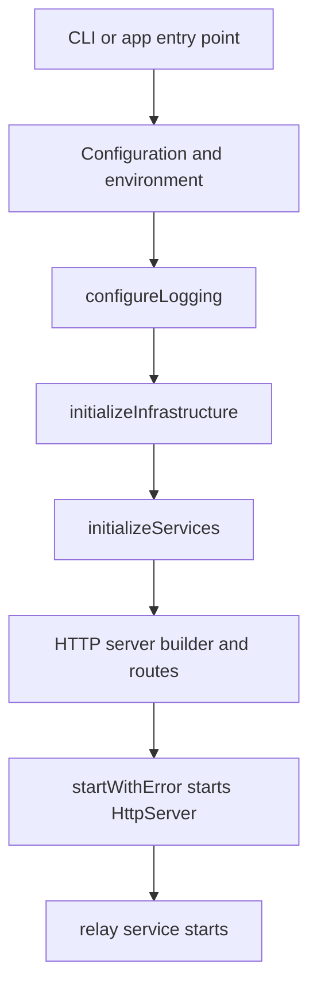

# Startup and Boot Sequence

This guide explains how the Garazyk server initializes. Understanding the boot sequence is essential for debugging startup failures, such as configuration errors or database permission issues.

## Full Flow

## Startup Boundaries

Startup failures are distinct from request-time errors. The `PDSApplication` handles initialization before the server begins answering routes:

1. **Validation**: Confirms the runtime identity and environment.
2. **Infrastructure**: Prepares data paths, key managers, and databases.
3. **Services**: Composes shared services on top of the infrastructure.
4. **Networking**: Wires the HTTP server and registers routes.
5. **Side Effects**: Starts the relay service and other post-start tasks.

## PDSApplication Sequence

The core initialization happens in `Garazyk/Sources/App/PDSApplication.m`:

1. **Load Configuration**: Reads `config.json` and sets up logging.
2. **Initialize Infrastructure**: Prepares key managers and opens shared databases.
3. **Production Identity Checks**: Ensures the issuer is a valid public HTTPS identity (if in production mode).
4. **Service Composition**: Instantiates services like `PDSAccountService` and `PDSRepositoryService`.
5. **HTTP Server Setup**: Configures the `HttpServer` via `ATProtoHttpServerBuilder`.
6. **Start Listener**: Begins listening for incoming connections.
7. **Relay Activation**: Starts the relay service once the server is ready.

## Startup Checklist

If the server fails to start, verify the following:
- Is the **issuer** correct for your environment?
- Are the **data directories** writable by the process?
- Did the **shared databases** initialize without error?
- Was **route wiring** completed before the listener started?
- Did the **relay service** start successfully?

## Debugging Startup Failures

- **Early Exit**: If the process dies before binding a port, check the configuration loading and infrastructure setup in `PDSApplication.m`.
- **Missing Routes**: If the port binds but requests return 404, verify the route registration in `ATProtoHttpServerBuilder.m`.
- **Inert Relay**: If the server answers requests but doesn't notify relays, check the relay service activation logic.

## Related Reading

- [Architecture Overview](./architecture-overview) — Detailed system design.
- [Setup Guide](./setup) — Initial project configuration.
- [Config Reference](../11-reference/config-reference) — Detailed configuration keys.
- [Documentation Map](../11-reference/documentation-map.md) — Index of all documentation.

