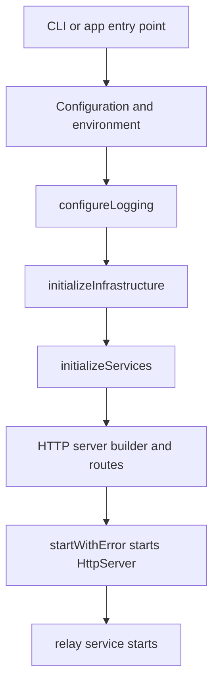

# Startup and Boot Sequence

## Goal

Read this page when the server fails before it handles useful traffic, or when you need to know how configuration, infrastructure, services, and route wiring are assembled during process startup. This is the shortest path from "the binary started" to "the runtime is actually serving the right surfaces."

## Full Flow

## Why Startup Bugs Need Their Own Mental Model

Startup problems are not request problems. `PDSApplication` does a large amount of work before a single route can answer:

- validates runtime identity assumptions,
- prepares data paths and infrastructure,
- creates shared services,
- wires the HTTP server,
- only then starts listening and enables relay side effects.

If the process dies early, reading endpoint code is usually wasted effort.

## Walkthrough: `PDSApplication`

The core sequence lives in `Garazyk/Sources/App/PDSApplication.m`.

1. Configuration is loaded and logging is configured.
2. Infrastructure is initialized, including key managers, databases, and other shared runtime dependencies.
3. Production identity checks enforce that issuer values are real public HTTPS identities, not placeholders.
4. Services are composed on top of that infrastructure.
5. `startWithError:` creates or configures the `HttpServer` and applies `PDSHttpServerBuilder`.
6. The HTTP server starts listening on the configured port.
7. The relay service starts after the main server is up.

That order explains why issuer mistakes, path-permission failures, or database setup bugs appear before any request-level logging you expected to see.

## What To Check First During Startup Work

- Is the issuer valid for the current environment?
- Are the data directories writable?
- Did shared databases initialize successfully?
- Did route wiring complete before the server attempted to listen?
- Did the relay service start only after the HTTP server succeeded?

Those questions map cleanly to the major startup stages.

## Where To Debug When This Breaks

- Start in `Garazyk/Sources/App/PDSApplication.m` for ordering, environment checks, and service composition.
- Start in `Garazyk/Sources/Network/PDSHttpServerBuilder.m` when startup "succeeds" but key routes are missing.
- Start in the database layer when the process dies during infrastructure setup.
- Start in configuration loading when the runtime identity or data paths look wrong.

## Tests That Should Fail If This Changes

- `Garazyk/Tests/App/PDSApplicationTests.m`
- `Garazyk/Tests/Network/PDSHttpServerBuilderTests.m`
- `Garazyk/Tests/Auth/OAuth2HandlerTests.m`
- `Garazyk/Tests/Database/Integration/DatabaseMigrationTests.m`

## Appendix

### Symptom split

- process exits before binding a port: configuration or infrastructure
- port binds but routes are missing: builder wiring
- routes answer but relay is inert: post-start side effects
