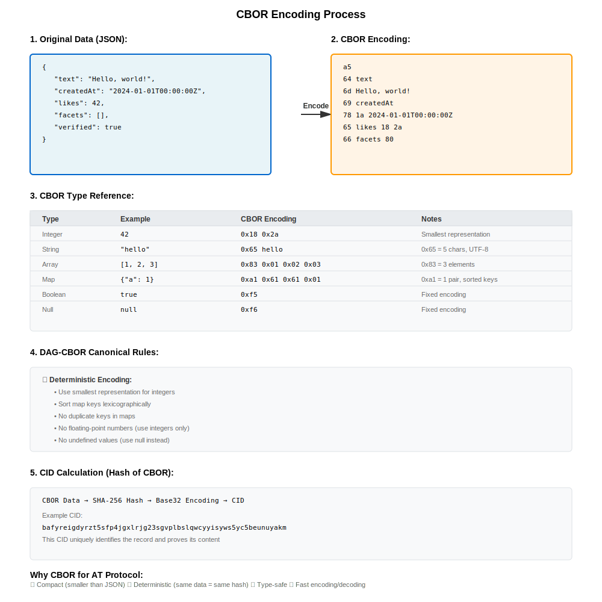

# CBOR and CAR Formats

## Why This Matters

In a decentralized social network, every post, like, and follow creates a record that must be:
- **Verifiable** — Anyone can prove a record hasn't been tampered with
- **Efficient** — Bandwidth and storage costs matter at scale
- **Portable** — Records move between servers without corruption
- **Deterministic** — The same data always produces the same hash

CBOR and CAR are the foundational data formats that make this possible. CBOR provides deterministic binary encoding for individual records, while CAR packages multiple records together for efficient synchronization. Without these formats, the AT Protocol's content-addressed architecture wouldn't work.

## CBOR (Concise Binary Object Representation)

### What is CBOR?

CBOR is a binary data format that:
- Is more compact than JSON
- Preserves data types (integers, floats, strings, arrays, maps)
- Is deterministic (same data always encodes the same way)
- Is language-independent

### Why CBOR?

The AT Protocol uses CBOR because:
- **Compact** — Smaller than JSON, important for bandwidth
- **Deterministic** — Essential for cryptographic hashing
- **Type-safe** — Preserves data types during serialization
- **Efficient** — Fast to encode and decode

### Real-World Impact

Consider a simple post: `{"text": "Hello, world!", "createdAt": "2024-01-01T00:00:00Z"}`. In JSON, this is 62 bytes. In CBOR, it's 48 bytes—a 23% reduction. Multiply this across millions of posts, and the bandwidth savings become substantial. More importantly, CBOR's deterministic encoding means this post will always hash to the same CID, enabling content addressing and deduplication across the network.



### CBOR Data Types

| Type | Example | CBOR Encoding |
|------|---------|---------------|
| Integer | `42` | `0x18 0x2a` |
| String | `"hello"` | `0x65 hello` |
| Array | `[1, 2, 3]` | `0x83 0x01 0x02 0x03` |
| Map | `{"a": 1}` | `0xa1 0x61 0x61 0x01` |
| Null | `null` | `0xf6` |
| Boolean | `true` | `0xf5` |

### CBOR in Code

The `ATProtoCBORSerialization` class provides the main interface for encoding and decoding CBOR data:

#### Basic Encoding and Decoding

```objc
// Encode a JSON object to CBOR
NSDictionary *record = @{
    @"text": @"Hello, world!",
    @"createdAt": @"2024-01-01T00:00:00Z"
};

NSError *error = nil;
NSData *cborData = [ATProtoCBORSerialization encodeDataWithJSONObject:record 
                                                                error:&error];
if (!cborData) {
    NSLog(@"Encoding failed: %@", error);
    return;
}

// Decode CBOR back to JSON
NSDictionary *decoded = [ATProtoCBORSerialization JSONObjectWithData:cborData 
                                                                error:&error];
if (!decoded) {
    NSLog(@"Decoding failed: %@", error);
    return;
}

// Verify round-trip
if ([decoded isEqualToDictionary:record]) {
    NSLog(@"Round-trip successful!");
}
```

**Source:** `ATProtoPDS/Sources/Core/ATProtoCBORSerialization.m` (lines 8-20)

### DAG-CBOR (Directed Acyclic Graph CBOR)

DAG-CBOR is a restricted subset of CBOR used in AT Protocol:
- **Deterministic encoding** — Canonical form for hashing
- **No floating-point** — Only integers
- **Sorted keys** — Maps have keys in sorted order
- **No duplicate keys** — Each key appears once

### DAG-CBOR Encoding Rules

1. **Integers** — Use smallest representation
2. **Strings** — UTF-8 encoded
3. **Arrays** — Elements in order
4. **Maps** — Keys sorted lexicographically
5. **No undefined values** — Use null instead

### Handling Special Types

The CBOR serializer handles AT Protocol's special types:

#### CID Links (CBOR Tag 42)

```objc
// CID links are encoded as CBOR Tag 42
// Input: {"$link": "bafy2bzaced..."}
// Output: CBOR Tag 42 with CID bytes

NSDictionary *recordWithLink = @{
    @"text": @"Hello!",
    @"parent": @{@"$link": @"bafy2bzaced4ueelaegfs5fq4a3fvh2ijmmq7xjlmakivezbsxyhynaiksqq"}
};

NSError *error = nil;
NSData *cborData = [ATProtoCBORSerialization encodeDataWithJSONObject:recordWithLink 
                                                                error:&error];

// When decoded, the CBOR Tag 42 is converted back to {"$link": "bafy..."}
NSDictionary *decoded = [ATProtoCBORSerialization JSONObjectWithData:cborData 
                                                                error:&error];
// decoded[@"parent"] == @{@"$link": @"bafy2bzaced..."}
```

**Source:** `ATProtoPDS/Sources/Core/ATProtoCBORSerialization.m` (lines 47-60)

#### Byte Strings (Base64 Encoding)

```objc
// Byte strings are encoded with base64
// Input: {"$bytes": "aGVsbG8="}
// Output: CBOR byte string

NSDictionary *recordWithBytes = @{
    @"text": @"Hello!",
    @"signature": @{@"$bytes": @"aGVsbG8gd29ybGQ="}  // "hello world" in base64
};

NSError *error = nil;
NSData *cborData = [ATProtoCBORSerialization encodeDataWithJSONObject:recordWithBytes 
                                                                error:&error];

// When decoded, byte strings are converted back to {"$bytes": "base64..."}
NSDictionary *decoded = [ATProtoCBORSerialization JSONObjectWithData:cborData 
                                                                error:&error];
// decoded[@"signature"] == @{@"$bytes": @"aGVsbG8gd29ybGQ="}
```

**Source:** `ATProtoPDS/Sources/Core/ATProtoCBORSerialization.m` (lines 61-70)

#### Map Key Sorting (Lexicographic Order)

```objc
// Maps are sorted by key (lexicographic order) for deterministic encoding
NSDictionary *record = @{
    @"z": @"last",
    @"a": @"first",
    @"m": @"middle"
};

NSError *error = nil;
NSData *cborData = [ATProtoCBORSerialization encodeDataWithJSONObject:record 
                                                                error:&error];

// The CBOR encoding will have keys in order: a, m, z
// This ensures deterministic hashing for CID generation
```

**Source:** `ATProtoPDS/Sources/Core/ATProtoCBORSerialization.m` (lines 71-85)

### Example: Encoding a Record

```objc
// Original record
NSDictionary *record = @{
    @"text": @"Hello, world!",
    @"createdAt": @"2024-01-01T00:00:00Z",
    @"facets": @[]
};

// Encode to DAG-CBOR
NSData *cbor = [ATProtoCBORSerialization encodeObject:record error:nil];

// Calculate CID (hash of CBOR data)
NSString *cid = [CID calculateCIDForData:cbor];
```

## CAR (Content Addressable aRchive)

### What is CAR?

CAR is a file format for storing content-addressed data. It's used to:
- Package records and blobs together
- Enable efficient repository synchronization
- Store snapshots of repository state

### Why CAR Matters

Imagine you're migrating your social media account from one server to another. With traditional systems, you'd need to export JSON files, upload them to the new server, and hope nothing breaks. With CAR files, your entire repository—posts, likes, follows, profile images—is packaged into a single, verifiable archive. The receiving server can verify every block's integrity using its CID, ensuring nothing was corrupted or tampered with during transfer.

CAR files are also essential for efficient synchronization. Instead of comparing every record individually, two servers can compare root CIDs. If they match, the repositories are identical. If they differ, the servers can walk the CAR structure to identify exactly which blocks need to be transferred—often just a handful of recent posts rather than the entire history.

### Design Trade-offs

**Why not use tar or zip?** Traditional archive formats don't understand content addressing. CAR files are specifically designed for content-addressed data, where each block is identified by its hash. This enables:
- **Deduplication** — Identical blocks appear only once, even if referenced multiple times
- **Partial sync** — Transfer only the blocks that differ between repositories
- **Verification** — Every block can be independently verified against its CID

**Why not use a database dump?** Database dumps are server-specific and don't preserve the content-addressed structure. CAR files are portable across any AT Protocol implementation and maintain the cryptographic guarantees of the MST structure.

### CAR Structure

```
CAR Header
├── Version (1 byte)
├── Roots (array of CIDs)
└── Blocks
    ├── Block 1 (CID + data)
    ├── Block 2 (CID + data)
    └── Block N (CID + data)
```

### CAR Format Details

**Header:**
```
Version: 1 (1 byte)
Roots: [root_cid_1, root_cid_2, ...] (CBOR encoded array)
```

**Each Block:**
```
Length: <block length> (CBOR encoded varint)
CID: <content identifier> (CBOR encoded)
Data: <block data> (raw bytes, length - CID_length)
```

The length field encodes the total size of the CID and data combined.

### CAR in Code

#### Reading a CAR File

```objc
// Read CAR from file
NSError *error = nil;
CARReader *reader = [CARReader readFromPath:@"/path/to/archive.car" error:&error];
if (!reader) {
    NSLog(@"Failed to read CAR: %@", error);
    return;
}

// Access root CID and blocks
CID *rootCID = reader.rootCID;
NSArray<CARBlock *> *blocks = reader.blocks;

// Iterate through blocks
for (CARBlock *block in blocks) {
    CID *blockCID = block.cid;
    NSData *blockData = block.data;
    
    // Process block data
    NSDictionary *decoded = [ATProtoCBORSerialization JSONObjectWithData:blockData 
                                                                    error:&error];
    if (decoded) {
        NSLog(@"Block CID: %@", blockCID.stringValue);
    }
}

// Find a specific block by CID
CARBlock *block = [reader blockWithCID:someCID];
if (block) {
    NSData *blockData = block.data;
}
```

**Source:** `ATProtoPDS/Sources/Repository/CAR.m` (lines 180-220)

#### Writing a CAR File

```objc
// Create a CAR writer with root CID
CARWriter *writer = [CARWriter writerWithRootCID:rootCID];

// Add blocks
for (NSData *blockData in blockDataArray) {
    // Calculate CID for the block
    NSData *hash = [CID sha256Digest:blockData];
    CID *blockCID = [CID cidWithDigest:hash codec:0x71];  // 0x71 = dag-cbor
    
    // Create and add block
    CARBlock *block = [CARBlock blockWithCID:blockCID data:blockData];
    [writer addBlock:block];
}

// Serialize to file
NSError *error = nil;
if (![writer writeToPath:@"/path/to/output.car" error:&error]) {
    NSLog(@"Failed to write CAR: %@", error);
    return;
}

// Or get as NSData
NSData *carData = [writer encodeWithError:&error];
if (!carData) {
    NSLog(@"Failed to encode CAR: %@", error);
}
```

**Source:** `ATProtoPDS/Sources/Repository/CAR.m` (lines 300-350)

### CAR Use Cases

**1. Repository Export**
```
Export user's entire repository as CAR file
├── Root: MST root CID
└── Blocks: All records and blobs
```

**2. Repository Sync**
```
Sync changes between two PDS instances
├── Root: New repository state
└── Blocks: Only changed records
```

**3. Backup**
```
Backup user's repository
├── Root: Repository state at backup time
└── Blocks: All records and blobs
```

## Serialization Patterns

### Encoding a Record

```objc
// In PDSRecordService.m
- (NSData *)encodeRecord:(NSDictionary *)record error:(NSError **)error {
    // 1. Validate record against lexicon
    if (![self validateRecord:record againstLexicon:@"app.bsky.feed.post" error:error]) {
        return nil;
    }
    
    // 2. Encode to DAG-CBOR
    NSData *cbor = [ATProtoCBORSerialization encodeObject:record error:error];
    if (!cbor) return nil;
    
    // 3. Calculate CID
    NSString *cid = [CID calculateCIDForData:cbor];
    
    // 4. Store in database
    [self storeRecord:record withCID:cid];
    
    return cbor;
}
```

### Decoding a Record

```objc
// In PDSRecordService.m
- (NSDictionary *)decodeRecord:(NSData *)cbor 
                      collection:(NSString *)collection
                           error:(NSError **)error {
    // 1. Decode from DAG-CBOR
    NSDictionary *record = [ATProtoCBORSerialization decodeData:cbor error:error];
    if (!record) return nil;
    
    // 2. Validate against lexicon
    if (![self validateRecord:record againstLexicon:collection error:error]) {
        return nil;
    }
    
    return record;
}
```

### Exporting Repository as CAR

```objc
// In PDSRepositoryService.m
- (NSData *)exportRepositoryAsCAR:(NSString *)did error:(NSError **)error {
    // 1. Get repository root CID
    NSString *rootCID = [self getRootCIDForDID:did];
    
    // 2. Collect all blocks (records and blobs)
    NSMutableArray *blocks = [NSMutableArray array];
    
    // Get MST blocks
    NSArray *mstBlocks = [self getMSTBlocksForDID:did];
    [blocks addObjectsFromArray:mstBlocks];
    
    // Get record blocks
    NSArray *recordBlocks = [self getRecordBlocksForDID:did];
    [blocks addObjectsFromArray:recordBlocks];
    
    // Get blob blocks
    NSArray *blobBlocks = [self getBlobBlocksForDID:did];
    [blocks addObjectsFromArray:blobBlocks];
    
    // 3. Create CAR
    CAR *car = [[CAR alloc] init];
    NSData *carData = [car encodeWithRoots:@[rootCID] blocks:blocks];
    
    return carData;
}
```

## Performance Considerations

### CBOR Encoding Performance

- **Deterministic encoding** — Ensures consistent hashing
- **Streaming** — Can encode/decode large objects
- **Caching** — Cache encoded forms to avoid re-encoding

### CAR File Size

- **Compression** — CAR files can be gzipped for storage
- **Incremental sync** — Only sync changed blocks
- **Deduplication** — Shared blocks appear once

## Next Steps

- **[MST Trees](./mst-trees)** — Merkle Search Tree structure
- **[Cryptography](./cryptography)** — Cryptographic operations
- **[Repository Protocol](../07-repository-protocol/repository-basics)** — Repository operations
