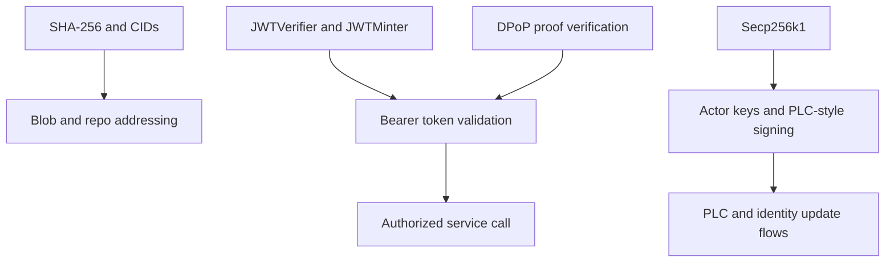

# Cryptography In Practice

## Overview

[Cryptography](./cryptography) explains which cryptographic roles exist in the
repo. This page shows how those roles combine in real request and identity
paths.

The useful question is not "which algorithm names appear in the tree?" It is
"which component verifies or signs which kind of data, and why?"

## The Three Main Crypto Paths

Garazyk's crypto work falls into three broad paths:

- content addressing with SHA-256 and CIDs
- request authentication with JWT and DPoP
- identity and repo signing with secp256k1-oriented flows



## JWT Verification Is Policy, Not Just Parsing

The auth layer does more than decode a token. It sets runtime expectations
before the verifier runs.

```objc
verifier.expectedIssuer = expectedIssuer;
verifier.allowedAlgorithms = [self allowedAlgorithmsForMinter:jwtMinter];
BOOL isValid = [verifier verifyJWT:jwt error:&verifyError];
if (!isValid || verifyError) {
    return nil;
}
```

Why this matters:

- issuer validation is runtime-configured
- allowed algorithms depend on the key material available to the server
- the helper is deciding which identities are acceptable, not just whether the
  token is well-formed

## DPoP Adds Request Binding

DPoP matters because a valid JWT alone is not sufficient when the token is
supposed to be bound to a proof key.

```objc
NSString *tokenJkt = jwt.payload.cnf[@"jkt"];
if (isDPoP) {
    if (!tokenJkt) return nil;
    if (![CryptoUtils constantTimeCompare:tokenJkt to:dpopThumbprint]) return nil;
} else if (tokenJkt) {
    return nil;
}
```

This is the key distinction between bearer validation and DPoP validation:

- bearer says "this token is valid for the subject"
- DPoP says "this token is valid and was presented by the expected proof key
  for this request"

## ES256K Is Not The Same Story As DPoP

The repo uses secp256k1 for ES256K-style verification in actor-key and related
flows. That is a different path from the P-256-based DPoP proof story.

`JWTVerifier` makes that split explicit:

```objc
if ([alg isEqualToString:@"ES256K"]) {
    Secp256k1 *secp = [Secp256k1 shared];
    verified = [secp verifySignature:signatureData
                             forHash:hashData
                       withPublicKey:self.publicKey
                               error:error];
}
```

That is why "JWTs" and "DPoP" should never be treated as one undifferentiated
crypto feature in the docs.

## Hashing Shows Up Everywhere

Even when contributors are not working on security features, they still cross
cryptographic boundaries because the repo is content-addressed.

- blob uploads compute CIDs from raw bytes
- repository blocks depend on stable digests
- signed operations hash structured data before signature verification

This is what makes storage, sync, and identity code feel connected. They all
depend on stable cryptographic identities for data.

## Practical Debugging Questions

When crypto-adjacent behavior breaks, start with the narrowest useful question:

- did the content hash or CID change unexpectedly?
- is the request using the correct token shape for the endpoint?
- is the server expecting the right issuer or audience?
- is the token bound to the proof key it was presented with?
- is the signing path using actor-key or OAuth-style verification?

That framing is usually more useful than starting from the algorithm names.

## Related Reading

- [Cryptography](./cryptography)
- [Auth Helpers](../04-network-layer/auth-helpers)
- [PLC Operation Walkthrough](./plc-operation-walkthrough)
- [DID Update Walkthrough](./did-update-walkthrough)

## Related

- [Documentation Map](../11-reference/documentation-map.md)
- [Contributor Guide](../index.md)
- [Repository Documentation Index](../repo-index/index.md)

