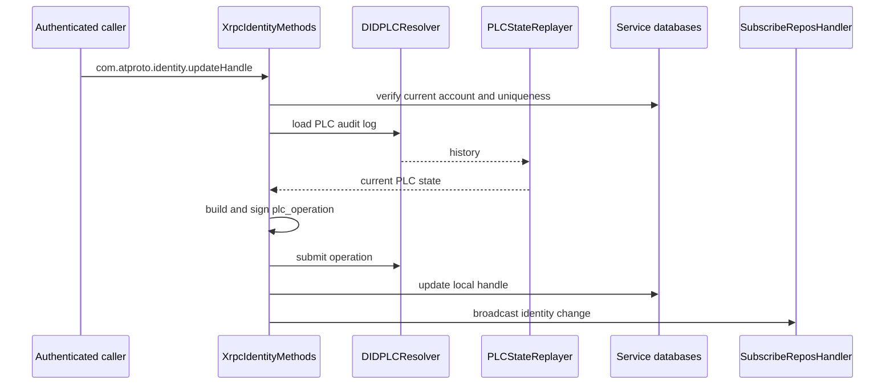

# DID Update Walkthrough

## Overview

[DID Document Updates](./did-document-updates) explains the rules. This page
shows one important concrete path: how a handle update for `did:plc` becomes a
new PLC operation and then becomes new local identity state.

This is the example that makes the "identity updates are history updates"
concept feel real.

## The Handle-Update Path

For `did:plc`, a handle update is not just a database write. The server has to
align local account state with PLC state and submit a new signed operation when
the PLC history still points at the old handle.



The order matters because a local handle change without PLC alignment would make
the server internally consistent but externally wrong.

## Building The New Operation

The handle update path preserves most of the current PLC state and replaces only
the handle-facing identity data that actually changed.

```objc
op[@"type"] = @"plc_operation";
op[@"rotationKeys"] = currentState.rotationKeys;
op[@"verificationMethods"] = currentState.verificationMethods;
op[@"alsoKnownAs"] = newAlsoKnownAs;
op[@"services"] = currentState.services;
op[@"prev"] = prevCid;
```

That preservation is the key reason the update path starts by replaying current
history. The server needs the current state in order to avoid unintentionally
dropping identity fields it should keep.

## Signing The Update

Once the operation is assembled, the server encodes it, hashes it, signs it, and
adds the signature back to the operation before submission.

```objc
NSData *opData = [ATProtoCBORSerialization encodeDataWithJSONObject:op error:&signError];
NSData *hash = [CryptoUtils sha256:opData];
sigData = [[Secp256k1 shared] signHash:hash withPrivateKey:perDidRotationKey error:&signError];
op[@"sig"] = [CryptoUtils base64URLEncode:sigData];
```

The implementation can fall back to the server rotation key when a per-DID key
is not available, but the important architectural point is the same: identity
change is authorized by signing a new operation, not by mutating a database row.

## Submission Is Not The Final Step

After PLC submission succeeds, the local PDS still has follow-up work to do:

- update local account state
- surface the new handle to the rest of the application
- broadcast identity change information to downstream sync consumers

This is why the update path crosses identity, PLC, database, and sync code in
one request.

## What To Check When It Breaks

If a DID update behaves incorrectly, verify these in order:

1. did the local uniqueness and auth checks pass?
2. did the replayed PLC state match the server's expectation?
3. did the new operation preserve rotation keys and services correctly?
4. did the PLC submission succeed?
5. did the local account update and identity broadcast run afterward?

That sequence maps directly to the real implementation path.

## Related Reading

- [DID Document Updates](./did-document-updates)
- [PLC Operation Walkthrough](./plc-operation-walkthrough)
- [Cryptography In Practice](./cryptography-in-practice)
- [Auth Helpers](../04-network-layer/auth-helpers)
