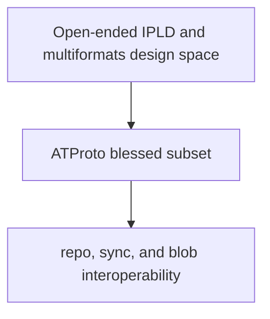

# ATProto's IPLD Profile

## Overview

ATProto borrows heavily from IPLD and multiformats, but it does not expose the
entire flexibility of that ecosystem to implementations.

This page is the payoff for the rest of the series: it shows the specific subset
ATProto expects, and why that constraint exists.

## The Core Design Choice

The broader IPLD stack is intentionally future-proof:

- many codecs can exist
- many hash functions can exist
- many text encodings can exist
- archive creation policies can vary by application

ATProto narrows that space so independently-built PDSes, relays, and indexers
can agree on the same block identities and transport expectations.

That is a protocol governance choice, not just an implementation preference.

## The Current Blessed Subset

The current ATProto data model and repository specs describe a narrow profile
for linked repository data.

| Dimension | ATProto profile |
| --- | --- |
| CID version | `1` |
| structured-data codec | `dag-cbor` / `0x71` |
| blob codec | `raw` / `0x55` |
| hash | `sha-256` / `0x12`, 32-byte digest |
| string form | `base32` with `b` prefix |
| archive format | CAR v1 |

This is why two ATProto implementations can compare or exchange repository
blocks without negotiating the basics first.

## The Terminology Shift You Should Know About

The current ATProto data model spec describes its normalized CBOR profile as
DRISL, a successor to DAG-CBOR. But the repository and ecosystem lineage are
still unmistakably IPLD-shaped:

- the blessed structured-data codec remains `dag-cbor` / `0x71`
- blocks are still linked by CID
- repositories are still exported as CAR v1

So contributors will see both vocabularies:

- spec language talking about DRISL
- implementation and tooling language talking about DAG-CBOR, CID, and CAR

That is not a contradiction. It is the result of ATProto evolving a narrower
application profile out of earlier IPLD building blocks.

## Why Garazyk Still Uses The Older Terms In Code

Garazyk's code and docs still use DAG-CBOR terminology in many places because
that is the immediate implementation surface:

- serializer classes are DAG-CBOR-oriented
- repository CIDs use the `dag-cbor` codec value
- CAR readers and writers move DAG-CBOR blocks around

So if you are reading the current codebase, think of the relationship this way:

- IPLD and multiformats provide the original mechanisms
- ATProto constrains them
- Garazyk implements that constrained world using DAG-CBOR-era names and
  repository machinery

## What This Means For Contributors

When you change repository or sync behavior, do not ask only whether the code
"works locally." Ask whether it still respects the ATProto profile:

- are the generated CIDs within the blessed subset?
- are repository blocks encoded canonically?
- does a CAR response have the right root and required blocks?
- are you assuming flexibility that the protocol intentionally removed?

That is the standard that keeps the system interoperable.

## Sources

- [AT Protocol Data Model](https://atproto.com/specs/data-model)
- [AT Protocol Repository Specification](https://atproto.com/specs/repository)
- [AT Protocol Sync Specification](https://atproto.com/specs/sync)
- [CID Specification](https://github.com/multiformats/cid)
- [CAR v1 Specification](https://ipld.io/specs/transport/car/carv1/)
- [DAG-CBOR Specification](https://ipld.io/specs/codecs/dag-cbor/spec/)

## Related Reading

- [IPLD and Multiformats Series](./)
- [AT Protocol Basics](../atproto-basics)
- [CBOR and DAG-CBOR](./cbor-and-dag-cbor)
- [CIDs and Multiformats](./cids-and-multiformats)\n\n## Related\n\n- [Documentation Map](../../11-reference/documentation-map.md)\n- [Contributor Guide](../../index.md)\n- [Repository Documentation Index](../../repo-index/index.md)\n\n