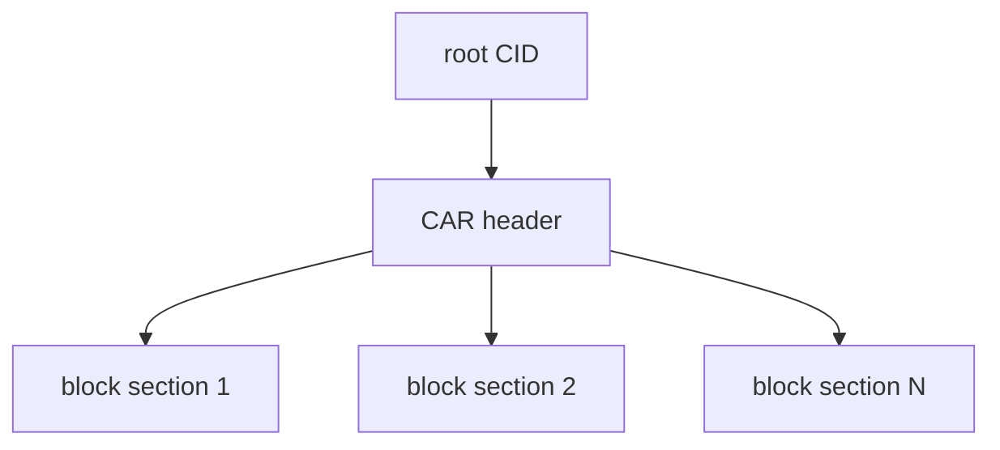

# CAR Files

## Overview

CAR stands for Content Addressable aRchive. It is the archive and transport
format used to move sets of IPLD blocks together while preserving their root
and block identities.

This is why CAR shows up naturally in ATProto:

- full repository export
- sync responses and block transfer
- any situation where a root plus reachable blocks need to travel together



## The Shape Of CAR v1

The CAR v1 specification describes the file as a header followed by one or more
block sections.

```text
[ varint | DAG-CBOR header ] [ varint | CID | block ] [ varint | CID | block ] ...
```

The header carries:

- `version`
- `roots`

Each block section carries:

- a varint length
- the block's CID in raw bytes
- the block's raw bytes

That simple structure is why CAR is easy to stream and easy to validate block by
block.

## What CAR Does And Does Not Guarantee

CAR preserves content-addressed structure, but it is not a magical integrity
container on its own.

The CAR spec is explicit about several limits:

- roots identify entry points, not necessarily the entire semantic meaning of
  the archive
- duplicate blocks are not fully forbidden by the base spec
- ordering is not inherently deterministic unless an application layer imposes
  additional rules
- indexing is external to CAR v1

That distinction matters because ATProto applications often care about more than
the base CAR spec guarantees.

## Why ATProto Uses CAR Anyway

ATProto uses CAR because it matches the repository model cleanly:

- repositories are already graphs of CID-addressed blocks
- sync consumers need roots plus referenced blocks
- offline backup and migration need a portable block archive

The current ATProto repository spec explicitly uses CAR v1 for repository
exports and describes diff-like CAR slices for synchronization.

## What ATProto Narrows

ATProto does not just say "use any CAR." It narrows the meaning:

- the primary root should be the relevant commit CID
- full exports include commit, MST nodes, and records
- implementations should be resilient to duplicate or extra blocks
- the file uses the same ATProto-specific CID constraints as the repository

So the archive format is inherited, but the operational contract is ATProto's.

## Why Contributors Should Care

If a sync response looks wrong, the failure may not be in HTTP handling at all.
It may be one of these:

- wrong root CID
- missing required block
- malformed CID bytes in a section
- block bytes that do not match the CID
- assumptions about ordering or duplication that the spec does not promise

Understanding CAR keeps those bugs from turning into "something is wrong with
the network" guesswork.

## Sources

- [CAR v1 Specification](https://ipld.io/specs/transport/car/carv1/)
- [AT Protocol Repository Specification](https://atproto.com/specs/repository)
- [AT Protocol Sync Specification](https://atproto.com/specs/sync)

## Related Reading

- [CBOR and DAG-CBOR](./cbor-and-dag-cbor)
- [CIDs and Multiformats](./cids-and-multiformats)
- [CAR Format](../../07-repository-protocol/car-format)
- [Repository Data Structures Walkthrough](../repository-data-structures-walkthrough)
