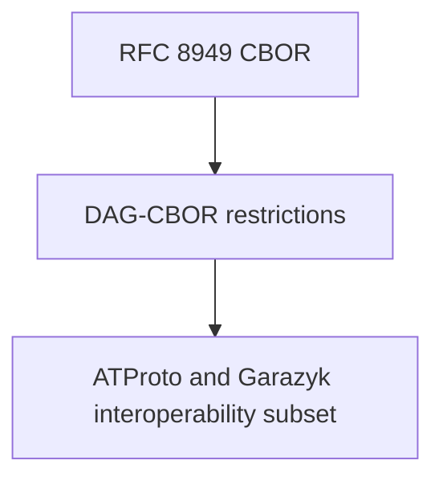

# CBOR and DAG-CBOR

## Overview

CBOR and DAG-CBOR are related, but they are not interchangeable ideas.

- CBOR is a general binary data format standardized by the IETF in RFC 8949
- DAG-CBOR is an IPLD codec profile layered on top of CBOR
- ATProto then narrows that profile further for interoperability

This layering matters because repository correctness depends on deterministic
bytes, not just logically similar objects.



## What Plain CBOR Gives You

CBOR is designed as a compact binary format with native support for maps,
arrays, strings, bytes, integers, floats, booleans, null, and tags. It is more
expressive than JSON and often more compact.

That flexibility is exactly why IPLD needed DAG-CBOR. Generic CBOR allows too
many equivalent or loosely-structured encodings for safe content addressing.

## What DAG-CBOR Adds

The DAG-CBOR specification takes CBOR and adds IPLD-focused restrictions so that
encoded values can safely participate in a content-addressed graph.

The most important restrictions are:

- links are represented with CBOR tag `42`
- map keys must be strings
- encodings must be canonical and minimal
- indefinite-length forms are not allowed
- extra tags are rejected

That is the bridge from "general binary format" to "safe block encoding for a
Merkle DAG."

## Why The CID Tag Matters

The biggest semantic change is that DAG-CBOR interprets tag `42` as an IPLD
content identifier. The encoded payload is a byte string containing the CID in
raw binary form with an identity multibase prefix byte.

That rule is why a link is not just "a string that looks like a CID." It has a
distinct binary representation inside a block.

```text
tag 42
  -> byte string
      -> 0x00 identity multibase prefix
      -> raw CID bytes
```

## ATProto Narrows This Again

The current ATProto data model spec describes its normalized CBOR profile as
DRISL, a successor to DAG-CBOR, and it narrows the allowed space further.

The most important contributor-facing consequence is that ATProto wants a much
more constrained encoding environment than generic IPLD:

- a blessed CID subset
- repository objects stored in the canonical binary form
- no application-visible freedom to swap encodings casually
- no floats in the current ATProto data model

Garazyk's codebase still talks in DAG-CBOR terms because the local
implementation, the CID codec values, and the repository/CAR machinery are all
part of that IPLD lineage.

## Why Contributors Need This Distinction

If you blur CBOR, DAG-CBOR, and ATProto's narrowed profile into one idea, you
miss where bugs actually come from:

- a value may be valid CBOR but invalid DAG-CBOR
- a value may be valid DAG-CBOR in general but outside ATProto's blessed subset
- a value may be logically equivalent but encoded differently, producing a
  different CID

That is why serialization rules are part of the protocol contract.

## Sources

- [RFC 8949: Concise Binary Object Representation (CBOR)](https://www.rfc-editor.org/rfc/rfc8949.html)
- [DAG-CBOR Specification](https://ipld.io/specs/codecs/dag-cbor/spec/)
- [AT Protocol Data Model](https://atproto.com/specs/data-model)

## Related Reading

- [CIDs and Multiformats](./cids-and-multiformats)
- [CBOR and CAR](../cbor-and-car)
- [Repository Data Structures Walkthrough](../repository-data-structures-walkthrough)

## Related

- [Documentation Map](../../11-reference/documentation-map.md)
- [Contributor Guide](../../index.md)

