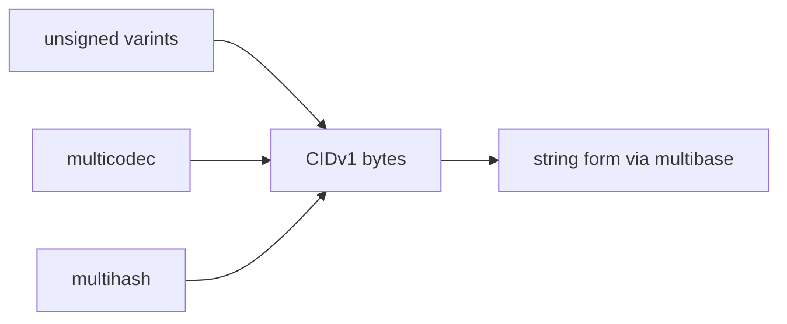

# CIDs and Multiformats

## Overview

A CID is not just a hash string. It is a layered identifier built out of other
multiformat components.

At minimum, a CIDv1 combines:

- a CID version marker
- a multicodec identifying what kind of content is addressed
- a multihash describing which hash function and digest length were used

When rendered as text, a CID also uses multibase so the string form says how
its bytes were encoded.



## The Pieces In Order

The CID specification describes CIDv1 as a self-describing binary identifier.
The `multiformats/cid` repository breaks it down as:

```text
<cidv1> ::= <cid-version><content-codec><content-multihash>
```

That structure answers three questions:

- which CID format version is this?
- what kind of content do these bytes identify?
- which hash function and digest length produced the address?

## What The Supporting Multiformats Do

Each supporting multiformat solves one problem:

- `multicodec`: code table for the addressed content type
- `multihash`: self-describing hash function plus digest length
- `multibase`: self-describing text encoding for binary data
- `unsigned-varint`: compact integer encoding used by CID and related specs

These are small pieces, but they are why CIDs can evolve without hard-coding
one global hash or one global string encoding forever.

## Why ATProto Uses A Narrow CID Subset

The original CID design is deliberately flexible. ATProto chooses not to expose
most of that flexibility on the wire because federated systems benefit from
predictability more than configurability.

The current ATProto data model and repository specs bless a narrow profile:

- CID version `1`
- codec `dag-cbor` / `0x71` for linked structured data
- codec `raw` / `0x55` for blobs
- hash type `sha-256` / `0x12` with 32-byte digests
- `base32` text form with a `b` prefix when stringified

That is the main reason ATProto CIDs are easier to reason about than generic
IPLD CIDs.

## Why Multicodec Still Matters Even In A Narrow Profile

Even if ATProto only blesses a handful of codecs today, the multicodec field is
still doing real work:

- it distinguishes structured blocks from raw blobs
- it keeps the CID self-describing
- it gives the protocol room to evolve without redefining CID from scratch

The multicodec table is the shared registry that makes those codes meaningful.

## The Practical Contributor Takeaway

When you see a CID in Garazyk, do not ask only "what bytes did this hash?"
Also ask:

- what codec was this addressing?
- was the string form converted through the right multibase?
- did the parser or serializer interpret the varints correctly?
- is the CID inside ATProto's blessed subset?

That is the right debugging frame for repository and blob identity bugs.

## Sources

- [CID Specification](https://github.com/multiformats/cid)
- [multicodec](https://github.com/multiformats/multicodec)
- [multihash](https://github.com/multiformats/multihash)
- [multibase](https://github.com/multiformats/multibase)
- [unsigned-varint](https://github.com/multiformats/unsigned-varint)
- [AT Protocol Data Model](https://atproto.com/specs/data-model)
- [AT Protocol Repository Specification](https://atproto.com/specs/repository)

## Related Reading

- [CAR Files](./car-files)
- [CID and Hashing](../../07-repository-protocol/cid-and-hashing)
- [Repository Data Structures Walkthrough](../repository-data-structures-walkthrough)\n\n## Related\n\n- [Documentation Map](../../11-reference/documentation-map.md)\n- [Contributor Guide](../../index.md)\n- [Repository Documentation Index](../../repo-index/index.md)\n\n