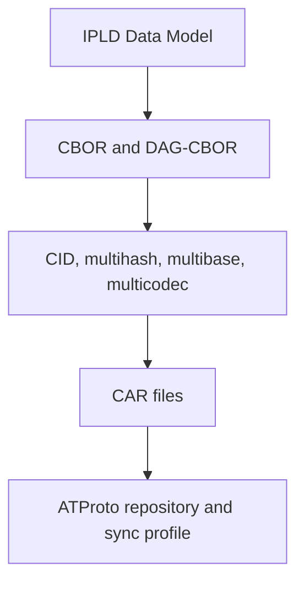

# IPLD and Multiformats Series

ATProto utilizes a specific subset of the IPLD and multiformats ecosystem to ensure repository interoperability. This series details the implementation of these primitives:
- **IPLD Data Model**: The foundational representation of data.
- **DAG-CBOR**: Deterministic binary encoding.
- **CIDs and Multiformats**: Content addressing and identifier standards.
- **CAR Files**: Portable block archives for transport and sync.

## Series Index
1. [IPLD Data Model and Merkle DAGs](./ipld-data-model-and-merkle-dags)
2. [CBOR and DAG-CBOR](./cbor-and-dag-cbor)
3. [CIDs and Multiformats](./cids-and-multiformats)
4. [CAR Files](./car-files)
5. [ATProto's IPLD Profile](./atproto-ipld-profile)

## Implementation Coverage
In Garazyk, these primitives govern the behavior of:
- Repository records and MST nodes.
- CID generation and block validation.
- CAR construction for synchronization and export.

Relevant classes include `CID`, `MST`, `RepoCommit`, `CARWriter`, and `CARReader`.

## Constraint Rationale
The IPLD and multiformats specifications are intentionally broad. ATProto constrains this flexibility to ensure federated interoperability:
- **Strict Codec Selection**: Only DAG-CBOR is permitted for repository data.
- **Fixed Hashing**: SHA-256 is the standard multihash.
- **Determinstic Encodings**: Specific multibase and multicodec profiles are enforced.

Nairrowing the supported stack ensures that different implementations produce identical, verifiable repository states.

## Sources
- [IPLD Data Model](https://ipld.io/docs/data-model/)
- [RFC 8949: CBOR](https://www.rfc-editor.org/rfc/rfc8949.html)
- [DAG-CBOR Specification](https://ipld.io/specs/codecs/dag-cbor/spec/)
- [CAR v1 Specification](https://ipld.io/specs/transport/car/carv1/)
- [CID Specification](https://github.com/multiformats/cid)
- [AT Protocol Data Model](https://atproto.com/specs/data-model)

## Related

- [Documentation Map](../../11-reference/documentation-map.md)
- [Contributor Guide](../../index.md)
- [Repository Documentation Index](../../repo-index/index.md)

