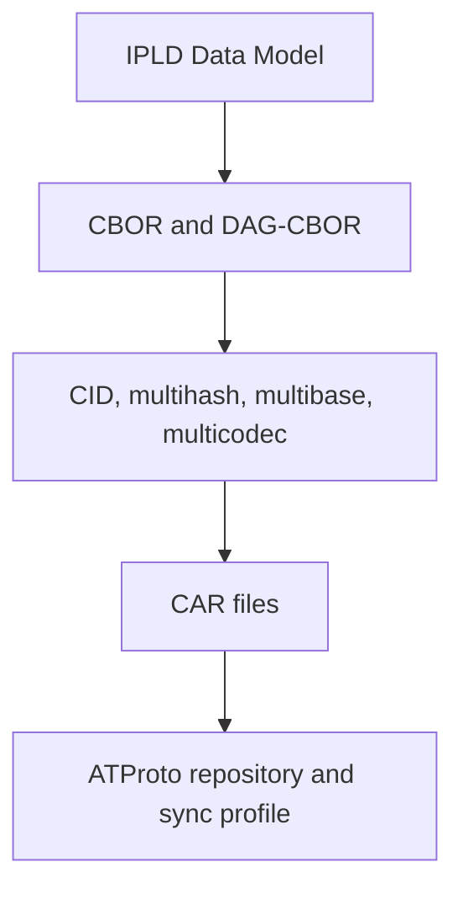

# IPLD and Multiformats Series

## Overview

ATProto did not invent its entire repository vocabulary from scratch. It
borrows heavily from the IPLD, multiformats, and IPFS ecosystem, then narrows
those primitives into a much stricter interoperability profile.

This series exists to explain that borrowed stack directly:

- what IPLD contributes
- what multiformats contribute
- what CAR contributes
- where ATProto follows those specs closely
- where ATProto intentionally constrains them further

The goal is not to turn Garazyk contributors into generic IPFS experts. The
goal is to make the borrowed pieces legible enough that repository, sync, and
CID behavior stop feeling magical.

## Read This Series In Order

1. [IPLD Data Model and Merkle DAGs](./ipld-data-model-and-merkle-dags)
2. [CBOR and DAG-CBOR](./cbor-and-dag-cbor)
3. [CIDs and Multiformats](./cids-and-multiformats)
4. [CAR Files](./car-files)
5. [ATProto's IPLD Profile](./atproto-ipld-profile)

That order moves from abstract model to concrete wire and storage formats, then
back up to the ATProto-specific subset.

## How This Connects Back To Garazyk

In Garazyk's codebase, these ideas show up most clearly in:

- repository records and MST nodes encoded as DAG-CBOR-like blocks
- CIDs created from canonical block bytes
- CAR responses built for sync and export paths
- repository and sync code that assumes the ATProto-blessed CID subset

If you are debugging `CID`, `MST`, `RepoCommit`, `CARWriter`, `CARReader`, or
the sync handlers, this series is the conceptual backdrop.

## Why ATProto Narrows The Borrowed Stack

The original IPLD and multiformats work is intentionally flexible:

- many codecs can exist
- many hash functions can be registered
- many multibase encodings can be valid
- CAR can represent arbitrary block collections

ATProto narrows that freedom because federated interoperability is more
important than maximum format choice. If two independent implementations do not
pick the same canonical subset, the content-addressed guarantees stop being
useful.

## Sources

- [IPLD Data Model](https://ipld.io/docs/data-model/)
- [RFC 8949: Concise Binary Object Representation (CBOR)](https://www.rfc-editor.org/rfc/rfc8949.html)
- [DAG-CBOR Specification](https://ipld.io/specs/codecs/dag-cbor/spec/)
- [CAR v1 Specification](https://ipld.io/specs/transport/car/carv1/)
- [CID Specification](https://github.com/multiformats/cid)
- [AT Protocol Data Model](https://atproto.com/specs/data-model)
- [AT Protocol Repository Specification](https://atproto.com/specs/repository)
