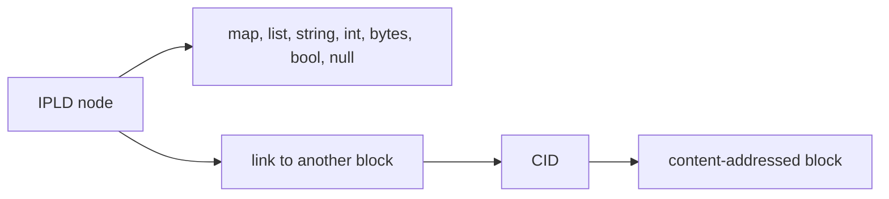
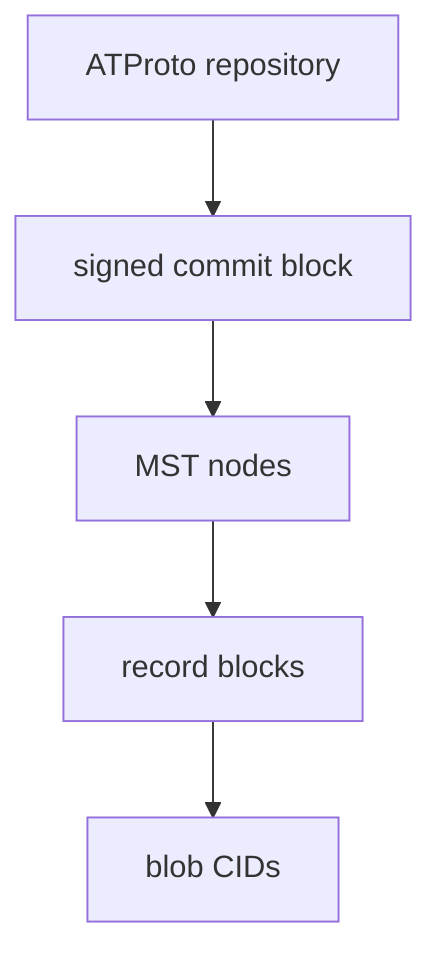

# IPLD Data Model and Merkle DAGs

## Overview

IPLD provides a standard for hash-linked data structures independent of serialization formats or protocols. ATProto repositories use IPLD to organize records as graphs of linked blocks.

The IPLD data model includes standard types like maps, lists, strings, and integers. The `link` kind is the primary addition: data points to other data by content hash instead of location.

## Merkle DAGs

A Merkle DAG is a directed acyclic graph where edges are content hashes. This provides three properties:

- integrity: tampering changes the hash.
- deduplication: identical content results in a single identity.
- traversability: following a link loads a block with a known CID.

ATProto repositories use this pattern for commits, MST nodes, and records.

## Content Addressing

The repository structure "commit -> tree nodes -> records" relies on content addressing for every hop:

- The commit points to repository state by CID.
- MST internal links point to child nodes by CID.
- MST leaf entries point to records by CID.
- Blobs are linked by CID.

The graph defines the verification boundary.

## ATProto's Mapping Of IPLD Concepts

ATProto uses IPLD-style concepts, but not the entire universe of IPLD
possibilities.

In practical Garazyk terms:

- `RepoCommit` is an IPLD-shaped object with CID-linked fields
- `MST` builds a Merkle Search Tree out of CID-linked nodes
- sync methods serialize slices of that graph into CAR responses

## Why IPLD Is Useful Even If Garazyk Does Not Expose "Generic IPLD APIs"

Garazyk is not trying to be a general-purpose IPLD toolkit. But the IPLD
model still helps contributors reason correctly about the implementation:

- a block is identified by what it contains, not where it lives
- links are self-certifying references
- serialization and hashing are part of the data model story, not an afterthought

Without that framing, repository code can look like custom ATProto machinery
instead of a specialized Merkle-DAG application.

## Sources

- [IPLD Data Model](https://ipld.io/docs/data-model/)
- [IPLD Overview](https://ipld.io/)
- [AT Protocol Data Model](https://atproto.com/specs/data-model)
- [AT Protocol Repository Specification](https://atproto.com/specs/repository)
- [Personal Data Repositories Guide](https://atproto.com/guides/data-repos)

## Related Reading

- [CBOR and DAG-CBOR](./cbor-and-dag-cbor)
- [CIDs and Multiformats](./cids-and-multiformats)
- [Merkle Search Trees](../mst-trees)
- [Repository Data Structures Walkthrough](../repository-data-structures-walkthrough)

## Related

- [Documentation Map](../../11-reference/documentation-map.md)
- [Contributor Guide](../../index.md)

