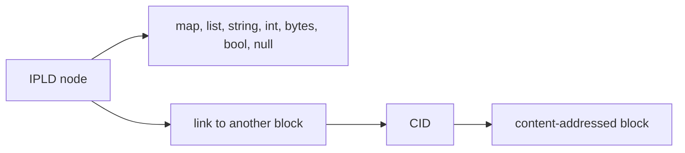
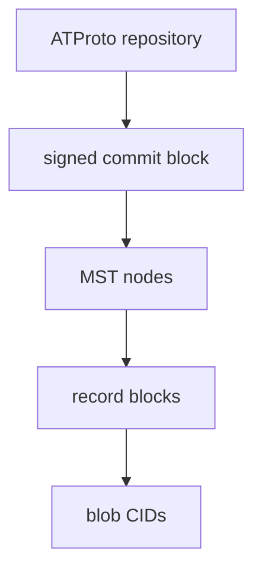

# IPLD Data Model and Merkle DAGs

## Overview

IPLD gives a common way to talk about hash-linked data structures without tying
the discussion to one serialization format or one application protocol. That is
why it matters to ATProto: repositories are not just bags of records, they are
graphs of linked blocks.

The IPLD data model starts with ordinary kinds such as maps, lists, strings,
integers, booleans, bytes, and null. Its crucial addition is the `link` kind:
data can point to other data by content hash instead of by location.

## What "Merkle DAG" Means Here

A Merkle DAG is a directed acyclic graph where edges are content hashes. That
single idea buys three properties at once:

- integrity: tampering changes the hash
- deduplication: equal content collapses to one identity
- traversability: following a link means loading a block with a known CID

In ATProto repositories, commits, MST nodes, and records all participate in
that pattern.

## Why This Matters More Than A Generic Tree Diagram

The repository is often shown as "commit -> tree nodes -> records," which is
useful but incomplete. The important thing is not just the shape of the tree.
The important thing is that every hop is content-addressed.

That means:

- the commit points to repository state by CID
- MST internal links point to child nodes by CID
- MST leaf entries point to records by CID
- blobs are also linked by CID even though they are stored outside the repo

The graph is the verification boundary.

## ATProto's Mapping Of IPLD Concepts

ATProto uses IPLD-style concepts, but not the entire universe of IPLD
possibilities.

In practical Garazyk terms:

- `RepoCommit` is an IPLD-shaped object with CID-linked fields
- `MST` builds a Merkle Search Tree out of CID-linked nodes
- sync methods serialize slices of that graph into CAR responses

## Why IPLD Is Useful Even If Garazyk Does Not Expose "Generic IPLD APIs"

Garazyk is not trying to be a general-purpose IPLD toolkit. But the IPLD
model still helps contributors reason correctly about the implementation:

- a block is identified by what it contains, not where it lives
- links are self-certifying references
- serialization and hashing are part of the data model story, not an afterthought

Without that framing, repository code can look like custom ATProto machinery
instead of a specialized Merkle-DAG application.

## Sources

- [IPLD Data Model](https://ipld.io/docs/data-model/)
- [IPLD Overview](https://ipld.io/)
- [AT Protocol Data Model](https://atproto.com/specs/data-model)
- [AT Protocol Repository Specification](https://atproto.com/specs/repository)
- [Personal Data Repositories Guide](https://atproto.com/guides/data-repos)

## Related Reading

- [CBOR and DAG-CBOR](./cbor-and-dag-cbor)
- [CIDs and Multiformats](./cids-and-multiformats)
- [Merkle Search Trees](../mst-trees)
- [Repository Data Structures Walkthrough](../repository-data-structures-walkthrough)
