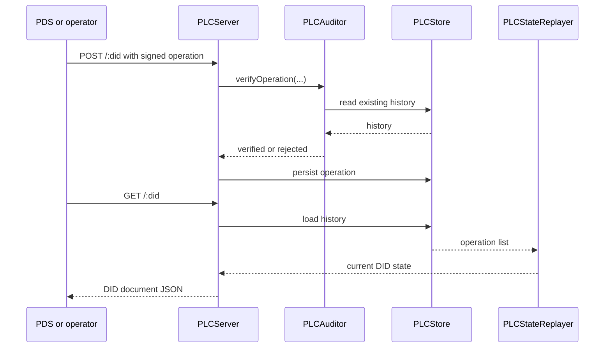

# PLC Operation Walkthrough

## Overview

[PLC Directory](./plc-directory) explains why PLC exists. This page shows what a
PLC operation looks like as data and how it moves through September's
validation, storage, and replay path.

The important contributor fact is that a PLC DID is the result of replaying
signed operations, not the result of editing one mutable DID document.

## The Shape Of An Operation

A modern PLC operation in this repo is a structured object that carries state,
history linkage, and a signature.

```json
{
  "type": "plc_operation",
  "rotationKeys": ["did:key:zExampleRotationKey"],
  "verificationMethods": { "atproto": "did:key:zExampleSigningKey" },
  "alsoKnownAs": ["at://alice.example.com"],
  "services": {
    "atproto_pds": {
      "type": "AtprotoPersonalDataServer",
      "endpoint": "https://pds.example.com"
    }
  },
  "prev": "bafyreibeforethisoperation",
  "sig": "base64url-signature"
}
```

Why the shape matters:

- `prev` links the operation into an append-only history
- `rotationKeys` define who may authorize future change
- `alsoKnownAs` and `services` become visible identity state

## Validation Happens Before Replay

The PLC stack validates an operation before it is allowed to influence current
state.

```objc
NSArray *rotationKeys = op.data[@"rotationKeys"];
NSDictionary *verificationMethods = op.data[@"verificationMethods"];
NSArray *alsoKnownAs = op.data[@"alsoKnownAs"];
NSDictionary *services = op.data[@"services"];
```

Around those field extractions, the implementation checks that:

- the operation type is supported
- required collections have the right shape
- rotation keys are valid `did:key` strings
- services are objects, not arbitrary values

That is why "bad PLC state" usually means "bad history or bad validation" rather
than "the DID document serializer is broken."

## The Full PLC Path



This is the core PLC mental model in one diagram: validate history, store
history, replay history.

## Replay Produces The DID Document

`PLCDIDState` converts replayed state into DID-document form:

```objc
return @{
    @"id": self.did,
    @"alsoKnownAs": self.alsoKnownAs ?: @[],
    @"verificationMethod": verificationMethods,
    @"service": services
};
```

That conversion is deliberately late in the process. The source of truth is the
operation history plus replay rules, not the final JSON object returned to a
resolver.

## Why This Matters For Contributors

If a DID document looks wrong, there are only a few productive places to look:

1. the submitted operation shape
2. the stored history and `prev` chain
3. auditor validation rules
4. replay logic that turns history into current state

Starting from the returned document alone usually hides the real bug.

## Related Reading

- [PLC Directory](./plc-directory)
- [DID Document Updates](./did-document-updates)
- [PLC Server Operations](../11-reference/plc-server-operations)
- [Cryptography In Practice](./cryptography-in-practice)
