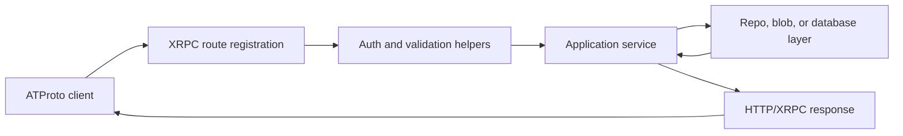
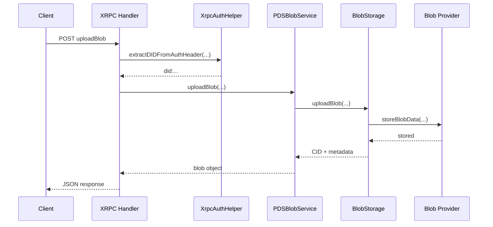

# Protocol Flow Walkthrough

## Overview

[AT Protocol Basics](./atproto-basics) provides the mental model. This page shows
that model in Garazyk's code.

This page shows the recurring shape of an ATProto request to help contributors trace feature changes.

## One Request, Four Layers

Most protocol requests in this repository move through the same four layers:

1. route registration
2. auth and validation
3. service orchestration
4. persistence or content-addressed storage

The codebase separates network helpers, services, and storage code to support this pattern.



## Example 1: Discovery Is Mostly Configuration

`com.atproto.server.describeServer` is the cleanest example of a request that is
mostly configuration plus response shaping.

```objc
[dispatcher registerComAtprotoServerDescribeServer:^(HttpRequest *request, HttpResponse *response) {
    NSString *issuer = [config canonicalIssuerWithPortHint:0];
    NSString *serverDid = didWebIdentifierFromIssuer(issuer, [config canonicalHostname]);
    response.statusCode = HttpStatusOK;
    [response setJsonBody:@{
        @"inviteCodeRequired": @(config.inviteCodeRequired),
        @"did": serverDid,
        @"version": @"0.1.0"
    }];
}];
```

Key takeaways:

- it shows route registration is where a protocol method becomes "real"
- it shows some ATProto surfaces are mostly config-driven
- it keeps the "XRPC is the protocol boundary" idea concrete

## Example 2: A Blob Upload Takes The Full Path

An authenticated write such as `com.atproto.repo.uploadBlob` exercises the whole
stack.



The handler code is short because the important work lives below it:

```objc
NSString *did = [XrpcAuthHelper extractDIDFromAuthHeader:authHeader
                                               jwtMinter:jwtMinter
                                         adminController:adminController
                                                 request:request
                                                response:response];
NSDictionary *result = [blobService uploadBlob:blobData
                                        forDid:did
                                      mimeType:contentType ?: @"application/octet-stream"
                                         error:&error];
```

Authenticate at the network edge, then pass work to a service.

## Where Records And Repositories Fit

Record endpoints follow the same general shape, but the storage boundary is
different:

- record handlers call `PDSRecordService`
- repository-facing reads and exports call `PDSRepositoryService`
- both eventually rely on actor stores, MST logic, or CAR materialization

Record changes often require both service-level reasoning and repository-level verification.

## How To Trace A Change

When you touch an ATProto behavior, use this loop:

1. find the registered XRPC method
2. identify the auth and validation helpers it depends on
3. find the owning service
4. inspect the repo, blob, or database code behind that service
5. read the nearest tests before assuming the current behavior is intentional

## Related Reading

- [AT Protocol Basics](./atproto-basics)
- [Services Overview](../03-application-layer/services-overview)
- [Auth Helpers](../04-network-layer/auth-helpers)
- [Blob Service](../03-application-layer/blob-service)
- [Repository Service](../03-application-layer/repository-service)

## Related

- [Documentation Map](../11-reference/documentation-map.md)
- [Contributor Guide](../index.md)

