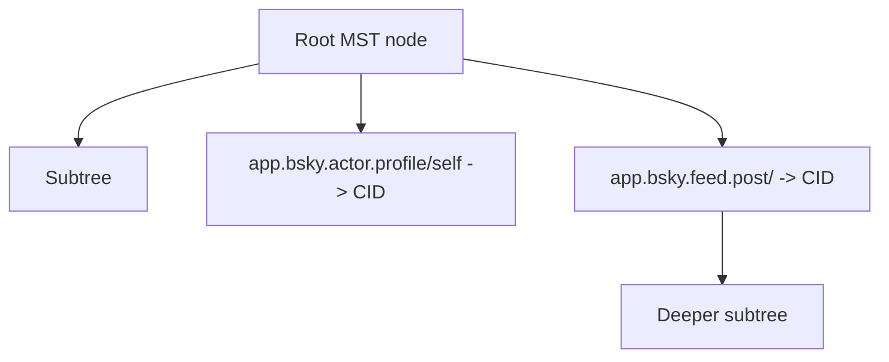

# Repository Data Structures Walkthrough

## Overview

[CBOR and CAR](./cbor-and-car) and [Merkle Search Trees](./mst-trees) explain
the concepts. This page shows how those concepts connect in Garazyk's
implementation.

The useful mental model is:

- DAG-CBOR gives a value stable bytes
- a CID names those bytes
- the MST arranges those CIDs into repository state
- CAR packages the blocks needed to move or verify that state


## Step 1: Garazyk Normalizes Structured Values Into DAG-CBOR

At the handler and service boundary, many values still look JSON-shaped. Before
they can become repository data, the repo has to normalize them into
deterministic bytes.

```objc
if (json.count == 1 && [json[@"$link"] isKindOfClass:[NSString class]]) {
  CID *cid = [CID cidFromString:json[@"$link"]];
  NSMutableData *tagPayload = [NSMutableData dataWithCapacity:1 + cid.bytes.length];
  uint8_t identityPrefix = 0x00;
  [tagPayload appendBytes:&identityPrefix length:1];
  [tagPayload appendData:cid.bytes];
  return [CBORValue tag:42 value:[CBORValue byteString:tagPayload]];
}
```

Why this matters:

- ATProto link wrappers are turned into real CID tags
- the representation is canonical before hashing
- format bugs here become CID bugs later

## Step 2: The Tree Serializes Nodes Into Stable Blocks

MST nodes are not hashed from ad hoc structs. They are serialized into a stable
CBOR shape and only then turned into CIDs.

```objc
- (CID *)getCID:(NSMapTable<MSTNode *, CID *> *)cache {
  CID *cached = [cache objectForKey:self];
  if (cached) return cached;

  NSData *cbor = [self serializeToCBOR:cache];
  CID *cid = [CID cidWithDigest:[CID sha256Digest:cbor] codec:0x71];
  [cache setObject:cid forKey:self];
  return cid;
}
```

That is the key invariant: node identity is derived from serialized content, not
from object identity or database row identity.

## Step 3: The Tree Keeps Ordered Paths, Not Just Unordered Keys

Garazyk's `MST` uses repository paths such as `collection/rkey` as keys. The
tree then uses hashed key depth and deterministic ordering to place those
entries.



That structure is what makes three things possible at once:

- stable repo roots
- ordered key lookup
- proof paths for targeted sync responses

## Step 4: Sync Builds A Narrow CAR Instead Of Dumping Everything

The `com.atproto.sync.getRecord` path is a good example because it builds a CAR
with only the blocks needed to justify one record.

```objc
CARWriter *writer = [CARWriter writerWithRootCID:commitCID];
[writer addBlock:[CARBlock blockWithCID:commitCID data:commitBlock]];
[writer addBlock:[CARBlock blockWithCID:recordCID data:blockData]];

NSArray<MSTNode *> *proofNodes = [mst getProofNodesForKey:mstKey];
for (MSTNode *node in proofNodes) {
  CID *nodeCID = [node getCID:cache];
  [writer addBlock:[CARBlock blockWithCID:nodeCID data:[node serializeToCBOR:cache]]];
}
```

This is the "why" behind the data-structure stack:

- CBOR gives stable record and node bytes
- the MST gives proof nodes
- CAR packages only the commit, record, and proof blocks needed by the client

## Step 5: CAR Preserves The Rooted Block Graph

`CARWriter` does not just concatenate bytes. It writes a header with the root
CID and then serializes each block as `CID bytes + block bytes`.

```objc
CBORValue *headerMap = [CBORValue map:@{
  [CBORValue textString:@"roots"]: rootsArray,
  [CBORValue textString:@"version"]: [CBORValue unsignedInteger:1]
}];
```

That is why a CAR response can be verified independently of the server that
produced it.

## Debugging Checklist

When repository structure looks wrong, check the layers in order:

1. did the value encode to the expected DAG-CBOR bytes?
2. did the expected CID come out of those bytes?
3. did the MST contain the path you thought it did?
4. did the CAR include the commit, record, and proof blocks you expected?

That sequence mirrors the implementation and usually isolates the bug faster
than starting from the network response alone.

## Related Reading

- [IPLD and Multiformats Series](./ipld-foundations/)
- [CBOR and DAG-CBOR](./ipld-foundations/cbor-and-dag-cbor)
- [CIDs and Multiformats](./ipld-foundations/cids-and-multiformats)
- [CAR Files](./ipld-foundations/car-files)
- [CBOR and CAR](./cbor-and-car)
- [Merkle Search Trees](./mst-trees)
- [Repository Basics](../07-repository-protocol/repository-basics)
- [Repository Service](../03-application-layer/repository-service)\n\n## Related\n\n- [Documentation Map](../11-reference/documentation-map.md)\n- [Contributor Guide](../index.md)\n- [Repository Documentation Index](../repo-index/index.md)\n\n