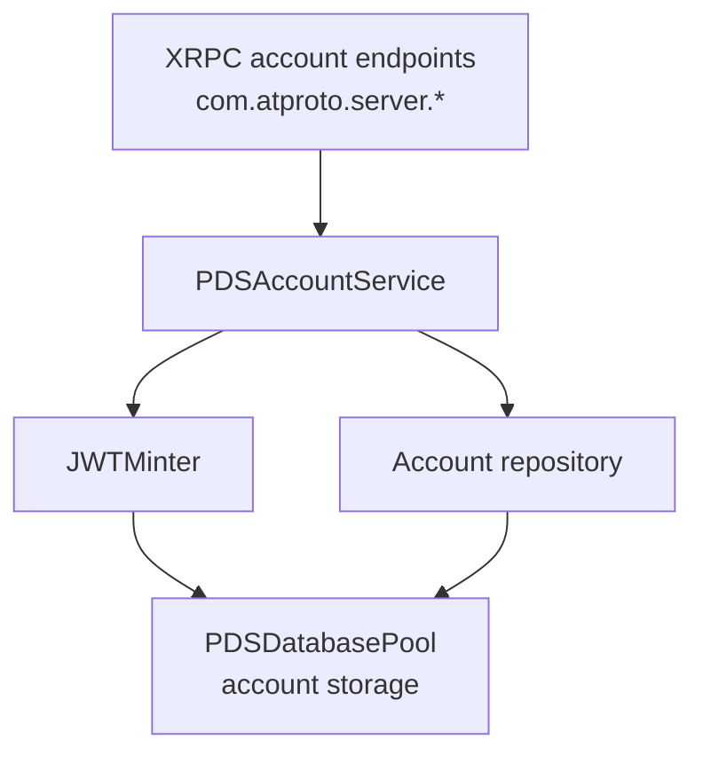

# Account Service

## Overview

The `PDSAccountService` manages account lifecycle operations including creation, authentication, token refresh, and deletion. It coordinates between the database layer and JWT token generation to provide a complete account management interface.

### Why This Service Matters

Account management is the foundation of any PDS implementation. Every user interaction begins with authentication, and proper account handling ensures:

- **Security**: Passwords are hashed, tokens are properly scoped, and authentication follows best practices
- **Identity**: Each account is tied to a DID, enabling decentralized identity across the ATProto network
- **Compliance**: Account deletion and data management meet regulatory requirements
- **User Experience**: Fast, reliable authentication with proper error handling

The Account Service sits at the intersection of identity, security, and user management, making it one of the most critical components in the PDS architecture.

## Responsibilities

- Account creation with email, password, and handle
- User authentication and login
- JWT access and refresh token generation
- Account information retrieval
- Account deletion with password verification
- Email provider integration for verification codes

## Architecture



## Key Methods

### Account Creation

```objc
- (nullable NSDictionary *)createAccountForEmail:(NSString *)email
                                        password:(NSString *)password
                                         handle:(NSString *)handle
                                             did:(nullable NSString *)did
                                          error:(NSError **)error;
```

Creates a new account with the provided credentials. Returns account information including the generated DID and initial tokens.

**Parameters:**
- `email`: User's email address
- `password`: Account password (hashed before storage)
- `handle`: User's handle (e.g., "alice.bsky.social")
- `did`: Optional pre-generated DID; if nil, one is generated automatically
- `error`: Error pointer for failure details

**Returns:** Dictionary with account info or nil on failure

**Implementation pattern (from PDSAccountService.m):**

The service validates the handle, generates cryptographic keys, registers with PLC, and stores the account:

```objc
// Validate Handle
if (![ATProtoHandleValidator validateHandle:handle error:error]) {
    return nil;
}
handle = [ATProtoHandleValidator normalizeHandle:handle];

// Generate signing and rotation keys
Secp256k1KeyPair *userKeyPair = [[Secp256k1 shared] generateKeyPairWithError:error];
if (!userKeyPair) return nil;

Secp256k1KeyPair *rotationKeyPair = [[Secp256k1 shared] generateKeyPairWithError:error];
if (!rotationKeyPair) return nil;

// Register DID with PLC or use provided DID
NSString *resolvedDid;
if (did) {
    resolvedDid = did;
} else {
    resolvedDid = [self _registerDIDWithPLCWithHandle:handle
                                           signingKey:userKeyPair
                                          rotationKey:rotationKeyPair
                                                error:error];
    if (!resolvedDid) return nil;
}

// Generate password hash
NSData *salt = [self generateSalt];
NSData *passwordHash = [self hashPassword:password salt:salt];

// Create and save account
PDSDatabaseAccount *account = [[PDSDatabaseAccount alloc] init];
account.email = email;
account.handle = handle;
account.did = resolvedDid;
account.passwordHash = passwordHash;
account.passwordSalt = salt;
account.createdAt = [[NSDate date] timeIntervalSince1970];
account.updatedAt = [[NSDate date] timeIntervalSince1970];

NSError *createError = nil;
if (![_accountRepository saveAccount:account error:&createError]) {
    if (error) *error = createError;
    return nil;
}

// Generate JWT tokens
JWT *jwt = [self.minter mintAccessTokenForDID:resolvedDid handle:handle scopes:@[@"atproto"] error:nil];
NSString *accessToken = [jwt encodedToken];
NSString *refreshToken = [[NSUUID UUID] UUIDString];

// Store tokens
account.accessJwt = [accessToken dataUsingEncoding:NSUTF8StringEncoding];
account.refreshJwt = [refreshToken dataUsingEncoding:NSUTF8StringEncoding];
[_accountRepository saveAccount:account error:nil];
[_sessionRepository storeRefreshToken:refreshToken forAccountDid:resolvedDid error:nil];

return @{
    @"did": resolvedDid,
    @"handle": handle,
    @"email": email,
    @"accessJwt": accessToken,
    @"refreshJwt": refreshToken
};
```

**Example usage:**
```objc
NSError *error = nil;
NSDictionary *account = [accountService createAccountForEmail:@"user@example.com"
                                                     password:@"secure_password"
                                                      handle:@"alice"
                                                        did:nil
                                                       error:&error];
if (account) {
    NSString *did = account[@"did"];
    NSString *accessToken = account[@"accessJwt"];
}
```

### Authentication

```objc
- (nullable NSDictionary *)loginWithIdentifier:(NSString *)identifier
                                     password:(NSString *)password
                                        error:(NSError **)error;
```

Authenticates a user by handle or email and password. Returns access and refresh tokens.

**Parameters:**
- `identifier`: User's handle or email
- `password`: Account password
- `error`: Error pointer for failure details

**Returns:** Dictionary with tokens and account info or nil on failure

**Implementation pattern (from PDSAccountService.m lines 200-280):**

The service looks up the account by email or handle, verifies the password, and generates new tokens:

```objc
- (nullable NSDictionary *)loginWithIdentifier:(NSString *)identifier
                                      password:(NSString *)password
                                         error:(NSError **)error {
    if (!identifier) {
        if (error) {
            *error = [ATProtoError errorWithCode:ATProtoErrorCodeMissingParameter
                                       message:@"Missing identifier"];
        }
        return nil;
    }

    // Look up account by email or handle
    NSError *dbError = nil;
    PDSDatabaseAccount *account = nil;
    if ([identifier containsString:@"@"]) {
        account = [_accountRepository accountForEmail:identifier error:&dbError];
    } else {
        account = [_accountRepository accountForHandle:identifier error:&dbError];
    }

    if (dbError) {
        if (error) *error = dbError;
        return nil;
    }

    if (!account) {
        if (error) {
            *error = [ATProtoError errorWithCode:ATProtoErrorCodeNotFound
                                       message:@"Account not found"];
        }
        return nil;
    }

    return [self loginWithAccount:account password:password error:error];
}

- (nullable NSDictionary *)loginWithAccount:(PDSDatabaseAccount *)account
                                   password:(NSString *)password
                                      error:(NSError **)error {
    // Verify password using constant-time comparison
    NSData *passwordHash = [self hashPassword:password salt:account.passwordSalt];
    BOOL isPasswordCorrect = PDSConstantTimeEqualData(passwordHash, account.passwordHash);

    // Also check app passwords if available
    if (!isPasswordCorrect && self.serviceDatabases) {
        NSError *appPasswordError = nil;
        if ([self.serviceDatabases verifyAppPasswordForAccount:account.did 
                                                      password:password 
                                                         error:&appPasswordError]) {
            isPasswordCorrect = YES;
        }
    }

    if (!isPasswordCorrect) {
        if (error) {
            *error = [ATProtoError errorWithCode:ATProtoErrorCodeInvalidCredentials
                                       message:@"Invalid password"];
        }
        return nil;
    }

    // Generate new tokens
    JWT *jwt = [self.minter mintAccessTokenForDID:account.did 
                                           handle:account.handle 
                                           scopes:@[@"atproto"] 
                                            error:nil];
    NSString *accessToken = [jwt encodedToken];
    NSString *refreshToken = [[NSUUID UUID] UUIDString];

    // Store tokens
    account.accessJwt = [accessToken dataUsingEncoding:NSUTF8StringEncoding];
    account.refreshJwt = [refreshToken dataUsingEncoding:NSUTF8StringEncoding];
    [_accountRepository saveAccount:account error:nil];
    [_sessionRepository storeRefreshToken:refreshToken forAccountDid:account.did error:nil];

    return @{
        @"did": account.did,
        @"handle": account.handle,
        @"email": account.email,
        @"accessJwt": accessToken,
        @"refreshJwt": refreshToken
    };
}
```

**Example usage:**
```objc
NSError *error = nil;
NSDictionary *session = [accountService loginWithIdentifier:@"alice"
                                                   password:@"secure_password"
                                                      error:&error];
if (session) {
    NSString *accessToken = session[@"accessJwt"];
    NSString *refreshToken = session[@"refreshJwt"];
}
```

### Token Refresh

```objc
- (nullable NSDictionary *)refreshAccessToken:(NSString *)refreshToken
                                       error:(NSError **)error;
```

Refreshes an expired access token using a valid refresh token.

**Parameters:**
- `refreshToken`: Valid refresh token from previous login
- `error`: Error pointer for failure details

**Returns:** Dictionary with new access token or nil on failure

**Example:**
```objc
NSError *error = nil;
NSDictionary *newSession = [accountService refreshAccessToken:refreshToken
                                                        error:&error];
if (newSession) {
    NSString *newAccessToken = newSession[@"accessToken"];
}
```

### Account Retrieval

```objc
- (nullable NSDictionary *)getAccountForDid:(NSString *)did error:(NSError **)error;
```

Retrieves account information for a specific DID.

**Parameters:**
- `did`: Decentralized identifier
- `error`: Error pointer for failure details

**Returns:** Dictionary with account info or nil if not found

### Account Deletion

```objc
- (BOOL)deleteAccount:(NSString *)did password:(NSString *)password error:(NSError **)error;
```

Deletes an account after password verification.

**Parameters:**
- `did`: Account DID to delete
- `password`: Password for verification
- `error`: Error pointer for failure details

**Returns:** YES on success, NO on failure

## Integration Points

### With JWT Minter

The service uses `JWTMinter` to generate access and refresh tokens:

```objc
@property (nonatomic, strong, nullable) JWTMinter *minter;
```

Tokens are signed with the PDS's private key and include claims for:
- `sub` (subject): User's DID
- `aud` (audience): PDS identifier
- `exp` (expiration): Token lifetime
- `iat` (issued at): Creation timestamp

### With Database Pool

Account data is persisted through `PDSDatabasePool`:

```objc
@property (nonatomic, strong) PDSDatabasePool *databasePool;
```

Each account has:
- Email address (unique)
- Handle (unique)
- Password hash (bcrypt or similar)
- DID (unique)
- Creation timestamp
- Account status (active/suspended)

### With Email Provider

Optional email provider for verification:

```objc
@property (nonatomic, strong, nullable) id<PDSEmailProvider> emailProvider;
```

Used for:
- Email verification during signup
- Password reset flows
- Account recovery

## Error Handling

Common error scenarios:

| Error | Cause | Handling |
|-------|-------|----------|
| Invalid email | Malformed email address | Validate format before submission |
| Duplicate handle | Handle already taken | Suggest alternatives |
| Weak password | Password doesn't meet requirements | Enforce password policy |
| Invalid credentials | Wrong password or handle | Reject login attempt |
| Account not found | DID doesn't exist | Return 404 error |
| Account suspended | Account has been disabled | Notify user |

## When to Use This Service

### Use Account Service When:

- **Creating new user accounts**: The service handles the complete account creation flow including DID generation, PLC registration, and initial token issuance
- **Authenticating users**: Login operations verify credentials and issue fresh tokens
- **Managing sessions**: Token refresh operations extend user sessions without requiring re-authentication
- **Implementing account deletion**: The service provides safe account removal with password verification

### Don't Use Account Service For:

- **Authorization checks**: Use `XrpcAuthHelper` for verifying tokens and checking permissions
- **Profile management**: Use `PDSRecordService` to manage profile records (app.bsky.actor.profile)
- **Password resets**: Implement separate password reset flow with email verification
- **OAuth flows**: Use dedicated OAuth handlers for third-party authentication

## Common Pitfalls and Troubleshooting

### Pitfall 1: Race Conditions on Account Creation

**Problem**: Multiple simultaneous account creation requests with the same handle or email can bypass uniqueness checks.

**Why it happens**: Database uniqueness constraints may not be checked atomically with the account creation logic.

**Solution**:
```objc
// Wrap account creation in a transaction
[store transactWithBlock:^(id<PDSActorStoreTransactor> transactor, NSError **blockError) {
    // Check uniqueness
    if ([transactor accountExistsForHandle:handle error:blockError]) {
        *blockError = [ATProtoError errorWithCode:ATProtoErrorCodeConflict
                                          message:@"Handle already taken"];
        return NO;
    }
    
    // Create account
    return [transactor saveAccount:account error:blockError];
} error:&error];
```

### Pitfall 2: Token Expiration Not Handled

**Problem**: Clients receive 401 errors when access tokens expire, disrupting user experience.

**Why it happens**: Access tokens are short-lived (15-60 minutes) by design for security.

**Solution**: Implement automatic token refresh in clients:
```objc
- (void)makeAuthenticatedRequest:(NSURLRequest *)request {
    // Check if token is expired or about to expire
    if ([self isTokenExpired:self.accessToken]) {
        // Refresh token first
        [self refreshTokenWithCompletion:^(NSString *newToken, NSError *error) {
            if (newToken) {
                self.accessToken = newToken;
                [self retryRequest:request];
            } else {
                // Refresh failed, require re-login
                [self promptForLogin];
            }
        }];
    } else {
        [self executeRequest:request];
    }
}
```

### Pitfall 3: Password Hashing Performance

**Problem**: Account creation and login are slow, especially under load.

**Why it happens**: Strong password hashing (bcrypt with high cost factor) is CPU-intensive by design.

**Solution**: Use appropriate cost factors and consider async processing:
```objc
// Use cost factor 12 for good security/performance balance
NSData *passwordHash = [self hashPassword:password 
                                     salt:salt 
                               costFactor:12];

// For high-traffic systems, consider background processing
dispatch_async(dispatch_get_global_queue(DISPATCH_QUEUE_PRIORITY_DEFAULT, 0), ^{
    NSData *hash = [self hashPassword:password salt:salt costFactor:12];
    dispatch_async(dispatch_get_main_queue(), ^{
        [self completeAccountCreation:account passwordHash:hash];
    });
});
```

### Pitfall 4: DID Generation Failures

**Problem**: Account creation fails intermittently with PLC registration errors.

**Why it happens**: PLC directory may be temporarily unavailable or rate-limiting requests.

**Solution**: Implement retry logic with exponential backoff:
```objc
- (NSString *)registerDIDWithRetry:(NSString *)handle
                        signingKey:(Secp256k1KeyPair *)signingKey
                       rotationKey:(Secp256k1KeyPair *)rotationKey
                             error:(NSError **)error {
    NSInteger maxAttempts = 3;
    NSTimeInterval delay = 1.0; // Start with 1 second
    
    for (NSInteger attempt = 0; attempt < maxAttempts; attempt++) {
        NSError *plcError = nil;
        NSString *did = [self _registerDIDWithPLCWithHandle:handle
                                                 signingKey:signingKey
                                                rotationKey:rotationKey
                                                      error:&plcError];
        
        if (did) return did;
        
        if (attempt < maxAttempts - 1) {
            [NSThread sleepForTimeInterval:delay];
            delay *= 2; // Exponential backoff
        } else {
            if (error) *error = plcError;
        }
    }
    
    return nil;
}
```

### Troubleshooting Guide

#### Issue: "Invalid credentials" on correct password

**Symptoms**: Login fails even with correct password.

**Possible causes**:
1. Password salt not retrieved correctly
2. Hash algorithm mismatch
3. Character encoding issues

**Diagnosis**:
```objc
// Add logging to verify hash computation
NSData *computedHash = [self hashPassword:password salt:account.passwordSalt];
PDS_LOG_DEBUG(@"Stored hash: %@", account.passwordHash);
PDS_LOG_DEBUG(@"Computed hash: %@", computedHash);
PDS_LOG_DEBUG(@"Hashes match: %d", PDSConstantTimeEqualData(computedHash, account.passwordHash));
```

#### Issue: "Handle already taken" on unique handle

**Symptoms**: Account creation fails claiming handle is taken when it's not.

**Possible causes**:
1. Handle normalization inconsistency
2. Case-sensitivity issues
3. Stale database state

**Diagnosis**:
```objc
// Verify handle normalization
NSString *normalizedHandle = [ATProtoHandleValidator normalizeHandle:handle];
PDS_LOG_DEBUG(@"Original handle: %@", handle);
PDS_LOG_DEBUG(@"Normalized handle: %@", normalizedHandle);

// Check database directly
PDSDatabaseAccount *existing = [_accountRepository accountForHandle:normalizedHandle error:nil];
PDS_LOG_DEBUG(@"Existing account: %@", existing);
```

#### Issue: Tokens not refreshing

**Symptoms**: Refresh token operation fails with "invalid token" error.

**Possible causes**:
1. Refresh token not stored in session repository
2. Token expired or revoked
3. DID mismatch

**Diagnosis**:
```objc
// Verify token storage
BOOL tokenExists = [_sessionRepository refreshTokenExists:refreshToken error:nil];
PDS_LOG_DEBUG(@"Refresh token exists: %d", tokenExists);

// Check token-DID association
NSString *associatedDid = [_sessionRepository didForRefreshToken:refreshToken error:nil];
PDS_LOG_DEBUG(@"Token associated with DID: %@", associatedDid);
```

## Best Practices

1. **Password Security**
   - Never store plaintext passwords
   - Use bcrypt or similar with appropriate cost factor (12-14)
   - Implement rate limiting on login attempts (5 attempts per 15 minutes)
   - Use constant-time comparison for password verification to prevent timing attacks

2. **Token Management**
   - Keep access tokens short-lived (15-60 minutes)
   - Use longer-lived refresh tokens (days/weeks)
   - Implement token rotation on refresh (issue new refresh token each time)
   - Revoke tokens on logout and store revocation list
   - Include token scope in JWT claims

3. **Account Creation**
   - Validate email format before attempting creation
   - Enforce password complexity requirements (minimum length, character types)
   - Verify email ownership before activation (send verification code)
   - Generate unique DIDs using PLC directory
   - Use database transactions to ensure atomicity

4. **Concurrency**
   - Use database transactions for account creation
   - Prevent race conditions on handle/email uniqueness with database constraints
   - Serialize token generation to avoid duplicate tokens
   - Implement optimistic locking for account updates

5. **Error Handling**
   - Return specific error codes for different failure modes
   - Log authentication failures for security monitoring
   - Implement account lockout after repeated failed attempts
   - Provide clear error messages without leaking security information

## Common Patterns

### Creating an Account with Email Verification

```objc
// 1. Create account
NSError *error = nil;
NSDictionary *account = [accountService createAccountForEmail:@"user@example.com"
                                                     password:@"password"
                                                      handle:@"alice"
                                                        did:nil
                                                       error:&error];

// 2. Send verification email
if (account && emailProvider) {
    NSString *verificationCode = [self generateVerificationCode];
    [emailProvider sendVerificationEmail:@"user@example.com"
                                   code:verificationCode];
}

// 3. Verify email (in separate request)
// User clicks link or enters code
[self verifyEmailForDid:account[@"did"] code:verificationCode];
```

### Implementing Login with Token Refresh

```objc
// 1. Initial login
NSError *error = nil;
NSDictionary *session = [accountService loginWithIdentifier:@"alice"
                                                   password:@"password"
                                                      error:&error];

// 2. Store tokens securely
NSString *accessToken = session[@"accessToken"];
NSString *refreshToken = session[@"refreshToken"];
[self storeTokensSecurely:accessToken refresh:refreshToken];

// 3. When access token expires, refresh it
NSDictionary *newSession = [accountService refreshAccessToken:refreshToken
                                                        error:&error];
if (newSession) {
    [self storeTokensSecurely:newSession[@"accessToken"]
                     refresh:newSession[@"refreshToken"]];
}
```

### Handling Account Deletion

```objc
// 1. Verify password
NSError *error = nil;
NSDictionary *session = [accountService loginWithIdentifier:@"alice"
                                                   password:@"password"
                                                      error:&error];

// 2. Delete account
if (session) {
    BOOL deleted = [accountService deleteAccount:session[@"did"]
                                        password:@"password"
                                           error:&error];
    if (deleted) {
        // Clear local tokens and data
        [self clearLocalData];
    }
}
```

## See Also

- [JWT Tokens](../06-authentication/jwt-tokens) - Understanding token structure and validation
- [Services Overview](services-overview) - How Account Service fits into the service layer
- [PDSApplication](pds-application) - Application-level integration
- [OAuth 2.0 with DPoP](../06-authentication/oauth2-dpop) - Advanced authentication flows
- [Security Best Practices](../06-authentication/security-best-practices) - Comprehensive security guidance
- [PLC Directory](../02-core-concepts/plc-directory) - DID registration and resolution\n\n## Related\n\n- [Documentation Map](../11-reference/documentation-map.md)\n- [Contributor Guide](../index.md)\n- [Repository Documentation Index](../repo-index/index.md)\n\n