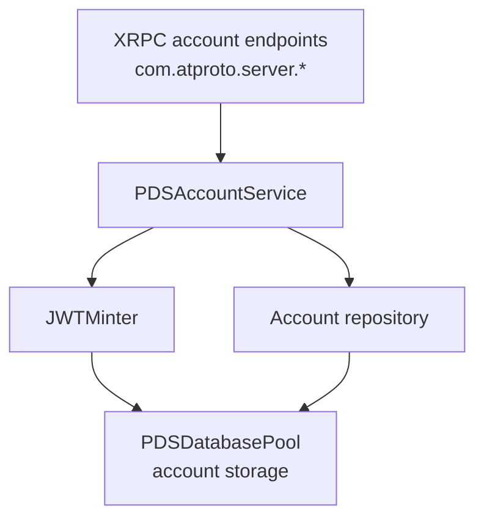

# Account Service

## Overview

`PDSAccountService` manages account creation, authentication, token refresh, and deletion. It coordinates between the database layer and JWT generation.

## Purpose

Account management handles authentication and identity:

- **Security**: Hashes passwords and scopes tokens.
- **Identity**: Ties accounts to DIDs for decentralized identity.
- **Compliance**: Manages account deletion and data regulatory requirements.
- **Performance**: Provides fast authentication with standard error handling.

## Responsibilities

- Account creation (email, password, handle).
- User authentication.
- JWT access and refresh token generation.
- Account information retrieval.
- Account deletion.
- Email verification integration.

## Architecture



## Methods

### Account Creation

```objc
- (nullable NSDictionary *)createAccountForEmail:(NSString *)email
                                        password:(NSString *)password
                                          handle:(NSString *)handle
                                              did:(nullable NSString *)did
                                           error:(NSError **)error;
```

Creates an account and returns the generated DID and initial tokens.

**Parameters:**
- `email`: User email address.
- `password`: Account password (hashed before storage).
- `handle`: User handle.
- `did`: Optional pre-generated DID.
- `error`: Failure details.

**Implementation (PDSAccountService.m):**

The service validates the handle, generates keys, registers with PLC, and stores the account:

```objc
// Validate Handle
if (![ATProtoHandleValidator validateHandle:handle error:error]) {
    return nil;
}
handle = [ATProtoHandleValidator normalizeHandle:handle];

// Generate signing and rotation keys
Secp256k1KeyPair *userKeyPair = [[Secp256k1 shared] generateKeyPairWithError:error];
if (!userKeyPair) return nil;

Secp256k1KeyPair *rotationKeyPair = [[Secp256k1 shared] generateKeyPairWithError:error];
if (!rotationKeyPair) return nil;

// Register DID with PLC or use provided DID
NSString *resolvedDid;
if (did) {
    resolvedDid = did;
} else {
    resolvedDid = [self _registerDIDWithPLCWithHandle:handle
                                           signingKey:userKeyPair
                                          rotationKey:rotationKeyPair
                                                error:error];
    if (!resolvedDid) return nil;
}

// Generate password hash
NSData *salt = [self generateSalt];
NSData *passwordHash = [self hashPassword:password salt:salt];

// Create and save account
PDSDatabaseAccount *account = [[PDSDatabaseAccount alloc] init];
account.email = email;
account.handle = handle;
account.did = resolvedDid;
account.passwordHash = passwordHash;
account.passwordSalt = salt;
account.createdAt = [[NSDate date] timeIntervalSince1970];
account.updatedAt = [[NSDate date] timeIntervalSince1970];

NSError *createError = nil;
if (![_accountRepository saveAccount:account error:&createError]) {
    if (error) *error = createError;
    return nil;
}

// Generate JWT tokens
JWT *jwt = [self.minter mintAccessTokenForDID:resolvedDid handle:handle scopes:@[@"atproto"] error:nil];
NSString *accessToken = [jwt encodedToken];
NSString *refreshToken = [[NSUUID UUID] UUIDString];

// Store tokens
account.accessJwt = [accessToken dataUsingEncoding:NSUTF8StringEncoding];
account.refreshJwt = [refreshToken dataUsingEncoding:NSUTF8StringEncoding];
[_accountRepository saveAccount:account error:nil];
[_sessionRepository storeRefreshToken:refreshToken forAccountDid:resolvedDid error:nil];

return @{
    @"did": resolvedDid,
    @"handle": handle,
    @"email": email,
    @"accessJwt": accessToken,
    @"refreshJwt": refreshToken
};
```

### Authentication

```objc
- (nullable NSDictionary *)loginWithIdentifier:(NSString *)identifier
                                     password:(NSString *)password
                                        error:(NSError **)error;
```

Authenticates by handle or email. Returns access and refresh tokens.

**Implementation (PDSAccountService.m):**

The service looks up the account, verifies the password, and generates tokens:

```objc
- (nullable NSDictionary *)loginWithIdentifier:(NSString *)identifier
                                      password:(NSString *)password
                                         error:(NSError **)error {
    if (!identifier) {
        if (error) {
            *error = [ATProtoError errorWithCode:ATProtoErrorCodeMissingParameter
                                       message:@"Missing identifier"];
        }
        return nil;
    }

    // Look up account by email or handle
    NSError *dbError = nil;
    PDSDatabaseAccount *account = nil;
    if ([identifier containsString:@"@"]) {
        account = [_accountRepository accountForEmail:identifier error:&dbError];
    } else {
        account = [_accountRepository accountForHandle:identifier error:&dbError];
    }

    if (dbError) {
        if (error) *error = dbError;
        return nil;
    }

    if (!account) {
        if (error) {
            *error = [ATProtoError errorWithCode:ATProtoErrorCodeNotFound
                                       message:@"Account not found"];
        }
        return nil;
    }

    return [self loginWithAccount:account password:password error:error];
}

- (nullable NSDictionary *)loginWithAccount:(PDSDatabaseAccount *)account
                                   password:(NSString *)password
                                      error:(NSError **)error {
    // Verify password using constant-time comparison
    NSData *passwordHash = [self hashPassword:password salt:account.passwordSalt];
    BOOL isPasswordCorrect = PDSConstantTimeEqualData(passwordHash, account.passwordHash);

    // Also check app passwords if available
    if (!isPasswordCorrect && self.serviceDatabases) {
        NSError *appPasswordError = nil;
        if ([self.serviceDatabases verifyAppPasswordForAccount:account.did 
                                                      password:password 
                                                         error:&appPasswordError]) {
            isPasswordCorrect = YES;
        }
    }

    if (!isPasswordCorrect) {
        if (error) {
            *error = [ATProtoError errorWithCode:ATProtoErrorCodeInvalidCredentials
                                       message:@"Invalid password"];
        }
        return nil;
    }

    // Generate new tokens
    JWT *jwt = [self.minter mintAccessTokenForDID:account.did 
                                           handle:account.handle 
                                           scopes:@[@"atproto"] 
                                            error:nil];
    NSString *accessToken = [jwt encodedToken];
    NSString *refreshToken = [[NSUUID UUID] UUIDString];

    // Store tokens
    account.accessJwt = [accessToken dataUsingEncoding:NSUTF8StringEncoding];
    account.refreshJwt = [refreshToken dataUsingEncoding:NSUTF8StringEncoding];
    [_accountRepository saveAccount:account error:nil];
    [_sessionRepository storeRefreshToken:refreshToken forAccountDid:account.did error:nil];

    return @{
        @"did": account.did,
        @"handle": account.handle,
        @"email": account.email,
        @"accessJwt": accessToken,
        @"refreshJwt": refreshToken
    };
}
```

### Token Refresh

```objc
- (nullable NSDictionary *)refreshAccessToken:(NSString *)refreshToken
                                       error:(NSError **)error;
```

Refreshes an expired access token.

### Account Retrieval

```objc
- (nullable NSDictionary *)getAccountForDid:(NSString *)did error:(NSError **)error;
```

Retrieves account info for a DID.

### Account Deletion

```objc
- (BOOL)deleteAccount:(NSString *)did password:(NSString *)password error:(NSError **)error;
```

Deletes an account after verifying the password.

## Integration

### JWT Minter
The service uses `JWTMinter` to generate access and refresh tokens signed with the PDS private key. Claims include `sub` (DID), `aud` (audience), `exp` (expiration), and `iat` (issued at).

### Database Pool
`PDSDatabasePool` persists account data, including unique emails, handles, and password hashes.

### Email Provider
The `PDSEmailProvider` handles email verification for signup, password resets, and account recovery.

## Error States

| Error | Cause |
|-------|-------|
| Invalid email | Malformed address |
| Duplicate handle | Handle taken |
| Weak password | Policy violation |
| Invalid credentials | Incorrect credentials |
| Account not found | Missing DID |
| Account suspended | Disabled account |

## Usage Guidelines

Use `PDSAccountService` for:
- Creating user accounts (DID generation, PLC registration).
- Authenticating users and issuing tokens.
- Managing sessions and token refresh.
- Deleting accounts.

Do not use `PDSAccountService` for:
- Authorization checks (use `XrpcAuthHelper`).
- Profile management (use `PDSRecordService`).
- OAuth flows (use dedicated handlers).

## Concurrency and Performance

- **Transactions**: Use database transactions for account creation to ensure handle/email uniqueness.
- **Password Hashing**: Use appropriate cost factors (e.g., 12) for bcrypt. Process hashing on background threads for high-traffic systems.
- **DID Generation**: Implement retry logic with exponential backoff for PLC registration.

## Best Practices

1. **Security**: Never store plaintext passwords. Use constant-time comparisons for verification.
2. **Token Lifecycle**: Use short-lived access tokens (15-60 minutes) and longer-lived refresh tokens. Implement token rotation on refresh.
3. **Validation**: Validate email and password complexity before attempting account creation. Use database constraints to prevent race conditions.
4. **Error Handling**: Return specific error codes and log failures for monitoring. Avoid leaking security details in error messages.

